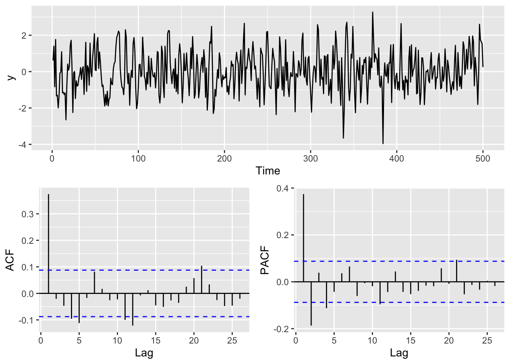
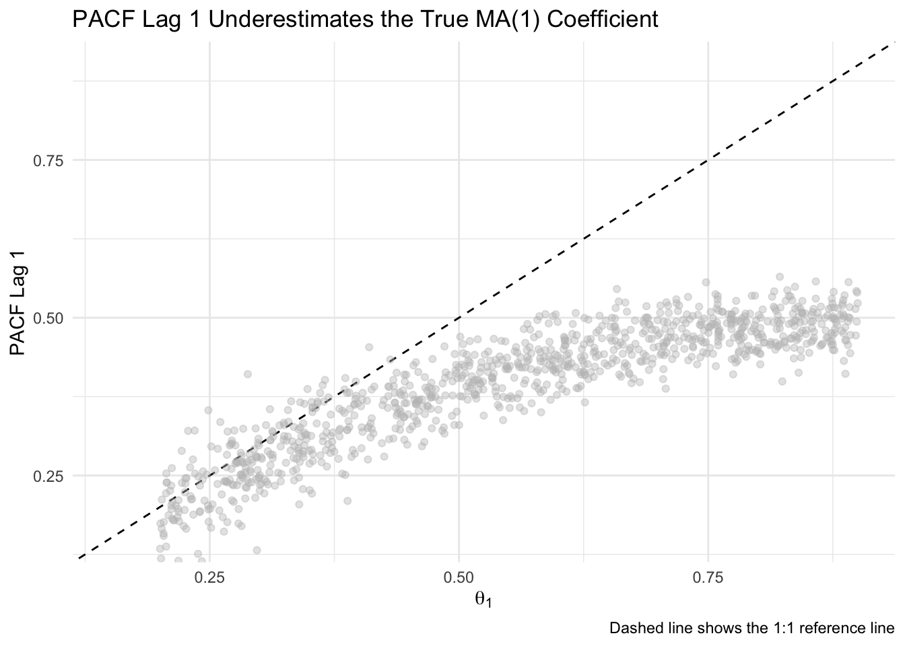
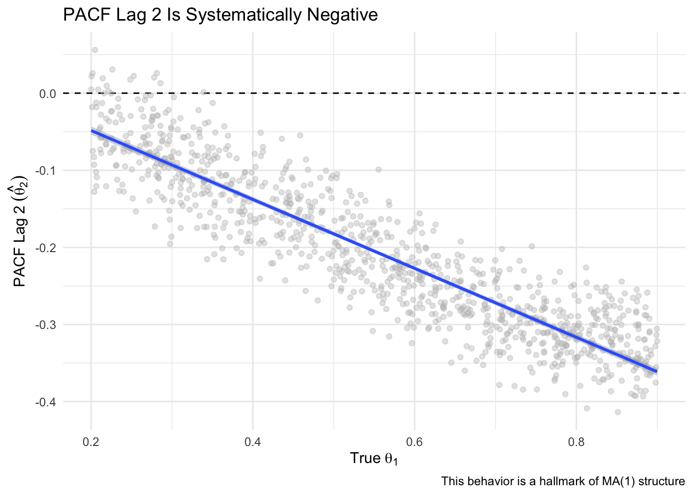

# Aside: Why the ACF and PACF Look the Way They Do in an MA(1) Process

## Introduction

At this point, you are already familiar with autoregressive (AR) and moving average (MA) models, and how they differ in terms of what drives dependencies in a time series. The focus here is on deepening your understanding of what the diagnostic plots (ACF and PACF) actually reveal in a simple MA(1) setting.

A MA(1) (moving average process of order 1) is a foundational model in time series analysis:

$$
y_t = \theta \epsilon_{t-1} + \epsilon_t
$$

Here, \(\epsilon_t\) are white noise errors, and \(\theta\) is the MA coefficient. Even though the model doesn't directly depend on past values of \(y_t\), its structure introduces short-term correlation through the overlap of shock terms. We use the term "shock" to emphasize that each \(\epsilon_t\) represents a new, unanticipated influence on the system — something that wasn’t predictable from past values and that directly moves the time series.

This document explores why the **autocorrelation function (ACF)** and **partial autocorrelation function (PACF)** behave the way they do in MA(1) processes. We focus on two unintuitive and commonly misunderstood features:

1. The PACF at **lag 1** tends to **underestimate** the true \(\theta\).
2. The PACF at **lag 2** is typically **negative**, despite the model only including a lag-1 term.

We use simulation to build intuition and illustrate these patterns.

## ACF and PACF of a Single MA(1) Simulation

Let's start by making a MA(1) time series. 


``` r
library(tidyverse)
library(forecast)
library(gridExtra)
set.seed(2346)

n <- 500
tm <- 1:n
y <- arima.sim(model = list(ma = 0.4), n = n)

simpleLayoutMatrix <- matrix(c(1, 1, 2, 3), nrow = 2, byrow = TRUE)
p1 <- ggplot() + geom_line(aes(x = tm, y = y)) + labs(x = "Time")
p2 <- ggAcf(y) + labs(title = NULL)
p3 <- ggPacf(y) + labs(title = NULL)

grid.arrange(p1, p2, p3, layout_matrix = simpleLayoutMatrix)
```



The time series plot shows typical short-term wiggliness — a feature of MA processes driven by shocks. The ACF shows a sharp drop-off after lag 1, which is the signature of an MA(1). The PACF, however, does something subtler: a bump at lag 1, and a surprising dip below zero at lag 2. That’s the focus of this document — understanding why this happens and what it tells us.

This simulation shows a typical MA(1) pattern:

- ACF: significant spike at lag 1 followed by rapid drop-off
- PACF: small positive spike at lag 1, followed by a negative value at lag 2

## Simulation Study Across Many MA(1) Coefficients

The code below builds a large data frame of simulation results. For each randomly chosen MA(1) coefficient (theta), we simulate a time series, compute its PACF, and extract the values at lag 1 and lag 2. This lets us explore how the PACF behaves systematically as theta varies. We will simulate 1000 MA(1) series with \(\theta \in [0.2, 0.9]\) to examine systematic behavior in the PACF.


``` r
m <- 1000                     # Number of simulations
res <- matrix(NA, m, 3)       # Object to store theta, PACF lag 1, PACF lag 2
thetas <- runif(m, 0.2, 0.9)  # Randomly draw MA(1) coefficients for simulation
res[,1] <- thetas             # Store theta

for(i in 1:m){
  y <- arima.sim(model = list(ma = thetas[i]), n = n)  # Simulate MA(1)
  tmp <- Pacf(y, plot = FALSE)                         # Get PACF
  res[i,2] <- tmp$acf[1,1,1]                           # Store lag 1 PACF
  res[i,3] <- tmp$acf[2,1,1]                           # Store lag 2 PACF
}
res <- as.data.frame(res)
names(res) <- c("Simulated_theta", "PACF_lag1", "PACF_lag2")
```

## Insight 1: PACF Lag 1 Underestimates \(\theta\)

This plot compares the true MA(1) coefficient used in each simulation (theta) to the estimated PACF value at lag 1. If the PACF exactly reflected the true coefficient, all points would fall along the dashed 1:1 line. Instead, we see a consistent pattern of underestimation — the PACF at lag 1 grows more slowly than theta, especially as theta increases. This visualizes how the PACF captures indirect correlation, not the actual model parameter.


``` r
ggplot(res, aes(x = Simulated_theta, y = PACF_lag1)) +
  geom_abline(slope = 1, intercept = 0, linetype = "dashed") +
  geom_point(alpha = 0.4, color = "gray") +
  labs(x = expression(theta[1]),
       y = "PACF Lag 1",
       title = "PACF Lag 1 Underestimates the True MA(1) Coefficient",
       caption = "Dashed line shows the 1:1 reference line") +
  coord_cartesian(xlim = c(0.15, 0.9), ylim = c(0.15, 0.9)) +
  theme_minimal()
```



### Why This Happens

The PACF at lag 1 is the coefficient from regressing \(y_t\) on \(y_{t-1}\). In an MA(1) model, \(y_t\) and \(y_{t-1}\) both include \(\epsilon_{t-1}\), creating a correlation. But this correlation is weaker than the actual MA coefficient \(\theta\), because it is **shared noise**, not a structural dependency. 

A structural dependency means that one value directly influences another — for example, in an AR(1) model, $y_{t-1}$ directly enters the equation for $y_t$. Shared noise, by contrast, means that two values are correlated because they both include the same random error term. In an MA(1), $y_t$ and $y_{t-1}$ are correlated not because one causes the other, but because both include \epsilon_{t-1}.

The correlation between $y_t$ and $y_{t-1}$ in an MA(1) model is:

$$
\text{ACF}(1) = \frac{\theta}{1 + \theta^2}
$$

This function grows sublinearly and is always smaller than \(\theta\). So when you regress \(y_t\) on \(y_{t-1}\), the PACF at lag 1 ends up underestimating the true coefficient. This is not bias in a statistical sense — it's just that the PACF is measuring something different from \(\theta\).

The ACF(1) formula comes from calculating the expected covariance between $y_t$ and $y_{t-1}$, then dividing by the variance. Both $y_t$ and $y_{t-1}$ share $\epsilon_{t-1}$, which creates a positive correlation. The denominator includes both $\epsilon_t$ and $\theta \epsilon_{t-1}$, leading to the extra $\theta^2$ in the variance.

Our simulation confirms this: as \(\theta\) increases, PACF lag 1 rises too, but never reaches the 1:1 line.

## Insight 2: PACF Lag 2 is Consistently Negative

This plot shows a strong inverse relationship between PACF lag 1 and lag 2. As PACF lag 1 increases (which happens as theta increases), PACF lag 2 becomes more negative. This pattern reflects how the model’s one-lag memory indirectly creates compensating effects at lag 2 once lag 1 has been accounted for.


``` r
ggplot(res, aes(x = PACF_lag1, y = PACF_lag2)) +
  geom_point(alpha = 0.4,color = "gray") +
  labs(x = "PACF Lag 1",
       y = "PACF Lag 2",
       title = "PACF Lag 2 Is More Negative as Lag 1 Increases",
       caption = "Each point is a simulated MA(1) process") +
  theme_minimal()
```


Here we plot PACF lag 2 against the true theta used in each simulation. The consistent downward slope illustrates that the more influence theta has at lag 1, the more negative the partial correlation becomes at lag 2 — an indirect, but systematic pattern that is unique to MA(1) models.


``` r
# Also show vs theta
ggplot(res, aes(x = Simulated_theta, y = PACF_lag2)) +
  geom_hline(yintercept = 0, linetype = "dashed") +
  geom_point(alpha = 0.4, color = "gray") +
  geom_smooth(method = "lm") +
  labs(x = expression(True~theta[1]),
       y = expression(PACF~Lag~2~(hat(theta[2]))),
       title = "PACF Lag 2 Is Systematically Negative",
       caption = "This behavior is a hallmark of MA(1) structure") +
  theme_minimal()
```

```
## `geom_smooth()` using formula = 'y ~ x'
```



### Why This Happens

The PACF at lag 2 is the partial correlation between \(y_t\) and \(y_{t-2}\), holding \(y_{t-1}\) constant. In an MA(1), there is no direct influence of \(y_{t-2}\) on \(y_t\), but they do share overlapping shock terms: \(y_{t-2}\) includes \(\epsilon_{t-2}\), which can influence \(y_{t-1}\), which in turn influences \(y_t\) through \(\epsilon_{t-1}\).

So once the regression adjusts for \(y_{t-1}\), the residual effect of \(y_{t-2}\) is actually in the **opposite direction**, resulting in a negative coefficient. The strength of this negative partial correlation increases with \(\theta\), leading to a nearly linear negative slope, as oour plot confirms.

Theoretically, the PACF value at lag 2 in an MA(1) process has a known form:

\[
\phi_{22} = \frac{-\theta^2}{1 + \theta^2}
\]

Here, \(\phi_{22}\) refers to the partial autocorrelation at lag 2 — specifically, it is the coefficient on \(y_{t-2}\) in a regression of \(y_t\) on both \(y_{t-1}\) and \(y_{t-2}\). More generally, \(\phi_{kk}\) denotes the PACF at lag \(k\), and it captures the unique contribution of \(y_{t-k}\) to predicting \(y_t\), after controlling for all intermediate lags. This negative value at lag 2 reflects how the MA(1) structure produces a compensating reversal in direction once the influence of \(y_{t-1}\) is accounted for.
The notation \(\phi_{22}\) refers to the **partial autocorrelation at lag 2** — that is, the coefficient on \(y_{t-2}\) in a regression of \(y_t\) on both \(y_{t-1}\) and \(y_{t-2}\). More generally, \(\phi_{kk}\) denotes the PACF at lag \(k\), and comes from the Durbin-Levinson algorithm used to estimate partial autocorrelations. It captures the unique contribution of \(y_{t-k}\) to predicting \(y_t\), after controlling for all intermediate lags \(y_{t-1}, y_{t-2}, \ldots, y_{t-(k-1)}\).

This matches the shape in our simulation — a negative curve that grows more negative with larger \(\theta\).

## Conclusion

This simulation-driven analysis shows:

- **PACF lag 1 underestimates \(\theta\)** because it captures indirect correlation from shared noise, not a structural relationship.
- **PACF lag 2 is consistently negative** due to the way overlapping shocks in an MA(1) structure reverse direction when accounting for intermediate lags.

Recognizing these patterns helps interpret the ACF and PACF of moving average processes more accurately — and avoids common missteps when students treat PACF values as direct analogues of model parameters.
