# Forecasting


## Big Idea
The correlation structure of a time series itself can often be enough to forecast it for a short time.

## Reading
Have a look at Chapter three from @Cowpertwait2009. It's OK to skim the readings in this book. It's not a great book for our purposes as many of you haven't taken linear algebra and the book occasionally goes that way. But it's useful to hum your way through the chapter nonetheless.

## Packages
You'll want the `forecast` [@R-forecast] library. And `tidyverse` [@R-tidyverse] naturally.


``` r
library(tidyverse)
library(forecast)
```

## Introduction
There are entire books written about forecasting time series data and many of them are financial in nature. (You would do well to quit the environmental world, make a lot of money in finance, and then make a nice donation to the University with "ESCI 504" written on the memo line of the check.) The idea is that you can use the properties of the time series itself to forecast it over a short period. If the series has enough temporal structure you can likely predict it (albeit with some error) for some short time period. I have to confess that I've never had to do any serious time series forecasting in my own research. I'm interested in describing and accounting for temporal structure as a way of understanding mechanism more than I am in predicting values. I did work with a grad student a few years ago who wanted to forecast river flow from temperature and precipitation records. We found that a time series forecast worked pretty well and sometimes better than using exogenous predictors. So, even if you can't make a trillion bucks forecasting environmental data, you should pay attention.

## A simple forecast

Let's imagine an AR(1) model and show how we can forecast it using \( y_{t-1} \) and \( \phi \) to model \( y_t \).

Suppose we have a model:

\[
y_t = \phi y_{t-1} + \epsilon_t
\]

where \( \phi = 0.7 \) and \( \epsilon_t \sim \mathcal{N}(0, 1) \).

If we know the current value \( y_t \), we can forecast the next value \( y_{t+1} \) as:

\[
\hat{y}_{t+1} = \phi y_t = 0.7 \times y_t
\]

Since this is a one-step-ahead forecast, the expected value of the error term \( \epsilon_{t+1} \) is zero, so our best forecast is just the deterministic part.

However, that forecast has some uncertainty associated with it that we can model as well. The forecast error is defined as:

\[
e_{t+1} = y_{t+1} - \hat{y}_{t+1} = \phi y_t + \epsilon_{t+1} - \phi y_t = \epsilon_{t+1}
\]

So the one-step-ahead forecast error has variance:

\[
\text{Var}(e_{t+1}) = \text{Var}(\epsilon_{t+1}) = 1
\]

This means our forecast is unbiased, but there is always a ±1 SD range of uncertainty.

### Two-step-ahead forecast

To forecast two steps ahead, we use our prediction for \( y_{t+1} \) to forecast \( y_{t+2} \). The true value is:

\[
y_{t+2} = \phi y_{t+1} + \epsilon_{t+2}
\]

We don't know \( y_{t+1} \), but we can plug in our forecast:

\[
\hat{y}_{t+2} = \phi \hat{y}_{t+1} = \phi^2 y_t
\]

This is the best guess based on information available at time \( t \). But now there are two sources of uncertainty: the new shock \( \epsilon_{t+2} \), and the fact that \( y_{t+1} \) itself was only an estimate. When we expand the expression for \( y_{t+2} \), we get:

\[
y_{t+2} = \phi (\phi y_t + \epsilon_{t+1}) + \epsilon_{t+2} = \phi^2 y_t + \phi \epsilon_{t+1} + \epsilon_{t+2}
\]

So the two-step-ahead forecast error is:

\[
e_{t+2} = y_{t+2} - \hat{y}_{t+2} = \phi \epsilon_{t+1} + \epsilon_{t+2}
\]

And the variance of this error is:

\[
\text{Var}(e_{t+2}) = \phi^2 \text{Var}(\epsilon_{t+1}) + \text{Var}(\epsilon_{t+2}) = \phi^2 + 1
\]

With \( \phi = 0.7 \), that gives:

\[
\text{Var}(e_{t+2}) = (0.7)^2 + 1 = 0.49 + 1 = 1.49
\]

So, while the one-step-ahead forecast has a variance of 1, the two-step-ahead forecast has a higher variance of 1.49. This increase reflects the compounding uncertainty as we project further into the future.

And you can foresee that if you want to forecast three steps out, the variance would increase again as additional error terms enter the expression, each scaled by a power of \( \phi \). The forecast error would include \( \phi^2 \epsilon_{t+1} + \phi \epsilon_{t+2} + \epsilon_{t+3} \), and its variance would be:

\[
\text{Var}(e_{t+3}) = \phi^4 + \phi^2 + 1
\]

In general, for an \( k \)-step-ahead forecast in an AR(1) model with white noise variance \( \sigma^2 \), the forecast error variance is:

\[
\text{Var}(e_{t+k}) = \sigma^2 \sum_{j=0}^{k-1} \phi^{2j}
\]

This is a geometric series, and if \( |\phi| < 1 \), it converges to:

\[
\lim_{k \to \infty} \text{Var}(e_{t+k}) = \frac{\sigma^2}{1 - \phi^2}
\]

So even though uncertainty grows with forecast horizon, it levels off to a fixed upper bound when the process is stationary. Recall how the ACF function in an AR(1) trailed off geometrically? This is the same idea.

### Example

Let's show this in a simple simulation. Below, we use the last observed value \( y_t \) to generate a one-step-ahead forecast:

\[
\hat{y}_{t+1} = \phi y_t
\]

Then, we use this forecasted value to produce a two-step-ahead forecast:

\[
\hat{y}_{t+2} = \phi \hat{y}_{t+1}
\]

and so on. This is called **chained forecasting**, and it mimics what we would do in practice when future values are unknown. While each step uses the same rule, the uncertainty compounds because each forecast depends on previous estimates rather than actual values.


``` r
# Simulate an AR(1) process and do chained forecasting
set.seed(62)  # for reproducibility
n <- 10
phi <- 0.7
epsilon <- rnorm(n)

# Generate the AR(1) series
y <- numeric(n)
y[1] <- epsilon[1]

for (t in 2:n) {
  y[t] <- phi * y[t - 1] + epsilon[t]
}

# Last observed value
y_t <- y[n]

# Forecasts
y_hat_1 <- phi * y_t                    # one-step-ahead
y_hat_2 <- phi * y_hat_1                # two-step-ahead (chained)
y_hat_3 <- phi * y_hat_2                # three-step-ahead (chained)

# Forecast SDs (1, phi^2 + 1, phi^4 + phi^2 + 1)
se_1 <- 1
se_2 <- sqrt(phi^2 + 1)
se_3 <- sqrt(phi^4 + phi^2 + 1)
```

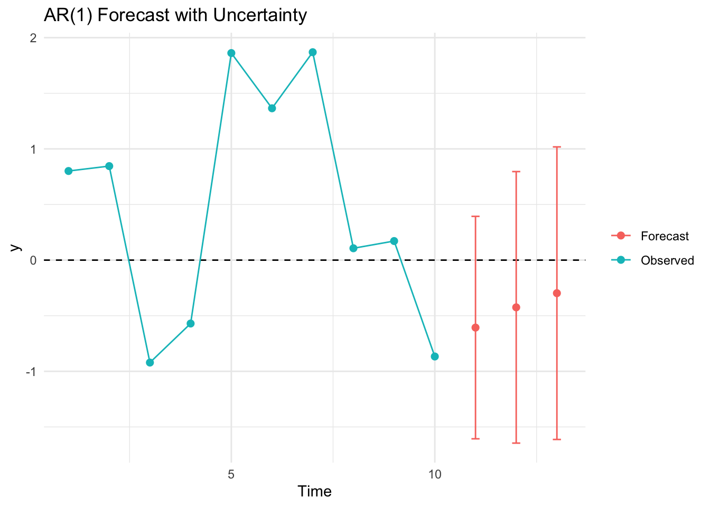

## Using ARMA coefficients to forecast
Now that we get the idea, let's work on a more sophisticated example using the fitted coefficients from an AR model. That is, we will build on our experience and use just the internal autocorrelation of a time series to forecast a few steps forward. Doing so is more interesting given stronger and longer memory processes. Thus, we will take the data of annual sunspot counts which you'll recall vary over about a decade and forecast the time series.


``` r
data(sunspot.year)
autoplot(sunspot.year) +
  labs(x="Year", y ="Sunspots (n)") + 
  theme_minimal()
```

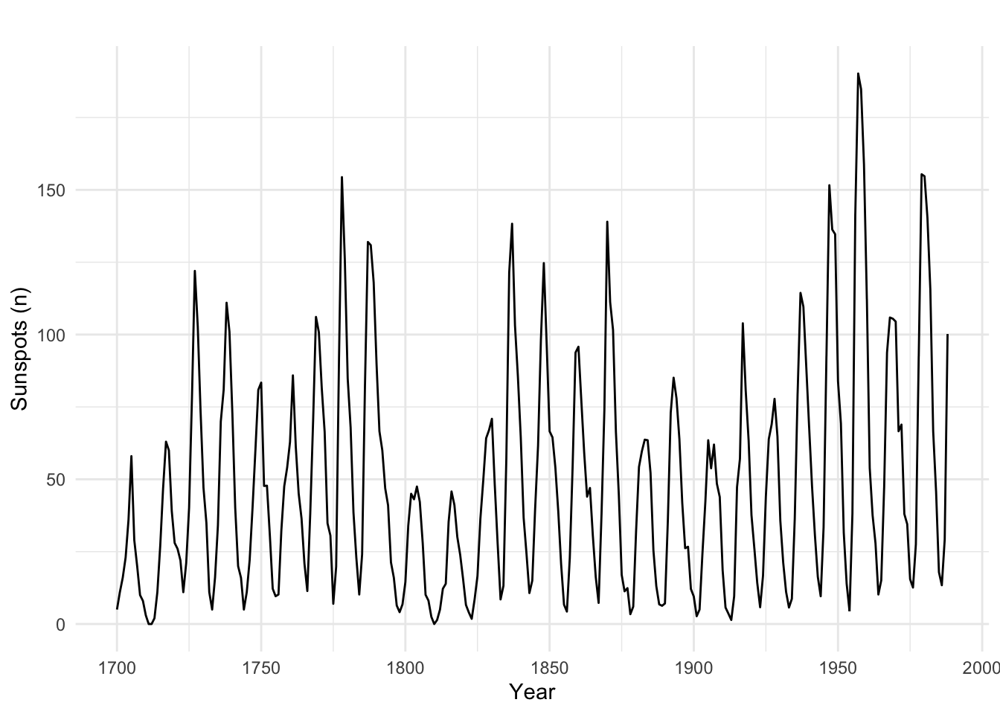

Until now we have been fitting AR and ARMA "by hand." We've been thinking about the models and deciding on the order based on ACF, PACF, AIC, etc. That is the smart way of doing things. It makes you think about the models, the processes, and so on. But some of you have already discovered the the `ar` and `auto.arima` functions which simplify this process (dangerously so^[Please use these automatic functions with care. They are blind algorithms that just operate until their stopping criteria are met. With great power comes great responsibility. They optimize based on information criteria, not predictive power. E.g.,`auto.arima` uses AICc, AIC, or BIC to pick models. These penalize complexity, but not harshly enough when sample sizes are large or when noise structures are complex. A model can "look" optimal by those criteria yet still generalize poorly. By default, `auto.arima` will consider fairly large values for AR and MA terms (max.p = 5, max.q = 5), which can fit noise patterns. In short samples, this is especially risky. In time series, near-identical scores can come from very different models. Without domain insight, functions like `auto.arima` might favor a more complex model that explains idiosyncrasies and not the "truth."]). The later is in the `forecast` library. Here we will use `ar` to fit an AR($p$) model and $p$ will be selected for us magically (actually by AIC). 


``` r
sunspot.ar <- ar(sunspot.year)
sunspot.ar
```

```
## 
## Call:
## ar(x = sunspot.year)
## 
## Coefficients:
##       1        2        3        4        5        6        7        8  
##  1.1305  -0.3524  -0.1745   0.1403  -0.1358   0.0963  -0.0556   0.0076  
##       9  
##  0.1941  
## 
## Order selected 9  sigma^2 estimated as  267.5
```

Note the the class of the `sunspot.ar` object and think about methods. Most models have a `predict` method. So, now that we have the AR(9) model for the sunspots we can predict sunspots out a few years.


``` r
sunspot.forecast <- predict(sunspot.ar, n.ahead = 10)
plot(sunspot.year,xlim=c(1700, 1998),col="grey",lwd=1.5, 
     ylab="Sunspots (n)")
lines(sunspot.forecast$pred,col="darkgreen",lwd=1.5)
```

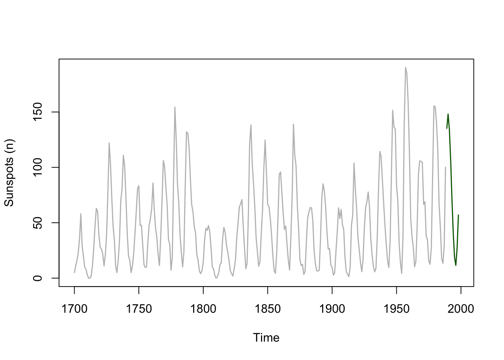

This is pretty cool. The sunspot data fit an AR(9) process and the `predict` function (look at `?predict.ar`) captures the cyclic nature of the sunspot data. Let's make a better plot by zooming in a little and adding the standard error of the forecast to the plot. I'll go `ggplot` for this one.


``` r
forecast_tb <- tibble(index = time(sunspot.forecast$pred),
                      yhat = sunspot.forecast$pred,
                      lower = sunspot.forecast$pred - sunspot.forecast$se,
                      upper = sunspot.forecast$pred + sunspot.forecast$se)

obs_tb <- broom::tidy(sunspot.year) %>% rename(y = value)   

ggplot() + 
  geom_line(data = obs_tb,mapping = aes(x=index,y=y)) +
  geom_ribbon(data = forecast_tb,
              mapping = aes(x=index,ymin=lower, ymax=upper),
              fill="darkgreen",alpha=0.5) +
  geom_line(data = forecast_tb,
            mapping = aes(x=index,y=yhat),
            col="darkgreen") +
  labs(y="Sunspots (n)",x="Year") +
  scale_x_continuous(expand = c(0,0),limits=c(1950,1998))
```

```
## Warning: Removed 250 rows containing missing values or values outside the scale range
## (`geom_line()`).
```

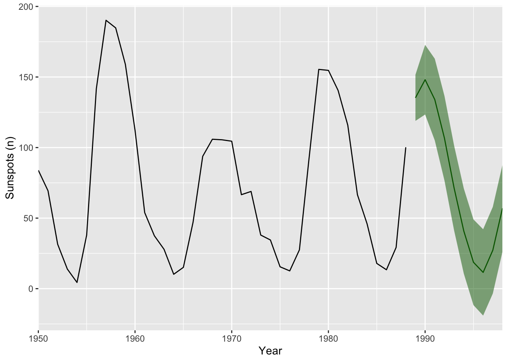

But what would happen if we extended this forward? Where will the predictions go? What about the errors?

## Holt-Winters
We've already worked with data containing *seasonality* and a *trend*. E.g., the CO$_2$ data you've used when you were decomposing time series back towards the start of class. Forecasting this kind of data is more involved than the AR or ARMA approach we used above. Recall *stationarity*? The Holt-Winters algorithm is a way forward. The book has an excellent explanation of the theory behind it. I'm not going to walk you through all of it but I want to explain, to some extent, the idea behind exponential smoothing. In simplest terms, exponential smoothing is a weighted average where points that are immediately back in time affect the predicted value more than points that are further back in time.  

Any time you want to forecast (predict), you need a model. Holt-Winters uses triple exponential smoothing to estimate $\hat y_{t+1}$ as a function of past values of $y_t$. The triple part means that Holt Winters applies the exponential smoothing concept to the 1) trend, 2) season, and 3) residuals. So let's look at what exponential smoothing is.

But we can start to unpack exponential smoothing much more simply using averages and moving averages. We've talked about kind of stuff a little but this is a good chance to get further into it.  

Let's think about this with some code. Below we have a time series $y_t$ with seven values and we will use those past values to predict the 8th value.


``` r
x <- 1:7
y <- c(8,5,12,11,12,9,19)
p1 <- ggplot(mapping = aes(x=x,y=y)) + 
  geom_point() + geom_line() +
  lims(x=c(1,9))
p1
```

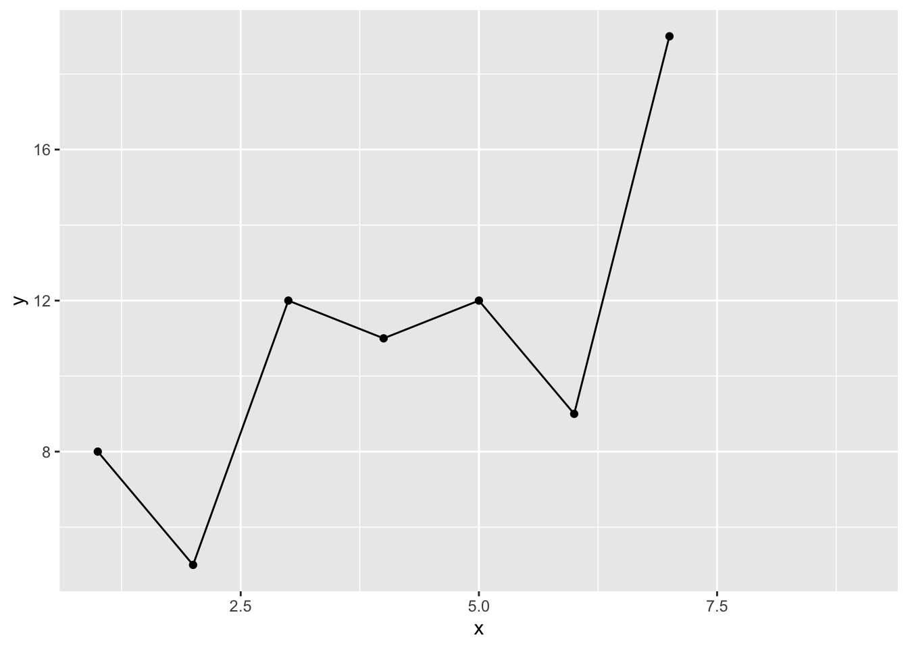

If I want to estimate $\hat y_8$ we could start with a simple average. The idea is that if $y$ is a random variable it will have a central tenancy so forecasting it to the mean is kind of reasonable, right?  So we will assume that $\hat y_8 = \bar y$ and add it to the plot. 


``` r
yhat1 <- mean(y)
yhat1
```

```
## [1] 10.85714
```

``` r
p1 + geom_point(mapping = aes(x=8,y=yhat1),color="blue",size=3)
```

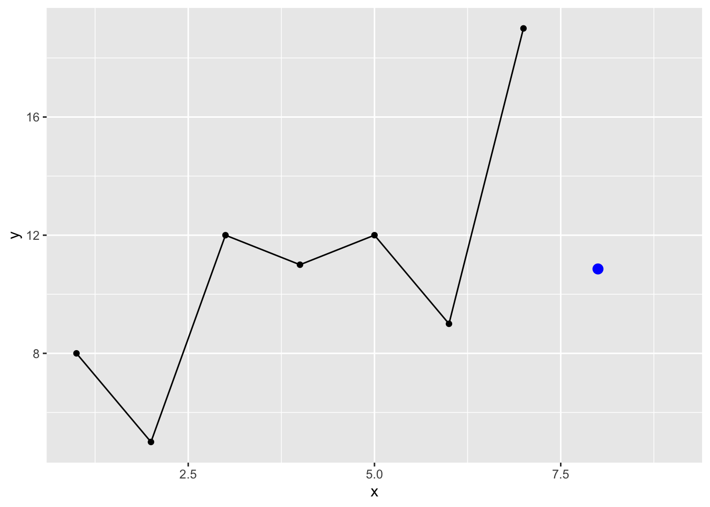

We can also use moving averages to get just a tiny bit more sophisticated. You used these some when we were reading and plotting data. Recall the `filter` and `rollmean` functions? Let's roll our own but in this case we won't roll the function along the length of $y$ but just select how many points back in time to use to estimate $\hat y_8$ :


``` r
maFunc <- function(x,n=2){
  nx <- length(x)
  mean(x[(nx-n+1):nx])
}
yhat2 <- maFunc(y,n=4) # 4 point
yhat2
```

```
## [1] 12.75
```

``` r
p1 + geom_point(mapping = aes(x=8,y=yhat2),color="blue",size=3)
```

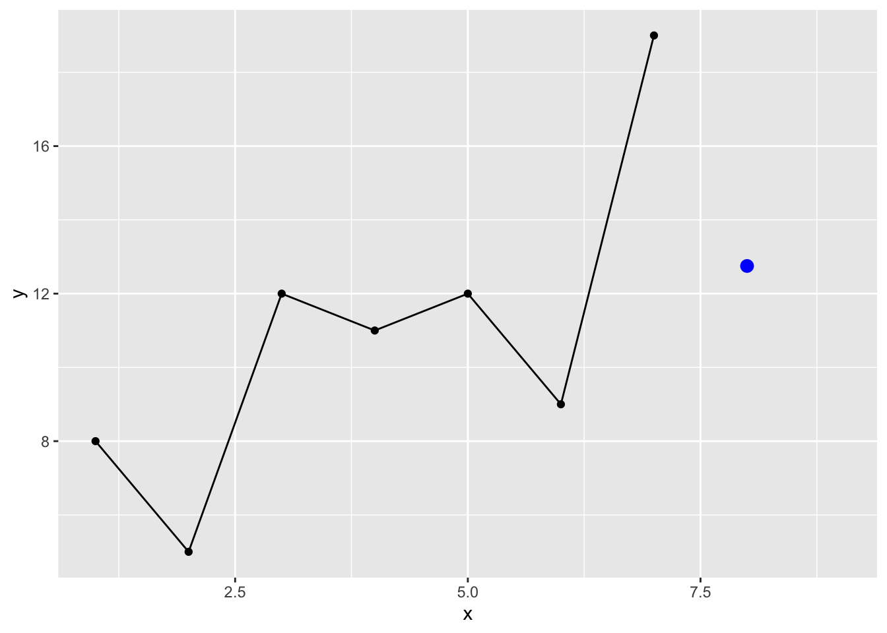

I know some of you are already programming quite a bit and have asked questions about how to write functions. Feel free to ignore if this doesn't interest you. I'll slip a little code snippet in here here so that if we set `n` to `NULL` we will just get the average.


``` r
maFunc <- function(x,n=2){
  if(is.null(n)) { mean(x) }
  else{
    nx <- length(x)
    mean(x[(nx-n+1):nx])
  }
}
maFunc(y,n=NULL)
```

```
## [1] 10.85714
```

``` r
# aka mean(y)
```

OK, back to work. Note that while we think about averages, moving or otherwise, we usually calculate it as the sum of the values divided by the number of values. E.g., `sum(x)/length(x)`. For the three point moving average that would calculate $y_8$ this would look like:


``` r
sum(y[5:7]) / 3
```

```
## [1] 13.33333
```

``` r
# aka
maFunc(y,3)
```

```
## [1] 13.33333
```

An algebraic thing that you might not have considered is that we can so the same thing as:

$$\hat y_8 = y_5 \times \frac{1}{3} + y_6 \times \frac{1}{3} + y_7 \times \frac{1}{3}$$

Or 

``` r
sum(y[5]*0.333 + y[6]*0.333 + y[7]*0.333)
```

```
## [1] 13.32
```

That is, we are moving the denominator up and multiplying each value by $1/3$. This gets the same answer and treats all observations for calculating the average the same way. Those three values are weighted evenly. However, we can also add weights to the average. You've done this at some point in your careers. The idea is to make some points have more influence. In time series this is almost always done to make more recent values matter more in the average. 

Thus we can supply a vector of weights, `w`, that sum to one that will affect the way the average is calculated. The length of `w` will be the length of the moving average and the weights will reflect the relative importance of that observations.For example here is a weighted moving average of 4 with 10%, 20%, 30% and 40% given to those last 4 points.

``` r
wmaFunc <- function(x,w){
  nx <- length(x)
  nw <- length(w)
  sum(x[(nx-nw+1):nx] * w)
}
yhat3 <- wmaFunc(y,w=c(0.1,0.2,0.3,0.4))
yhat3
```

```
## [1] 13.8
```

``` r
p1 + geom_point(mapping = aes(x=8,y=yhat3),color="blue",size=3)
```

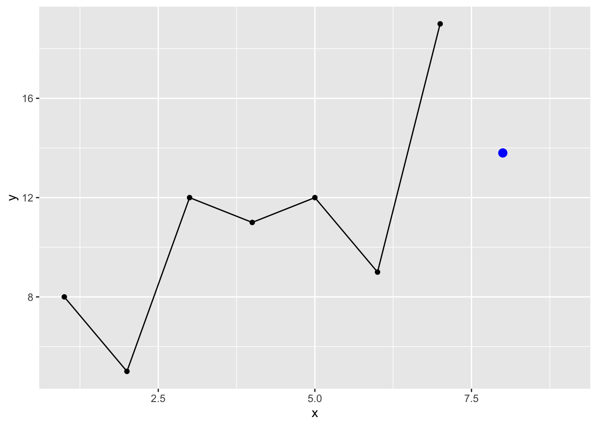

So above we are estimating the 8th value of $y$ using the four prior values where each is value is weighted:

$$\hat y_8 = y_4 \times 0.1 + y_5 \times 0.2 + y_6 \times 0.3 + y_7 \times 0.4$$

Note that for this to make sense, the weights adding up to 1. If you used weights like 0.9, 0.8, 0.7, 0.6 (which add up to 3.0) you'd get something ridiculous for the estimate If you were programming defensively you'd add a check to the top of `wmaFunc` to make sure the argument `w` summed to one. Again ignore this if you like:


``` r
wmaFunc <- function(x,w){
  if(!isTRUE(all.equal(sum(w),1,tolerance = 0.01))) {stop("w must sum to 1")}
  nx <- length(x)
  nw <- length(w)
  sum(x[(nx-nw+1):nx] * w)
}
```

Understanding weights in general is a pretty fundamental skill and especially important for what we are going to do next. Take some time to make sure you follow the concept. Oh, and recall the `filter` function? We just recreated some of what it does. Look at the help page for filter and see if you see how this ties together note the last non-`NA` values from this call to `filter`. Because the base `filter` function conflicts with dplyr's `filter` we will call `stats::filter` explicitly.


``` r
wmaFunc(y,w=c(1/3,1/3,1/3))
```

```
## [1] 13.33333
```

``` r
stats::filter(y,filter = c(1/3,1/3,1/3))
```

```
## Time Series:
## Start = 1 
## End = 7 
## Frequency = 1 
## [1]        NA  8.333333  9.333333 11.666667 10.666667 13.333333        NA
```

Let's pause and see what these estimates look like:

``` r
preds <- tibble(x=8,
                yhat=c(yhat1,yhat2,yhat3),
                description=c("mean","moving avg","weighted moving avg"))
p1 + geom_point(preds,mapping = aes(x=x,y=yhat),
                color="blue",size=3) +
  geom_text(preds,mapping = aes(x=x,y=yhat,label=description),
            position = position_nudge(y = -0.25),color="blue",size=3)
```

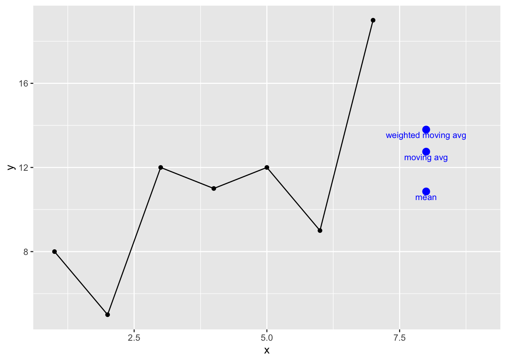

These are all reasonable predictions but not especially interesting. But let's think about the weighted moving average differently. Imagine the weighted average where we consider the entire series and assign exponentially smaller weights as we go back in time. For example if we started with a smoothing coefficient of $\alpha = 0.9$, our weights going back in time from 7 would be:

$$0.9^1, 0.9^2, 0.9^3, 0.9^4, 0.9^5, ...$$
Or:
$$0.900, 0.810, 0.729, 0.656, 0.590, ... $$

You can see that this decreases in a predictable negative exponential decay and as the time step backwards increases the weights approach zero. E.g., if we used $\alpha = 0.9$ and looked at the weights going back 50 time steps:


``` r
x <- 1:50
y <- 0.9^x
ggplot() + geom_point(aes(x=x,y=y)) +
  labs(y="Weight",
       x="Number of backwards time steps")
```

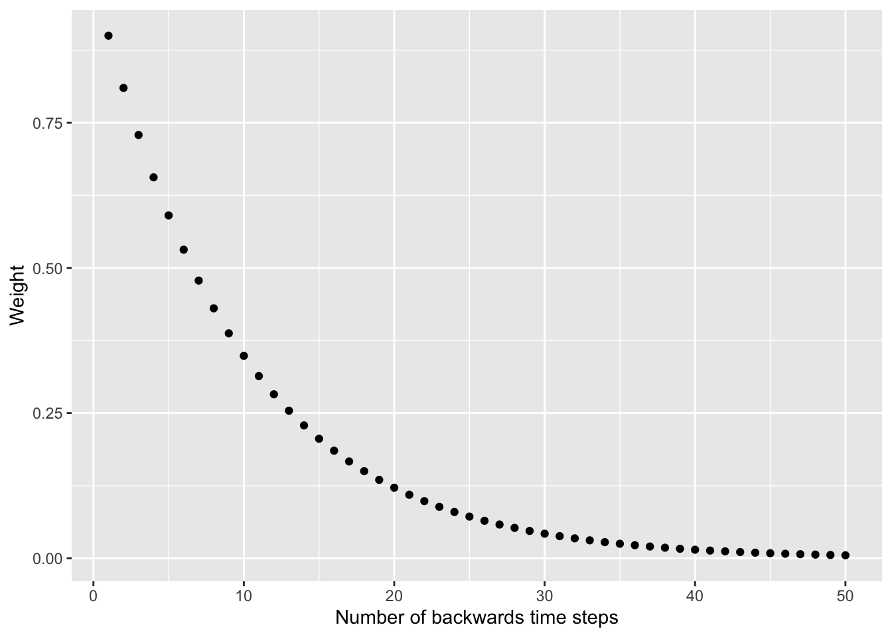

You've probably spotted a problem. We can't use these weights like we did the moving average because the that the series sums to more than one. That screws up the weighted moving average concept. What Holt (or maybe all the way back to Poisson -- I'm not up on the history of math) did was solve this elegantly as:
$$ \hat y_t  = \alpha \times y_t + (1 - \alpha) \times \hat y_{t-1}$$

Spend some time appreciating this formula. It shows that your estimate is the sum of two products. This is essentially a weighted average with $\alpha$ and $1 - \alpha$  as the weights. Since these two terms sum to one we can use it as a moving average.

This is a recursive formula where $1 - \alpha$ is multiplied by the prior expected value $\hat y_{t-1}$ so this crawls back to the beginning of the series. We implement this in a loop:


``` r
expFunc <- function(x,alpha=0.5){
  xhat <- x[1]
  nx <- length(x)
  for(i in 2:nx){
    xhat[i] <- alpha * x[i] + (1 - alpha) * x[i-1]
  }
  xhat[nx]
}
y <- c(8,5,12,11,12,9,19)
yhat <- expFunc(y,alpha=0.9)
yhat
```

```
## [1] 18
```

We can see what these look like for different values of $\alpha$:


``` r
x <- 1:7
y <- c(8,5,12,11,12,9,19)
preds <- tibble(x=8,
                yhat=c(expFunc(y,alpha=0.8),
                       expFunc(y,alpha=0.4),
                       expFunc(y,alpha=0.2)),
                description=c("alpha = 0.8",
                              "alpha = 0.4",
                              "alpha = 0.2"))

ggplot(mapping = aes(x=x,y=y)) + 
  geom_point() + geom_line() +
  lims(x=c(1,9)) + 
  geom_point(preds,mapping = aes(x=x,y=yhat),
             color="blue",size=3) +
  geom_text(preds,mapping = aes(x=x,y=yhat,label=description),
            position = position_nudge(y = -0.25),color="blue",size=3)
```

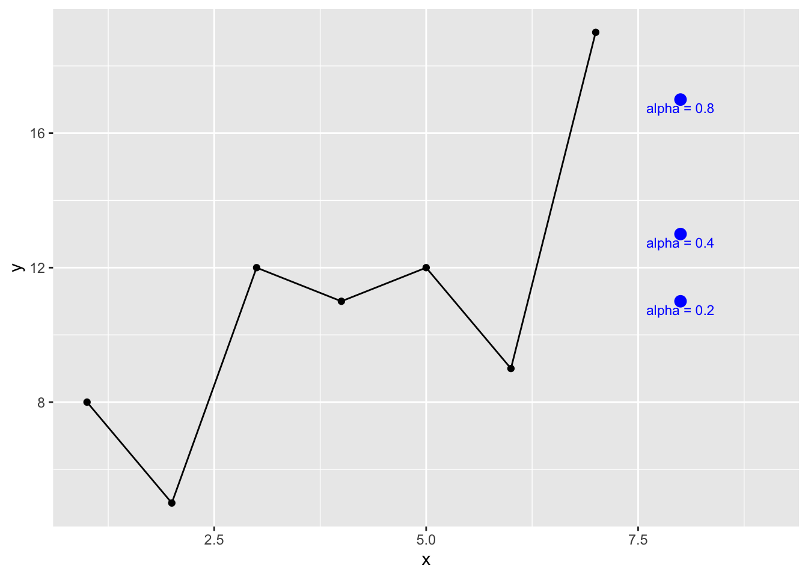

This is the base concept underneath Holt-Winters smoothing. The book walks you through how to go from $\hat y_t  = \alpha \times y_t + (1 - \alpha) \times \hat y_{t-1}$ (eq. 3.15) to the entire Holt-Winters method (eq. 3.21) which is composed of combining the simple smoothing as shown above ($\alpha$) with the trend ($\beta$) and seasonality ($\gamma$) to to do the forecasting. The trick is figuring out what the parameters ($\alpha$, $\beta$, $\gamma$) are. The `HoltWinters` function does this with numeric optimization -- in the default case minimizing the sum of the squared errors for all three parameters. 

Here is it in action:


``` r
fname <- "https://www.esrl.noaa.gov/gmd/webdata/ccgg/trends/co2/co2_mm_mlo.txt"
co2 <- read.table(fname)
co2 <- co2[,4]
co2 <- ts(co2,start=c(1958,3),frequency = 12)
hw <- HoltWinters(co2)
hw
```

```
## Holt-Winters exponential smoothing with trend and additive seasonal component.
## 
## Call:
## HoltWinters(x = co2)
## 
## Smoothing parameters:
##  alpha: 0.5306546
##  beta : 0.01455503
##  gamma: 0.3019897
## 
## Coefficients:
##            [,1]
## a   427.2432590
## b     0.2152986
## s1   -1.7319226
## s2   -3.1603238
## s3   -3.1203881
## s4   -1.7525459
## s5   -0.4967728
## s6    0.4805736
## s7    1.1996301
## s8    1.6694987
## s9    2.9822135
## s10   3.4534960
## s11   2.7131830
## s12   0.6168803
```

``` r
plot(co2,xlim=c(1980,2040),ylim=c(340,460),
     ylab=expression(CO[2]~(ppm)))
lines(predict(hw,n.ahead = 120),col="blue")
```

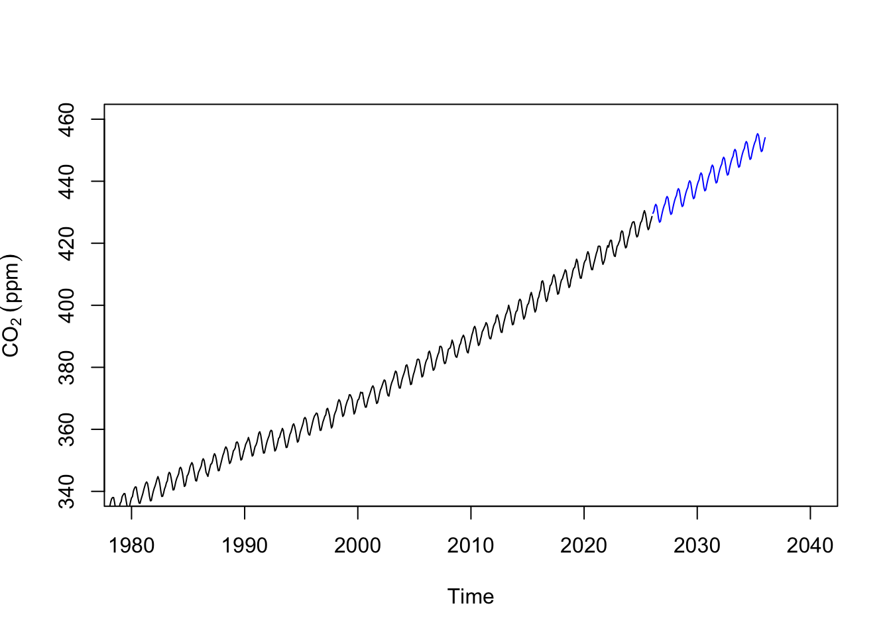


## Your work
### A silly prediction
Let's look at [globally averaged methane](https://www.esrl.noaa.gov/gmd/ccgg/trends_ch4/) concentrations. The data are monthly and run back to 1983.

``` r
fname <- "https://gml.noaa.gov/webdata/ccgg/trends/ch4/ch4_mm_gl.txt"
ch4 <- read.table(fname)
ch4 <- ch4[,3:4]
names(ch4) <- c("DecimalDate","ppb")

ggplot(ch4,mapping = aes(x=DecimalDate,y=ppb)) +
  geom_line() +
  labs(x="Date",y=expression(CH[4]~(ppb)),
       title="Global Monthly Mean Methane Concentration")
```

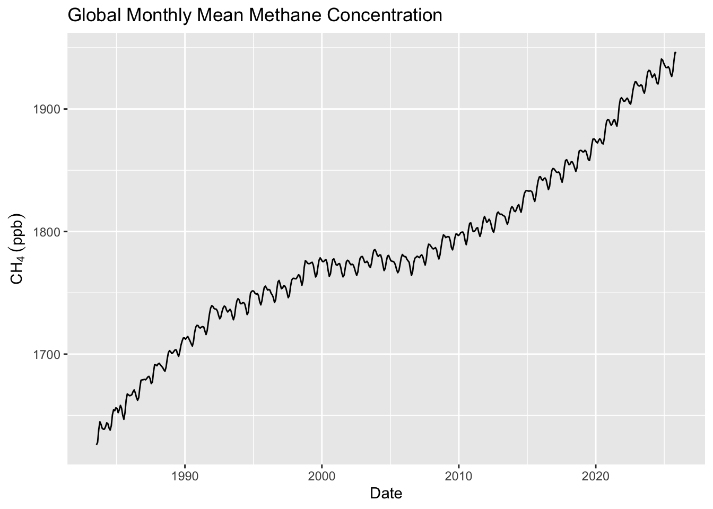

``` r
# make a ts object
ch4.ts <- ts(ch4$ppb,start=c(1983,7),frequency = 12)
```

#### Train and Test
Let's divide the data into two parts. The first chuck of the time series we can use for training a model and we can use the second chunk for testing the model. Thus, you can forecast the training data over the time period of the data you withheld and see how compares it to the test data. This is standard model building stuff to do, right? Training and testing data are fantastic ways of withholding information in order to assess a model's skill (as long as you have data to spare).


``` r
ch4.train <- window(ch4.ts, end = 2016)
ch4.test <- window(ch4.ts, start = 2016)

ggplot() +
  geom_line(data=broom::tidy(ch4.train),
            mapping = aes(x=index,y=value),
            color="darkred") +
  geom_line(data=broom::tidy(ch4.test),
            mapping = aes(x=index,y=value),
            color="darkblue") +
  geom_vline(xintercept = 2016) +
  geom_text(aes(x=2016,y=1900,label="Train  Test"),nudge_x = -0.5) +
  labs(x="Date",y=expression(CH[4]~(ppb)),
       title="Global Monthly Mean Methane Concentration") +
  theme_minimal()
```

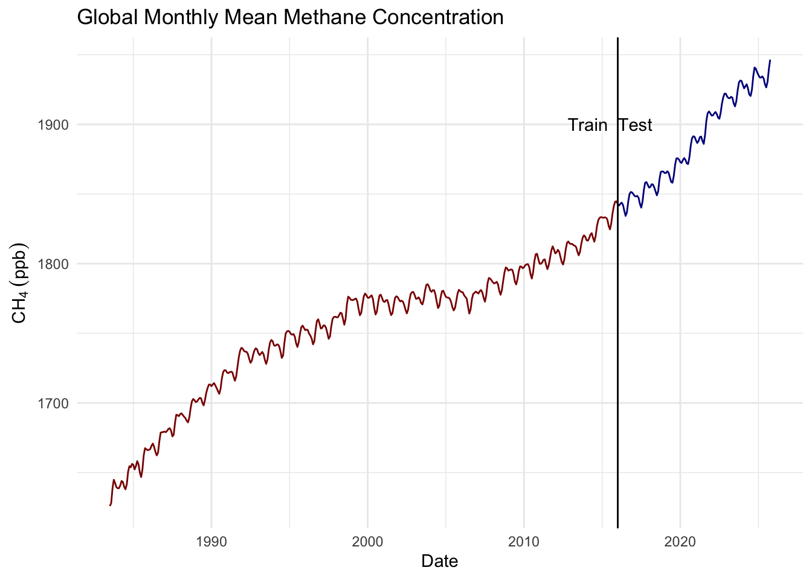

#### AR($p$) Forecast
And fit an AR($p$) model via:

``` r
ch4.ar <- ar(ch4.train)
ch4.ar
```

```
## 
## Call:
## ar(x = ch4.train)
## 
## Coefficients:
##       1        2        3        4  
##  1.0802  -0.1542  -0.0289   0.0891  
## 
## Order selected 4  sigma^2 estimated as  71.72
```

Forecast the training data over the period of the testing data. Overlay the testing data on your plot. How do they compare visually? Now compare the predicted data to the withheld (test) data statistically (e.g., correlation and RMSE). Is this a "good" model? Can you explain what is going on with these predictions?


#### Holt-Winters Forecast
And make a Holt-winters model too.


``` r
ch4.hw <- HoltWinters(ch4.train)
```

```
## Warning in HoltWinters(ch4.train): optimization difficulties: ERROR:
## ABNORMAL_TERMINATION_IN_LNSRCH
```

``` r
ch4.hw
```

```
## Holt-Winters exponential smoothing with trend and additive seasonal component.
## 
## Call:
## HoltWinters(x = ch4.train)
## 
## Smoothing parameters:
##  alpha: 0.8729582
##  beta : 0.01981042
##  gamma: 1
## 
## Coefficients:
##             [,1]
## a   1839.8827680
## b      0.5998914
## s1     1.8281395
## s2     1.3145093
## s3     0.5110901
## s4    -1.9972249
## s5    -7.0008862
## s6    -9.9788581
## s7    -6.6378429
## s8    -0.2315650
## s9     4.5676653
## s10    6.2974446
## s11    4.8814883
## s12    2.5872320
```

Forecast the training data over the period of the testing data. Overlay the testing data on your plot. How do they compare visually? Now compare the predicted data to the withheld (test) data statistically  (e.g., correlation and RMSE). Is this a "good" model? Can you explain what is going on with these predictions?


### Write Up and Reflect
Pass in a R Markdown doc with your analysis. Leave all code visible, although you may quiet messages and warnings if desired. Turn in your knitted html. The last section of your document should include a reflection where you explain how it all went. What triumphs did you have? What is still confusing?


