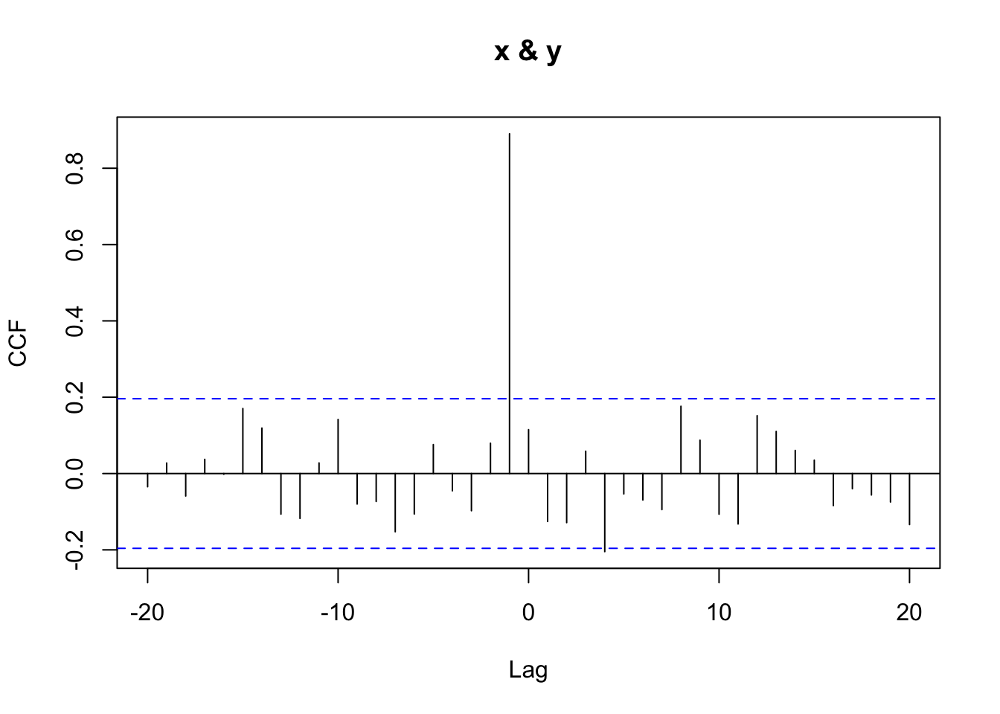
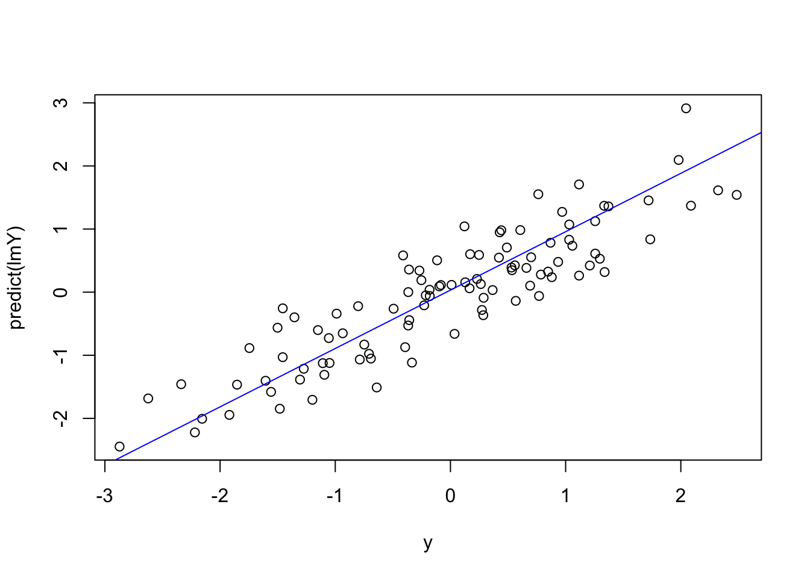
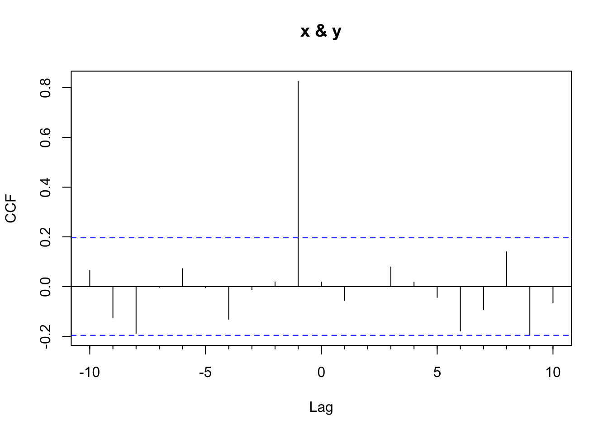
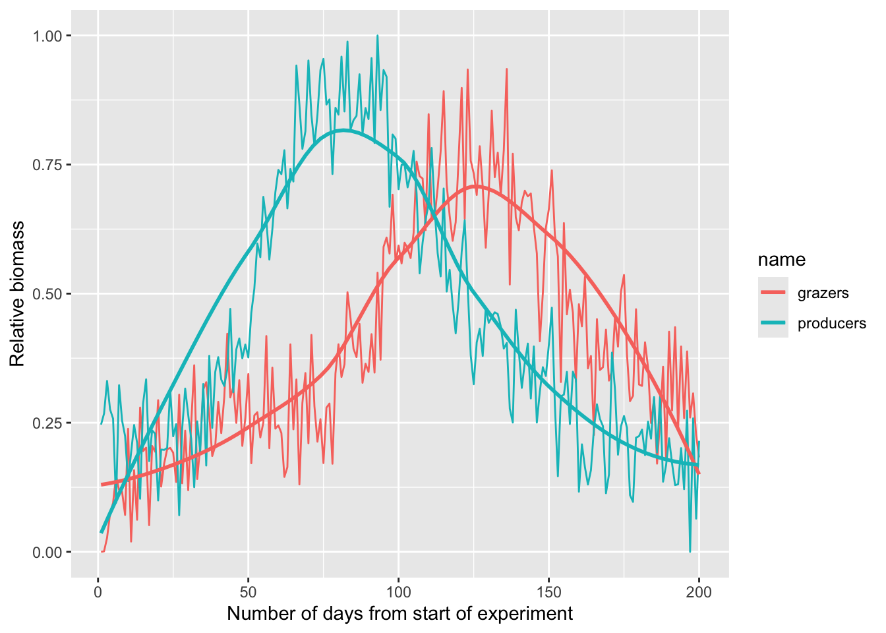

# Cross Correlation


## Big Idea
Here we extend the concept of the autocorrelation function to a bivariate case of how `y` might be correlated with lagged values of `x`.

## Reading
Have a look at Chapter three from @Cowpertwait2009. It's OK to skim the readings in this book. It's not a great book for our purposes as many of you haven't taken linear algebra and the book occasionally goes that way. But it's useful to hum your way through the chapter nonetheless.

## Packages
I'll use `forecast` [@R-forecast] as well as tidyverse [@R-tidyverse] syntax. 


``` r
library(tidyverse)
library(forecast)
```

## Lags
Here is a quick primer on different ways of lagging data.


``` r
n <- 10
x <- ts(rnorm(n))
x
```

```
## Time Series:
## Start = 1 
## End = 10 
## Frequency = 1 
##  [1]  0.079854780  0.233410688  0.107206736  1.150652223  0.903326353
##  [6] -0.965635624 -0.146067990 -0.559301795 -0.214952105  0.001970085
```

``` r
# v1: Lag by hand
xLag_v1 <- ts(c(NA,x[-n]))
# v2: use stats::lag ("little el lag")
# Note the sign of k: negative k starts later.
xLag_v2 <- stats::lag(x, k = -1)
xLag_v2
```

```
## Time Series:
## Start = 2 
## End = 11 
## Frequency = 1 
##  [1]  0.079854780  0.233410688  0.107206736  1.150652223  0.903326353
##  [6] -0.965635624 -0.146067990 -0.559301795 -0.214952105  0.001970085
```

``` r
# v3: use Hmisc::Lag  ("big el lag")
# Note that shift is specifies the number of observations 
# to be shifted to the right -- positive shift starts later.
xLag_v3 <- Hmisc::Lag(x, shift = 1)
xLag_v3
```

```
## Time Series:
## Start = 1 
## End = 10 
## Frequency = 1 
##  [1]          NA  0.07985478  0.23341069  0.10720674  1.15065222  0.90332635
##  [7] -0.96563562 -0.14606799 -0.55930180 -0.21495211
```

``` r
# ^^ This is the same behavior that dplyr::lag has. E.g.,
dplyr::lag(c(x),n=1)
```

```
##  [1]          NA  0.07985478  0.23341069  0.10720674  1.15065222  0.90332635
##  [7] -0.96563562 -0.14606799 -0.55930180 -0.21495211
```

``` r
# But dplyr::lag doesn't like ts objects, hence the c(x). 
# It's all gross to parse out, I know.

tsp(xLag_v1)
```

```
## [1]  1 10  1
```

``` r
tsp(xLag_v2)
```

```
## [1]  2 11  1
```

``` r
tsp(xLag_v3)
```

```
## [1]  1 10  1
```

``` r
# ts.union helps you see what's going on
ts.union(x,xLag_v1,xLag_v2,xLag_v3)
```

```
## Time Series:
## Start = 1 
## End = 11 
## Frequency = 1 
##               x     xLag_v1      xLag_v2     xLag_v3
##  1  0.079854780          NA           NA          NA
##  2  0.233410688  0.07985478  0.079854780  0.07985478
##  3  0.107206736  0.23341069  0.233410688  0.23341069
##  4  1.150652223  0.10720674  0.107206736  0.10720674
##  5  0.903326353  1.15065222  1.150652223  1.15065222
##  6 -0.965635624  0.90332635  0.903326353  0.90332635
##  7 -0.146067990 -0.96563562 -0.965635624 -0.96563562
##  8 -0.559301795 -0.14606799 -0.146067990 -0.14606799
##  9 -0.214952105 -0.55930180 -0.559301795 -0.55930180
## 10  0.001970085 -0.21495211 -0.214952105 -0.21495211
## 11           NA          NA  0.001970085          NA
```


## From ACF to CCF
Chapter 3 introduces cross-correlation in the context of forecasting. Here, we reinforce the idea with a simple example and tie it back to the concept of autocorrelation.

Autocorrelation is the correlation of a variable with its own past values (e.g., $y_t$ with $y_{t-1}$). Cross-correlation extends this idea to two different time series, asking: how does $x_{t-k}$ relate to $y_t$?

You’re already used to the idea that you can correlate two variables $x$ and $y$, but you can also lag $x$ like we did for autocorrelation. For example, $y_t$ can be correlated to $x_{t-1}$, which we can implement like this: `cor(y[2:n], x[1:(n-1)])`.

Here’s a toy example:


``` r
n <- 100
x <- rnorm(n)
y <- c(0, x[-n]) + rnorm(n, sd = 0.5)
cor(x, y) # doesn't correlate
```

```
## [1] 0.1149159
```

``` r
cor(x[1:(n-1)], y[2:n]) # correlates great!
```

```
## [1] 0.8908105
```

``` r
Ccf(x, y) # the cross correlation plot
```



By hand, you can see that $\text{cor}(x_{t-1}, y_t) = 0.891$, whereas $\text{cor}(x_t, y_t) = 0.115$. We can view these correlations across multiple lags using the cross-correlation plot from `Ccf`. That function returns the correlation between $x_{t+k}$ and $y_t$ for various values of lag $k$.

A positive lag on the plot means that **x is lagged behind y** (i.e., you're correlating earlier y-values with later x-values), while a negative lag means **x leads y** — and might be useful for forecasting.

This kind of lagged relationship is useful for **predictive modeling**, where we use past values of one variable to forecast the present (or future) values of another.

Thus, given a time series like $x_t$, we could forecast $y_t$ based on $x_{t-1}$:


``` r
# lag x
xLag <- c(0, x[-n])
# note this does the same lag operation
xLag <- dplyr::lag(x, n = 1, default = 0)

lmY <- lm(y ~ xLag)
plot(y, predict(lmY))
abline(lmY, col = "blue")
```



Cross-correlation is commonly used to identify short-lag predictive relationships. This is common in economics (e.g., jobless claims leading GDP) and in environmental science — for instance, where river discharge might precede changes in turbidity, or phytoplankton peaks might precede zooplankton booms.

As with all time series correlations, beware of spurious relationships — especially when both series share strong seasonal or trend components.


## How `Ccf()` Normalizes Correlations

The eagle-eyed among you will notice that the values from `Ccf` don't align exactly with what `cor` produces. For the detail oriented, here is the scoop.

The `ccf()` function in R computes cross-correlations that are normalized in a specific way. It uses the full-series mean and standard deviation for both variables, even when the number of overlapping points decreases at higher lags. This section shows what that means in practice and how to manually reproduce the `ccf()` result at lag 1.

Let's create some data.


``` r
n <- 100
x <- rnorm(n)

# make y depend on lagged x (lag = 1)
y <- 0.8 * c(0, x[1:(n-1)]) + rnorm(n, sd = 0.5)

# Lagged vectors aligned for lag 1
x_lag <- x[1:(n - 1)]
y_trunc <- y[2:n]
```

We construct `y` to depend on a lagged version of `x`, and use `0` as the first value to avoid introducing an `NA`.

Let's get the correlation at lag one using `cor()`


``` r
cor(x_lag, y_trunc)
```

```
## [1] 0.8302037
```

This computes a standard Pearson correlation using only the overlapping values. It uses `n - 1` observations and calculates means and standard deviations from that subset.

Let's compare that to what `ccf()` gives


``` r
ccf_obj <- Ccf(x, y, lag.max = 10)
```



``` r
ccf_lag1 <- ccf_obj$acf[ccf_obj$lag == -1]
ccf_lag1
```

```
## [1] 0.8253849
```

That correlation at lag 1 from `ccf_lag1`  is **slightly different** from the result of `cor(x_lag, y_trunc)` (0.8302037). Why? Because `ccf()`:
- Uses only `n - 1` data pairs at lag 1
- But computes the mean and standard deviation using all `n` values from the full series of `x` and `y`

This ensures that correlation values at all lags are on the same scale.

We can manually reproduce what `ccf()` does


``` r
k <- 1  # lag
num <- sum((x_lag - mean(x)) * (y_trunc - mean(y)))        # numerator
denom <- (n - k) * sd(x) * sd(y)                           # denominator uses full-series SDs
manual_ccf <- num / denom
manual_ccf
```

```
## [1] 0.8253849
```

This manual calculation matches the value from `ccf()` exactly.

You might ask yourself: why  does this matter? Well, this normalization approach allows `ccf()` (and `acf()`) to produce values that are comparable across different lags, even as the number of overlapping pairs shrinks. It’s a subtle point, but crucial for accurate interpretation of time series correlations. And when lags get really large like in the autotrophs and heterotrophs example, it's worth understanding what happens under the hood.

## Your work
Look at the file `PhytoGrazersExp1.rds`. It contains data used in a mesocosm simulation. The `producers` time series shows relative biomass of phytoplankton while the `grazers` time series shows the zooplankton biomass. The times are indexed by `day`. 


``` r
pg <- readRDS("data/PhytoGrazersExp1.rds")
# make these wide data long
pgLong <- pg %>% pivot_longer(cols=-1)
# and make a nice ggplot
ggplot(pgLong,aes(x=day,y=value,color=name)) +
  geom_line() +
  geom_smooth(se = FALSE) +
  labs(y="Relative biomass",
       x="Number of days from start of experiment")
```

```
## `geom_smooth()` using method = 'loess' and formula = 'y ~ x'
```



It seems clear that there is an offset between the two series. Just eyeballing it, it looks like there is a four to six week lag between the grazers and producers. Use cross correlation and see if you can determine the lagged relationship more specifically. 

The file `PhytoExp2.rds` shows you just the phytoplankton from another experiment. Can you forecast the grazers over that time period? That is, show how you can use the lagged relationship between producers and grazers you found above to model the grazers in `PhytoExp2.rds`.


### Write Up and Reflect
Pass in a R Markdown doc with your analysis. Leave all code visible, although you may quiet messages and warnings if desired. Turn in your knitted html. The last section of your document should include a reflection where you explain how it all went. What triumphs did you have? What is still confusing?

