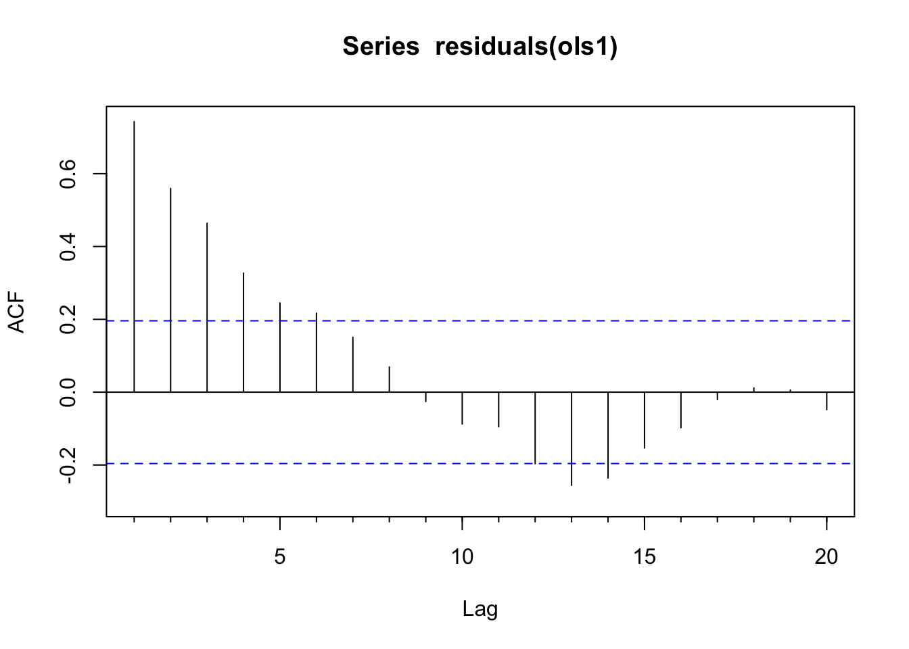
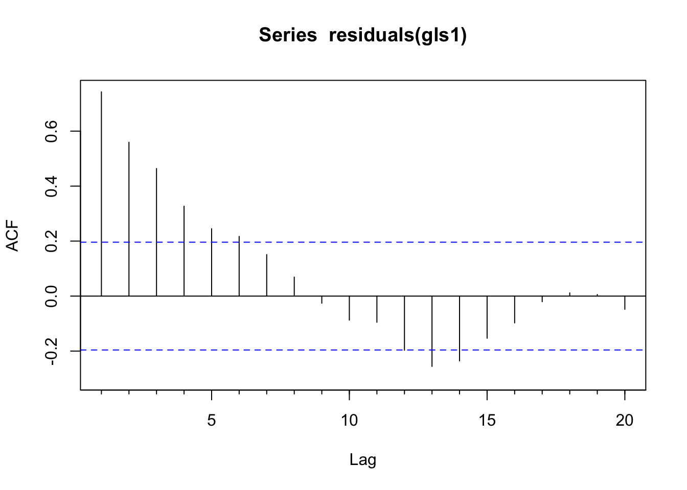

# Regression


## Big Idea
OLS regression can be problematic with time series because the assumption of independence gets violated pretty easily. But, there are other approaches that are useful.

## Reading
Have a look at Chapter five (through section 5.3) from @Cowpertwait2009. It's OK to skim the readings in this book. It's not a great book for our purposes as many of you haven't taken linear algebra and the book occasionally goes that way. But it's useful to hum your way through the chapter nonetheless.

## Packages
You'll want to install the `nlme` [@R-nlme] library if you don't have it. We are going to fit a linear model using generalized least squares as opposed to ordinary least squares and you'll need the `gls` function from `nlme`. I'll use `forecast` [@R-forecast] as well and tidyverse [@R-tidyverse]. 


``` r
library(tidyverse)
library(nlme)
library(forecast)
```

## Regression
### Adjusting OLS
As know, time series data are typically autocorrelated in some way. We've seen this over and over and we've learned to spot it and to fit models of various complexity to describe it. 

A very common situation with environmental data is to want to do an ordinary least squares regression using time series data. If your data are a time series, you are doing time-series regression. And that has different pitfalls than standard regression.

The biggest issue is that if the residuals (errors) are autocorrelated, you have violated the assumption of independence.  What does this mean? Well, [the standard errors on the coefficient estimates tend to be underestimated (and the t-scores overestimated) when the autocorrelations of the errors at low lags are positive](https://en.wikipedia.org/wiki/Autocorrelation#Regression_analysis). This means that any statistical inference could be wrong, e.g., the the p-values from a t-test will be artificially low. But despair not! If we take the the time series structure of the errors into account we can usually still model the association between $x$ and $y$ effectively. 

Is this a little opaque? Let's make up an example. Let's say you wanted to build a model of salmon in a creek as function of the summer water temperature. Temps get too warm  and the wee fish suffer and die before they get counted by the poor intern. You can make up a mechanism however you like. This is just a thought experiment, right? So you make a nice linear model $y=\beta_0 + \beta_1 x + \epsilon$ where $y$ is the number of salmon, $\beta_0$ is the intercept and $\beta_1$ is the coefficient on the variable $x$ which is the water temperature, and $\epsilon$ is the residual. You have a gorgeous time series every year ($t$) for some number of years which makes this a time series regression: $y_t=\beta_0 + \beta_1 x_t + \epsilon_t$. You run an OLS regression and get a negative slope and a t-test says that your model has skill (good $R^2$, $p<0.05$, etc). Great -- you fire off a letter to Nature, or write your thesis, or go put some wood in a stream, or just bathe in the satisfaction of a job well done. But of course your model won't fit perfectly so you'll have residuals or errors from the model ($\epsilon$). Now, if those residuals are not independent and identically distributed (~iid), you have violated the assumptions of the OLS regression. The standard errors might be wrong, the p-values might be inflated. Alas. The classic reason that residuals are not ~iid in time series is because they are not independent and that means autocorrelation.

In general here is a good approach when dealing with time series variables in a regression.

1. Start by doing an ordinary least squares regression.  

2. Look at the AR structure of the residuals with ACF and PACF plots.

3. If the residuals look clean then carry on. Note that it's OK for the variable $y$ or $x$ to be autocorrelated -- watch the residuals. If the residuals have AR structure, estimate and diagnose an appropriate AR or ARMA model.

4. If needed, get the adjusted regression coefficients (estimates, standard errors). We want to have a model that adjusts for the AR structure in the residuals. We can create an adjusted data set by hand and use OLS (see text) or use GLS with an appropriate correlation structure (below).

Let's create a data set to play with. We will generate two time series. The variable `x` will be ordinary white noise. The variable `y` will be a function of `x` plus AR(1) noise $\epsilon$. We will pretend we don't know about $\epsilon$ and perform two regressions of $y=f(x)$ and look at the residuals and the estimate of the slope ($\hat\beta$).  


``` r
set.seed(47) # for reproducibility
n <- 100
phi <- 0.8
x <- ts(rnorm(n))
epsilon <- arima.sim(model = list(ar=phi),n = n)
epsilon <- epsilon - mean(epsilon) # demean
B0 <- 0 # intercept
B1 <- 0.5 # slope
y <- B0 + B1*x + epsilon
# step 1 - the regular ols regression
ols1 <- lm(y~x)
# step 2 - inspect the residuals
Acf(residuals(ols1)) # problem with independence
```



``` r
Pacf(residuals(ols1)) # looks like an AR1
```


``` r
# step 3 - get a good model
ar1 <- ar(residuals(ols1))$ar
ar1
```

```
## [1] 0.7429079
```

``` r
# two ways of getting a model that works
# step 4 - method 1 - adjust by hand
# y lagged at one time step: 
# (see poscript below of notes on lagging)
y.lag1 <- c(NA,y[-n]) 
head(cbind(y,y.lag1))
```

```
## Time Series:
## Start = 1 
## End = 6 
## Frequency = 1 
##             y      y.lag1
## 1  1.27400585          NA
## 2 -0.66681772  1.27400585
## 3 -0.03946659 -0.66681772
## 4  1.07026783 -0.03946659
## 5  0.52585722  1.07026783
## 6  0.86750649  0.52585722
```

``` r
y2 <- y - ar1*y.lag1 # Use ar1 to make y white noise

x.lag1 <- c(NA,x[-n]) # x lagged at one time step
x2 <- x - ar1*x.lag1 # Use ar1 to make x white noise

ols2 <- lm(y2~x2)
Acf(residuals(ols2)) # clean
```


### GLS
We have all been taught OLS. OLS is a **method** for estimating the unknown parameters in a linear regression model -- e.g., estimating the intercept ($\beta_0$) and slope ($\beta_1$) of a line in the formula $y=\beta_0 + \beta_1x$. OLS works by choosing the parameters of a linear function by minimizing the sum of the squares of the differences between the observed dependent variable ($y$) in the given data set and those predicted by the linear function (e.g., $y=\beta_0 + \beta_1x$ in the example above, but note that you can have more than one independent variable in a multiple regression). If conditions like homoscedasticity, independence, and normality are met, the OLS estimators are optimal (often called BLUE -- Best Linear Unbiased Estimators). In other words, when the assumptions are met, OLS works. OLS has a nice property that teaching it is relatively simple and can be done without a bunch of matrix algebra. You can calculate the sum of squares by hand and in intro stats courses we relate OLS to simpler concepts like correlation.

The other common least squares approach is generalized least squares (GLS). GLS is a **method** of estimation of a linear process which accounts for heteroscedasticity and structure in the error term. If OLS is used for homoscedastic regressions (i.e. $y$ has the same variance for each $x$), GLS is used for heteroscedastic regression (different variances). GLS can also be used for correlated (non-independent) residuals. The theory with GLS is that the residuals can be transformed so that the variances are equal and uncorrelated. You can think of it like this: OLS minimizes the sum of the squared distances between the observed and predicted values assuming uncorrelated and equal variance in errors. GLS minimizes the squared distances relative to the **covariance structure** of the residuals.

Formally, the GLS estimator is:
\[ \hat{\beta}_{GLS} = (X^\top \Sigma^{-1} X)^{-1} X^\top \Sigma^{-1} y \]
where $\Sigma$ is the error covariance matrix.

When using `gls()` from the `nlme` package in R, estimation is typically done via **Restricted Maximum Likelihood (REML)**, which is particularly useful when estimating variance parameters in the presence of correlation. But the core idea is still weighted least squares — just with more structure in how we define those weights.

In spatial and time-series analysis, the error term is often autocorrelated. So, if the important difference between OLS and GLS is the assumptions made about the error term of the model, we can use GLS to allow for autocorrelated errors and avoid having inefficient estimation of the unknown parameters in a linear model. [Why not always use GLS over OLS?](https://www.reddit.com/r/AskStatistics/comments/36ocl1/why_not_always_use_gls_over_ols/). It's a good question and I think of it along the lines of the [KISS principle](https://en.wikipedia.org/wiki/KISS_principle). If you meet the OLS assumptions, use it. If you don't then look for alternatives like GLS. Also, GLS requires you to know (or correctly guess) the structure of the residual correlations — if you get that wrong, you might do more harm than good.

We will start by assuming `epsilon` follows an iid process (e.g., $N(0,1)$) and we will fit a model with uncorrelated errors. E.g., here we use `gls` but this gives the same info as `lm` would because `gls` assumes iid errors unless told otherwise.


``` r
# step 1 - the regular ols regression but fit with gls rather than lm
gls1 <- gls(y~x)
summary(gls1)
```

```
## Generalized least squares fit by REML
##   Model: y ~ x 
##   Data: NULL 
##        AIC     BIC    logLik
##   395.8891 403.644 -194.9446
## 
## Coefficients:
##                  Value Std.Error   t-value p-value
## (Intercept) 0.01618039 0.1690315 0.0957241  0.9239
## x           0.18575084 0.1726484 1.0758912  0.2846
## 
##  Correlation: 
##   (Intr)
## x -0.053
## 
## Standardized residuals:
##        Min         Q1        Med         Q3        Max 
## -2.4730783 -0.3348105  0.1230050  0.5216485  2.3144795 
## 
## Residual standard error: 1.687976 
## Degrees of freedom: 100 total; 98 residual
```

``` r
# step 2 - inspect the residuals
Acf(residuals(gls1)) # problem with independence
```



``` r
Pacf(residuals(gls1)) # looks like an AR1
```


The residuals of this model are autocorrelated as an AR(1) process from looking at the plots. Thus, we have violated the assumption of independent residuals. But do not despair. We will use a GLS model that allows us to specify an AR(1) correlation structure for the residuals and perform hypothesis testing in the presence of this temporal structure. Doing so, will give us new and improved estimates of the parameters. We will thus sleep well knowing in our hearts that we have done good.

We will do this by updating the `gls1` object and specifying that errors follow an autoregressive process with the `corARMA` function. By specifying `corARMA(p=1)` we are asking `nlme` to fit an AR(1) error structure. An AR(1) assumes that residuals closer in time are more similar and the correlation decays geometrically. If we had residuals that followed a different process (e.g., an ARMA(1,1) model) we could try to fit that with `corARMA(p=1, q=1)`. The `update` function will then try to estimate the AR and MA parameters using numerical optimization. This can fail when models are too complex (e.g., too high an order).


``` r
# step 3 - update the model with an appropriate correlation structure
cs1 <- corARMA(p=1)
gls2 <- update(gls1,correlation=cs1)
summary(gls2)
```

```
## Generalized least squares fit by REML
##   Model: y ~ x 
##   Data: NULL 
##      AIC      BIC  logLik
##   307.26 317.5998 -149.63
## 
## Correlation Structure: AR(1)
##  Formula: ~1 
##  Parameter estimate(s):
##       Phi 
## 0.7946776 
## 
## Coefficients:
##                  Value Std.Error   t-value p-value
## (Intercept) -0.0697539 0.5035316 -0.138529  0.8901
## x            0.4496653 0.0948284  4.741882  0.0000
## 
##  Correlation: 
##   (Intr)
## x -0.023
## 
## Standardized residuals:
##        Min         Q1        Med         Q3        Max 
## -2.4516182 -0.4319559  0.1445074  0.5484367  2.1868956 
## 
## Residual standard error: 1.767387 
## Degrees of freedom: 100 total; 98 residual
```

``` r
# step 4 - and inspect the residuals. Note type="normalized"
# in the calls to `residuals`.
Acf(residuals(gls2,type="normalized")) # clean!
```


We ask for the "normalized" residuals above because they are the transformed residuals that account for the error correlation and heteroscedasticity structure we specified. They’re essentially standardized residuals that assume your model’s covariance matrix is correct.

Zooming out a bit. We fit a linear model of the form $y=\beta_0 + \beta_1x$ using GLS and got out estimates for the intercept ($\hat\beta_0$) and slope ($\hat\beta_1$). First, we assumed that the error term was uncorrelated. Looking at summary, we can see the the estimate of the slope ($\hat\beta_1$) is 0.186 and significantly different than zero. We also have a variety of goodness of fit statistics and some other goodies. I'll walk through those in the video. The important thing to wrap your head around here is that we fit GLS with uncorrelated errors meaning it's essentially identical to OLS. Compare the above to the more familiar `summary(lm(y~x))`.

So what's the big deal? We started with a model that showed `x` as a significant predictor of `y`. We ended up, after much wailing and rending of garments, with a model that showed `x` as a significant predictor of `y`. Is it a better model? Was it worth the trouble? Let's consider a few things. 


``` r
anova(gls1,gls2)
```

```
##      Model df      AIC      BIC    logLik   Test  L.Ratio p-value
## gls1     1  3 395.8891 403.6440 -194.9445                        
## gls2     2  4 307.2600 317.5998 -149.6300 1 vs 2 90.62914  <.0001
```

1. The GLS model with the correlated residuals has a lower AIC and BIC than the naive uncorrelated model.

2. The original function we used to make $y$ was $y=\beta_0 + \beta_1x + \epsilon$ where $\beta_0 = 0$ and $\beta_1$ = 0.5. Both the GLS models got the intercept right (-0.07 for `gls2` and 0.02 for `gls1`). But the GLS model with the correlated residuals does a better job of getting the true value of the slope (0.45 vs 0.19).

3. The error estimate on $\beta_1$ was lower on the model with correlated residuals than the naive uncorrelated model (0.0948 vs 0.1726). This is because GLS uses the correct structure of error variance and correlation, which improves **efficiency** of parameter estimation.

Finally, we did it "right" -- that should be satisfying. What would have happened if $\beta_1$ had been lower? That is, what if $y$ was made up of more noise and less $x$? E.g., $y=\beta_0 + 0.5(\beta_1)x + 2(\epsilon)$? This model, with 100 points should be pretty robust on the simple hypothesis test on the slope (H$_1$: $\beta_1 \neq 0$) but we know that parameter estimation is inefficient with autocorrelated residuals so having clean residuals and good parameter estimation is important.

There is a lot to learn about how the `nlme` library goes about fitting the correlation structures. The definitive book on the subject is Pinheiro and Bates (2000) and should be something you look to for more information. Zuur's 2009 book "Mixed Effects Models and Extensions in Ecology with R" is also quite good.

## Your work
### What Does Generalized Mean?
Below I'm going to ask you to compare GLS and OLS using some real data. But first, write a paragraph that explains the difference between OLS and GLS. What is a generalized model?

### Regression Simulation
Now, revisit the code above and adjust `n`, `B1`, and `phi` to see how the results of an OLS model change. Is OLS or GLS better at capturing the true value of `B1` when there are non-independent errors? Or is OLS robust to moderate autocorrelation? You can do this in a full blown simulation of course, but you can just mess around with the values a bit and try to get a feel for it.


### Regression for real
Finally, let's look at some data. A great [paper](http://onlinelibrary.wiley.com/doi/10.1002/2015GL067613/full) by Connie Woodhouse and colleagues looks at how annual flows on the Colorado River are affected by precipitation, soil moisture, and temperature. Read the paper. It's great and short. 


``` r
dat <- readRDS("data/woodhouse.rds")
dat <- dat %>% mutate(MAF = LeesWYflow / 1e6)
# add a 5-yr moving average
dat <- dat %>% mutate(MAF5yr = c(stats::filter(MAF,filter = rep(0.2,5))))
ggplot(data=dat, aes(x=Year)) +
  geom_line(aes(y=MAF),color="lightgreen") + 
  geom_line(aes(y=MAF5yr),color="darkgreen") + 
  labs(y= "Millions of Acre Feet", title="Colorado River at Lee's Ferry",
       sub = "Total Flow for Water Year") + 
  scale_x_continuous(expand=c(0,0))
```

```
## Warning: Removed 4 rows containing missing values or values outside the scale range
## (`geom_line()`).
```


The main gist of the paper is that precipitation explains most of the variability in the river's flow but that temperature is important under certain conditions. E.g., "Different combinations of temperature, precipitation, and soil moisture can result in flow deficits of similar magnitude, but recent droughts have been amplified by warmer temperatures that exacerbate the effects of relatively modest precipitation deficits." This is cool: Transpiration and evaporation are greater when it's warmer, right? The cool thing that Woodhouse et al. have done is tease out the relationship between precipitation and temperature in a new way.

The data they used are [online](http://api.onlinelibrary.wiley.com/asset/v1/doi/10.1002%2F2015GL067613/asset/supinfo%2Fgrl54032-sup-0002-supplementary.xls?l=SkaBT8QEx2qJNlNuWYUA8egjXrDIGPrsc%2BJNFhVbgejndxaATsnxsKxw9Obx5z6ES3xmGsI%2BC8dr%0ATCeBc2NX422bcHVTPUXn) and I've grabbed the relevant info and put it in the file `woodhouse.rds` as a `data.frame`. Explore the data (go back to week one for ideas of what to do -- **plot your data!**) and eventually make a model of river flow (`LeesWYflow`) as a function of October to April precipitation (`OctAprP`). The units on flow are cumulative flow over the water year in acre feet and cumulative October to April precipitation is in mm.

Is it a good model? How do the residuals look in a time series context? Interpret. Does a GLS approach change your interpretation from an OLS approach? Given your work with the simulated data above do you think Woodhouse et al. are on safe footing with OLS?


### Write Up and Reflect
Pass in a R Markdown doc with your analysis. Leave all code visible, although you may quiet messages and warnings if desired. Turn in your knitted html. The last section of your document should include a reflection where you explain how it all went. What triumphs did you have? What is still confusing?


