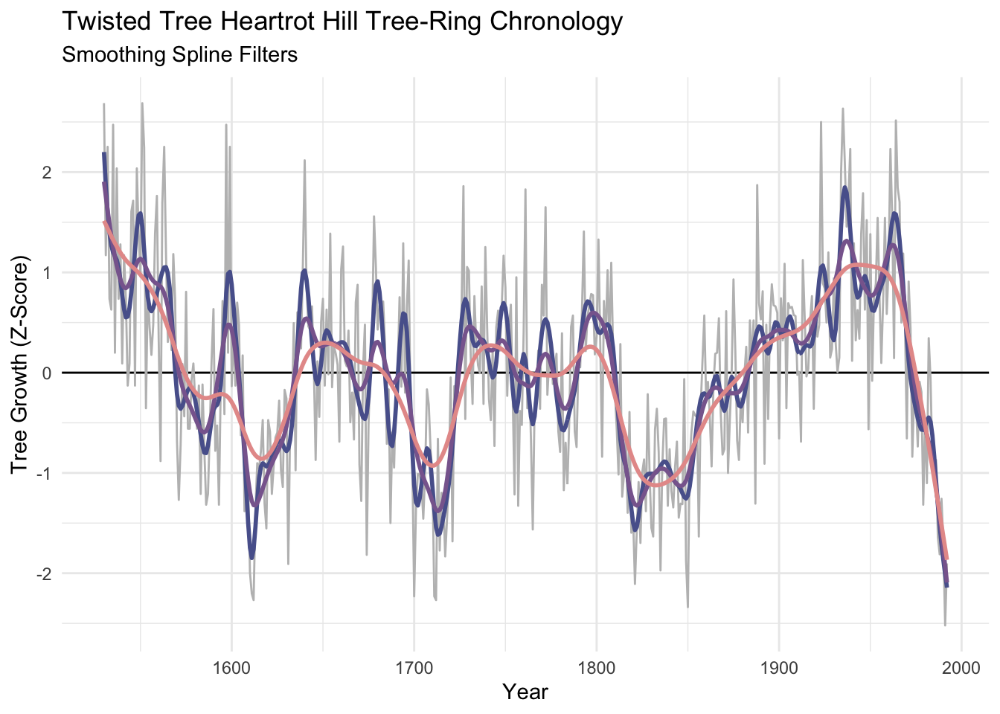
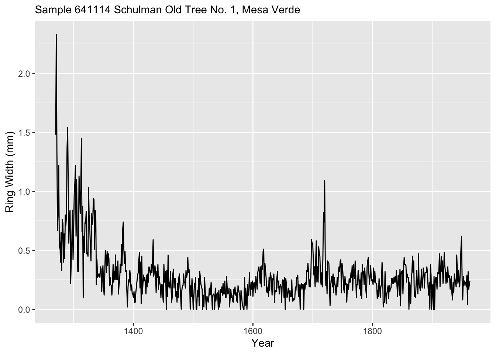
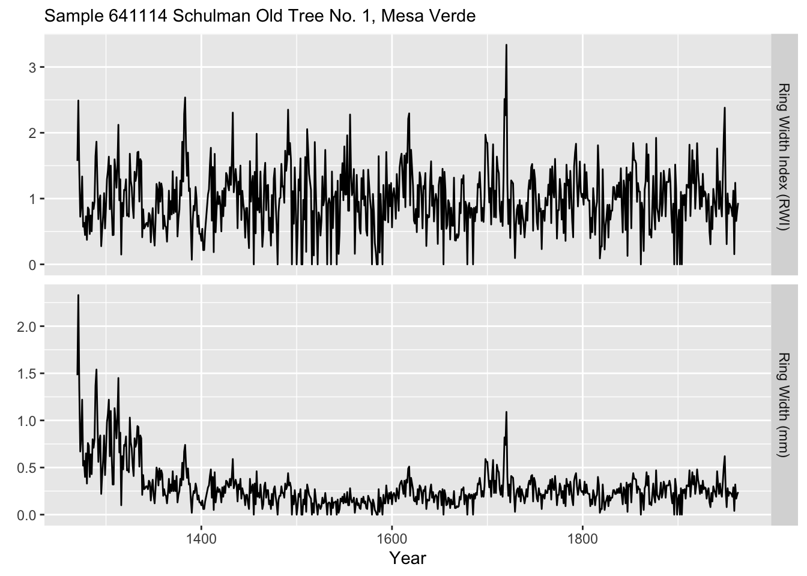
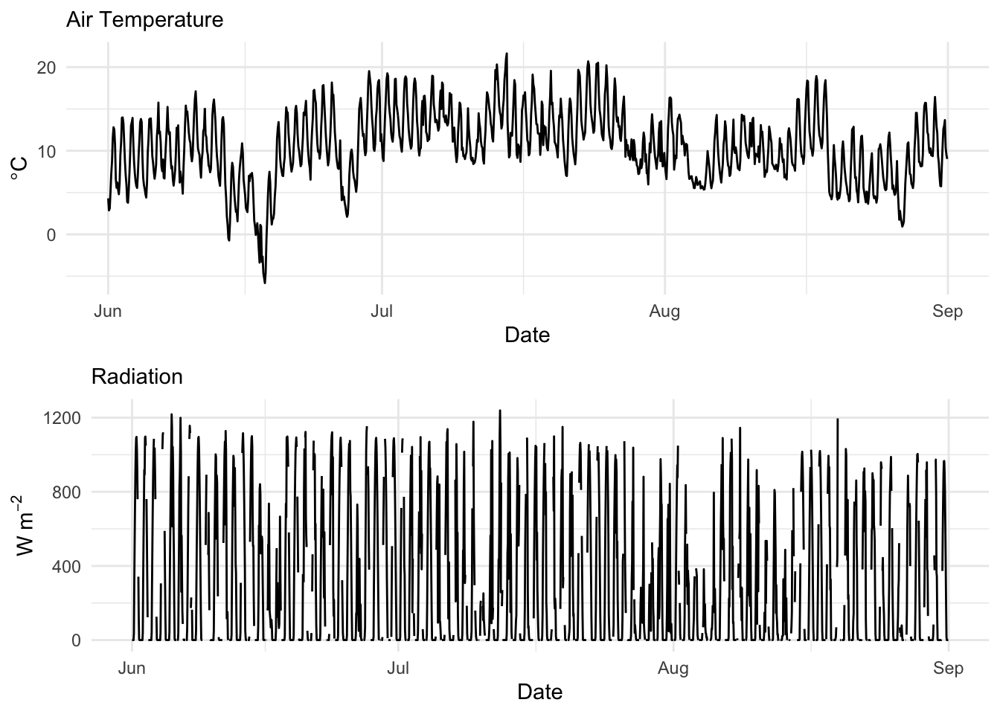

# Filtering, smoothing


## Big Idea
Very often one wants to smooth or filter data to analyze or work only with particular aspects of the data. This kind of analysis is a big deal in time-series analysis. Smoothing is a way of isolating different frequencies of data but still thinking in the time domain.

## Packages
You will want the `dplR` [@R-dplR] package -- a subtle work of staggering genius -- as well as `zoo` [@R-zoo] and `hydroTSM` [@R-hydroTSM].


``` r
library(tidyverse)
library(dplR)
library(hydroTSM)
library(zoo)
```

## Filters as visual aids 
Recall the very simple moving average filters we made earlier in class? Let's revisit. People who work with time series are forever adding smooth lines to their plots in order to highlight signal and de-emphasize noise. It's like a sickness. And everybody has a different way of doing it. We already looked at moving averages using the `filter()` function. Let's just take a quick peek at some other common ones.

We've been using a lot simulated data, which is something I really like to do. It's good for setting up situations where we want to see if we understand how a method works. But let's use some tree-ring data this time to demonstrate a few different smoothing options.

This is a tree-ring chronology from near the arctic treeline in Canada that is one of the onboard data sets in `dplR`. I've pulled out the years for plotting. 


``` r
data(cana157)
dat <- tibble(yrs = time(cana157), Z = scale(cana157[,1]))
nyrs <- nrow(dat)
p1 <- ggplot() + 
  geom_hline(yintercept = 0) +
  geom_line(data=dat, mapping = aes(x=yrs,y=Z), color = "grey") +
  labs(x="Year",y="Tree Growth (Z-Score)", 
       title="Twisted Tree Heartrot Hill Tree-Ring Chronology") +
  theme_minimal()
p1
```


### Moving (running) average

We've already looked at moving averages (aka running averages). Let's revisit. These have the advantage of being dirt simple. Below we will see that they definitely emphasize low frequency in the examples below (at 20, 50, and 100 years) but retain some jaggedness too.


``` r
sfPal <- PNWColors::pnw_palette(name="Starfish",n=3,type="discrete")
dat <- dat %>% 
  mutate(ma20 = c(stats::filter(x=Z, filter=rep(x=1/20,times=20), sides=2)),
         ma50 = c(stats::filter(x=Z, filter=rep(x=1/50,times=50), sides=2)),
         ma100 = c(stats::filter(x=Z, filter=rep(x=1/100,times=100), sides=2)))
p1 + labs(subtitle = "Moving Average Filters") +
  geom_line(data=dat, mapping = aes(x=yrs,y=ma20), color = sfPal[1],linewidth=1) +
  geom_line(data=dat, mapping = aes(x=yrs,y=ma50), color = sfPal[2],linewidth=1) +
  geom_line(data=dat, mapping = aes(x=yrs,y=ma100), color = sfPal[3],linewidth=1)
```

```
## Warning: Removed 19 rows containing missing values or values outside the scale range
## (`geom_line()`).
```

```
## Warning: Removed 49 rows containing missing values or values outside the scale range
## (`geom_line()`).
```

```
## Warning: Removed 99 rows containing missing values or values outside the scale range
## (`geom_line()`).
```


### Hanning
The Hanning filter is similar to the moving average in the sense that the curve emphasizes low frequency variability and loses the jaggedness over the moving average. It's also a  simple filter (look at the code by typing `hanning` at the `R` prompt) but it is a start into thinking in the frequency domain. It's part of a family of functions called window functions that are zero-valued outside of some interval chosen by the user. It's used quite a bit by time-series wonks and it is implemented in `dplR` with the function `hanning()`. I'll skip the theory here but it's a great precursor to the work we will do with spectral analysis next week.


``` r
dat <- dat %>% 
  mutate(han20 = hanning(Z,n=20),
         han50 = hanning(Z,n=50),
         han100 = hanning(Z,n=100))
p1 + labs(subtitle = "Hanning Filters") +
  geom_line(data=dat, mapping = aes(x=yrs,y=han20), color = sfPal[1],linewidth=1) +
  geom_line(data=dat, mapping = aes(x=yrs,y=han50), color = sfPal[2],linewidth=1) +
  geom_line(data=dat, mapping = aes(x=yrs,y=han100), color = sfPal[3],linewidth=1)
```

```
## Warning: Removed 19 rows containing missing values or values outside the scale range
## (`geom_line()`).
```

```
## Warning: Removed 49 rows containing missing values or values outside the scale range
## (`geom_line()`).
```

```
## Warning: Removed 99 rows containing missing values or values outside the scale range
## (`geom_line()`).
```


Like the moving average the smooth is shorter than the input data. It's too bad because its nice to preserve the ends of the data but there is much wringing of hands and gnashing of teeth about the "right" way of running a smoothing algorithm where the data are sparse. This so-called end-member problem is the subject of a lot of work in the time-series literature.

Let's look at `dat`. Here are the first 75 rows in a sortable table.

``` r
DT::datatable(round(dat,2),options = list(pageLength = 75))
```

```{=html}
<div class="datatables html-widget html-fill-item" id="htmlwidget-25d19f70ed3b04491bc5" style="width:100%;height:auto;"></div>
<script type="application/json" data-for="htmlwidget-25d19f70ed3b04491bc5">{"x":{"filter":"none","vertical":false,"data":[["1","2","3","4","5","6","7","8","9","10","11","12","13","14","15","16","17","18","19","20","21","22","23","24","25","26","27","28","29","30","31","32","33","34","35","36","37","38","39","40","41","42","43","44","45","46","47","48","49","50","51","52","53","54","55","56","57","58","59","60","61","62","63","64","65","66","67","68","69","70","71","72","73","74","75","76","77","78","79","80","81","82","83","84","85","86","87","88","89","90","91","92","93","94","95","96","97","98","99","100","101","102","103","104","105","106","107","108","109","110","111","112","113","114","115","116","117","118","119","120","121","122","123","124","125","126","127","128","129","130","131","132","133","134","135","136","137","138","139","140","141","142","143","144","145","146","147","148","149","150","151","152","153","154","155","156","157","158","159","160","161","162","163","164","165","166","167","168","169","170","171","172","173","174","175","176","177","178","179","180","181","182","183","184","185","186","187","188","189","190","191","192","193","194","195","196","197","198","199","200","201","202","203","204","205","206","207","208","209","210","211","212","213","214","215","216","217","218","219","220","221","222","223","224","225","226","227","228","229","230","231","232","233","234","235","236","237","238","239","240","241","242","243","244","245","246","247","248","249","250","251","252","253","254","255","256","257","258","259","260","261","262","263","264","265","266","267","268","269","270","271","272","273","274","275","276","277","278","279","280","281","282","283","284","285","286","287","288","289","290","291","292","293","294","295","296","297","298","299","300","301","302","303","304","305","306","307","308","309","310","311","312","313","314","315","316","317","318","319","320","321","322","323","324","325","326","327","328","329","330","331","332","333","334","335","336","337","338","339","340","341","342","343","344","345","346","347","348","349","350","351","352","353","354","355","356","357","358","359","360","361","362","363","364","365","366","367","368","369","370","371","372","373","374","375","376","377","378","379","380","381","382","383","384","385","386","387","388","389","390","391","392","393","394","395","396","397","398","399","400","401","402","403","404","405","406","407","408","409","410","411","412","413","414","415","416","417","418","419","420","421","422","423","424","425","426","427","428","429","430","431","432","433","434","435","436","437","438","439","440","441","442","443","444","445","446","447","448","449","450","451","452","453","454","455","456","457","458","459","460","461","462","463"],[1530,1531,1532,1533,1534,1535,1536,1537,1538,1539,1540,1541,1542,1543,1544,1545,1546,1547,1548,1549,1550,1551,1552,1553,1554,1555,1556,1557,1558,1559,1560,1561,1562,1563,1564,1565,1566,1567,1568,1569,1570,1571,1572,1573,1574,1575,1576,1577,1578,1579,1580,1581,1582,1583,1584,1585,1586,1587,1588,1589,1590,1591,1592,1593,1594,1595,1596,1597,1598,1599,1600,1601,1602,1603,1604,1605,1606,1607,1608,1609,1610,1611,1612,1613,1614,1615,1616,1617,1618,1619,1620,1621,1622,1623,1624,1625,1626,1627,1628,1629,1630,1631,1632,1633,1634,1635,1636,1637,1638,1639,1640,1641,1642,1643,1644,1645,1646,1647,1648,1649,1650,1651,1652,1653,1654,1655,1656,1657,1658,1659,1660,1661,1662,1663,1664,1665,1666,1667,1668,1669,1670,1671,1672,1673,1674,1675,1676,1677,1678,1679,1680,1681,1682,1683,1684,1685,1686,1687,1688,1689,1690,1691,1692,1693,1694,1695,1696,1697,1698,1699,1700,1701,1702,1703,1704,1705,1706,1707,1708,1709,1710,1711,1712,1713,1714,1715,1716,1717,1718,1719,1720,1721,1722,1723,1724,1725,1726,1727,1728,1729,1730,1731,1732,1733,1734,1735,1736,1737,1738,1739,1740,1741,1742,1743,1744,1745,1746,1747,1748,1749,1750,1751,1752,1753,1754,1755,1756,1757,1758,1759,1760,1761,1762,1763,1764,1765,1766,1767,1768,1769,1770,1771,1772,1773,1774,1775,1776,1777,1778,1779,1780,1781,1782,1783,1784,1785,1786,1787,1788,1789,1790,1791,1792,1793,1794,1795,1796,1797,1798,1799,1800,1801,1802,1803,1804,1805,1806,1807,1808,1809,1810,1811,1812,1813,1814,1815,1816,1817,1818,1819,1820,1821,1822,1823,1824,1825,1826,1827,1828,1829,1830,1831,1832,1833,1834,1835,1836,1837,1838,1839,1840,1841,1842,1843,1844,1845,1846,1847,1848,1849,1850,1851,1852,1853,1854,1855,1856,1857,1858,1859,1860,1861,1862,1863,1864,1865,1866,1867,1868,1869,1870,1871,1872,1873,1874,1875,1876,1877,1878,1879,1880,1881,1882,1883,1884,1885,1886,1887,1888,1889,1890,1891,1892,1893,1894,1895,1896,1897,1898,1899,1900,1901,1902,1903,1904,1905,1906,1907,1908,1909,1910,1911,1912,1913,1914,1915,1916,1917,1918,1919,1920,1921,1922,1923,1924,1925,1926,1927,1928,1929,1930,1931,1932,1933,1934,1935,1936,1937,1938,1939,1940,1941,1942,1943,1944,1945,1946,1947,1948,1949,1950,1951,1952,1953,1954,1955,1956,1957,1958,1959,1960,1961,1962,1963,1964,1965,1966,1967,1968,1969,1970,1971,1972,1973,1974,1975,1976,1977,1978,1979,1980,1981,1982,1983,1984,1985,1986,1987,1988,1989,1990,1991,1992],[[2.69],[1.17],[2.25],[0.74],[0.63],[2.47],[0.2],[2.04],[0.74],[1.28],[0.09],[1.17],[0.74],[-0.13],[0.09],[1.61],[1.71],[-0.13],[2.04],[1.39],[0.96],[2.69],[2.25],[-0.35],[0.8100000000000001],[0.45],[0.18],[0.48],[1.39],[1.76],[0.31],[-0.88],[1.7],[2.25],[1.17],[0.31],[0.74],[0.23],[1.18],[0.73],[-0.68],[-1.27],[-0.73],[0.09],[-0.44],[0.8100000000000001],[-0.5600000000000001],[-0.5600000000000001],[-0.07000000000000001],[0.09],[-0.28],[-0.5600000000000001],[-0.13],[-1.21],[-0.12],[-0.77],[-1.32],[-1.21],[-0.5600000000000001],[0.13],[0.63],[-0.78],[-0.53],[-1.32],[-0.13],[0.71],[-0.41],[2.47],[0.2],[2.25],[-0.13],[0.39],[-0.13],[0.7],[0.48],[-0.62],[0.17],[-1.38],[-1.24],[-1.07],[-1.99],[-2.2],[-2.27],[-1.37],[-0.9],[-0.96],[-0.78],[-0.47],[-1.31],[-1.55],[-0.47],[-0.59],[-1.21],[-0.9399999999999999],[-0.64],[-0.6],[-0.28],[-0.97],[-1.14],[-0.17],[-0.26],[-1.91],[-0.58],[-0.48],[0.49],[-0.97],[0.6],[0.58],[0.24],[1.08],[2.12],[0.85],[0.46],[0.42],[0.66],[0.06],[-0.87],[0.11],[-0.44],[0.51],[0.74],[-0.13],[0.63],[-0.02],[1.39],[-0.14],[0.26],[0.19],[0.08],[-0.6899999999999999],[1.03],[1.26],[0.12],[0.06],[0.42],[-0.49],[-0.2],[-0.67],[0.7],[0.88],[-0.92],[-1.28],[0.05],[0.48],[-1.82],[-0.51],[0.09],[0.43],[1.56],[1.06],[0.43],[0.67],[0.5600000000000001],[0.71],[0.29],[-0.71],[-0.17],[-1.5],[-0.6],[-0.95],[-0.2],[0.03],[0.75],[-0.14],[1.29],[-0.2],[0.66],[1.12],[-0.37],[-0.92],[-2.23],[-1.35],[-1.01],[-1.02],[-1.12],[-1.46],[-1],[-0.17],[-0.32],[-0.77],[-1.01],[-2.23],[-2.27],[-0.66],[-1.77],[-1.2],[-1.29],[-1.83],[-1.46],[-1.05],[-0.05],[-1.68],[-0.13],[-0.29],[-0.19],[0.15],[0.66],[1.86],[-0.46],[1.05],[1.02],[0.16],[-0.31],[0.76],[0.29],[0.08],[-0.01],[0.86],[-0.31],[1.25],[0.45],[-0.27],[-0.47],[0.23],[-0.73],[0.46],[0.62],[0.22],[0.66],[1.17],[0.85],[-0.23],[0.45],[0.68],[-0.23],[-1.21],[0.95],[-1.33],[-0.38],[-0.52],[0.41],[1.83],[-0.35],[0.02],[-0.66],[-1.56],[-0.33],[-0.21],[0.22],[-0.36],[0.88],[0.57],[1.65],[-0.22],[0.12],[0.3],[-0.11],[0.04],[0.19],[-0.59],[-0.79],[0.39],[-1.17],[-0.7],[-1.11],[-0.48],[0.46],[0.57],[-0.59],[-0.74],[0.1],[0.05],[0.65],[1.41],[0.22],[0.5600000000000001],[0.67],[0.78],[0.77],[0.18],[0.37],[1.33],[0.27],[-0.84],[0.71],[0.34],[1.02],[0.27],[1.1],[0.25],[-0.19],[-0.5600000000000001],[-1.02],[0.28],[-1.24],[-1.02],[-0.64],[-1.4],[-0.39],[-1.6],[-1.46],[-2.11],[-1.57],[-1.09],[-1.7],[-0.99],[-0.87],[-1.38],[-0.21],[-0.99],[-1.55],[-1.63],[-0.5600000000000001],[-0.36],[-0.79],[-1.97],[-0.92],[-0.46],[-0.46],[-1.33],[-0.76],[-1.18],[-1.34],[-0.9399999999999999],[-0.6899999999999999],[-1.45],[-1.31],[-1.31],[-0.06],[-1.88],[-2.34],[-0.87],[-0.59],[-0.39],[-0.42],[-0.45],[-1.63],[-0.35],[0.11],[0.57],[-0.26],[-0.09],[-0.43],[-0.9399999999999999],[-0.14],[0.19],[0.2],[0.54],[-0.4],[-0.82],[-0.76],[0.61],[-1],[-0.47],[0],[0.93],[0.22],[-0.68],[-0.87],[-0.26],[-0.49],[-0.02],[0.26],[-0.6],[0.52],[0.1],[0.52],[-1.31],[1.87],[0.6899999999999999],[0.53],[0.8100000000000001],[-0.91],[0.48],[-0.46],[0.49],[0.88],[0.67],[0.66],[0.6],[-0.66],[0.74],[0.32],[1.09],[-0.35],[0.6899999999999999],[0.65],[0.66],[0.58],[0.5600000000000001],[-0.02],[0.02],[-0.6899999999999999],[1.12],[0.5600000000000001],[-0.04],[0.04],[0.53],[0.76],[-0.36],[0.63],[0.36],[0.48],[2.5],[0.89],[0.84],[0.5],[1.2],[0.15],[0.24],[0.9399999999999999],[0.3],[0.01],[0.15],[2.02],[2.63],[2.1],[1.46],[1.75],[2.23],[0.12],[1.29],[0.32],[0.62],[0.34],[1.39],[1.79],[0.63],[1.52],[-0.5600000000000001],[1.38],[-0.08],[0.75],[0.89],[1.54],[0.78],[0.1],[0.7],[1.54],[0.59],[1.05],[2.23],[1.53],[0.15],[2.52],[1.84],[1.7],[0.5],[1.19],[0.48],[-0.66],[0.91],[0.45],[-0.84],[-0.22],[-0.29],[-0.74],[-0.09],[-0.19],[-1.32],[-0.45],[-1.1],[0.34],[-0.06],[-0.92],[-0.92],[-0.87],[-1.64],[-1.81],[-1.26],[-1.71],[-2.52],[-1.9]],[null,null,null,null,null,null,null,null,null,1.14,1.05,1.13,1.13,1.07,1.08,0.98,0.98,0.9,0.9399999999999999,0.96,0.97,0.87,0.92,1.04,1.09,1.02,0.98,0.99,0.95,0.92,0.84,0.64,0.49,0.51,0.45,0.47,0.43,0.38,0.3,0.22,0.19,0.21,0.12,-0.06,-0.12,-0.18,-0.28,-0.35,-0.44,-0.47,-0.4,-0.38,-0.37,-0.44,-0.42,-0.43,-0.42,-0.27,-0.25,-0.15,-0.14,-0.09,-0.09,0,0.03,0.04,0.12,0.11,0.07000000000000001,0.01,-0.12,-0.19,-0.28,-0.28,-0.32,-0.4,-0.42,-0.57,-0.64,-0.83,-0.85,-0.9,-0.95,-1.03,-1.09,-1.09,-1.11,-1.09,-1.09,-1.04,-0.95,-0.9399999999999999,-0.86,-0.8100000000000001,-0.74,-0.74,-0.67,-0.62,-0.54,-0.41,-0.28,-0.21,-0.13,-0.06,0.01,0.04,0.01,0.07000000000000001,0.1,0.13,0.18,0.27,0.33,0.36,0.4,0.44,0.43,0.41,0.4,0.31,0.26,0.28,0.26,0.24,0.23,0.2,0.23,0.2,0.25,0.27,0.19,0.13,0.1,0.13,-0.03,-0.05,-0.06,-0.05,0.03,0.11,0.08,0.05,0.08,0.11,0.1,0.09,0.09,0.05,-0.01,-0.11,-0.07000000000000001,-0,0.03,0,0.16,0.17,0.2,0.23,0.14,0.04,-0.1,-0.2,-0.27,-0.36,-0.43,-0.47,-0.51,-0.44,-0.43,-0.42,-0.46,-0.57,-0.73,-0.75,-0.91,-0.96,-1.05,-1.2,-1.25,-1.26,-1.15,-1.17,-1.12,-1.09,-1.04,-0.96,-0.88,-0.78,-0.78,-0.6899999999999999,-0.59,-0.47,-0.37,-0.3,-0.2,-0.14,-0.07000000000000001,0.06,0.12,0.24,0.26,0.33,0.31,0.34,0.31,0.33,0.33,0.24,0.3,0.31,0.3,0.28,0.32,0.31,0.29,0.22,0.27,0.16,0.16,0.07000000000000001,0.07000000000000001,0.17,0.18,0.17,0.17,0.07000000000000001,0.02,-0,-0.02,-0.1,-0.1,-0.06,0,-0.04,-0.03,0.05,-0,0.07000000000000001,0.09,0.09,0.03,-0.04,-0.08,-0.12,-0.14,-0.09,-0.05,-0.01,-0.05,-0.07000000000000001,-0.11,-0.13,-0.18,-0.1,-0.1,-0.08,-0.04,-0.01,0.02,0.06,0.12,0.17,0.24,0.23,0.32,0.36,0.39,0.38,0.46,0.51,0.5,0.47,0.38,0.33,0.25,0.18,0.11,0,-0.06,-0.15,-0.24,-0.41,-0.5,-0.51,-0.64,-0.7,-0.8,-0.88,-0.9399999999999999,-1.01,-1.07,-1.13,-1.11,-1.14,-1.12,-1.16,-1.18,-1.13,-1.13,-1.12,-1.09,-1.04,-1.03,-1.02,-0.97,-0.99,-1.01,-1.01,-1,-1.05,-1.09,-1.05,-1.05,-1.05,-1.03,-0.96,-0.99,-0.99,-0.96,-0.86,-0.84,-0.78,-0.74,-0.74,-0.71,-0.63,-0.55,-0.46,-0.48,-0.43,-0.35,-0.27,-0.29,-0.3,-0.28,-0.21,-0.11,-0.13,-0.18,-0.22,-0.23,-0.23,-0.19,-0.18,-0.14,-0.15,-0.13,-0.23,-0.11,-0.04,0.03,0.04,0.04,0.09,0.07000000000000001,0.05,0.08,0.15,0.22,0.27,0.26,0.3,0.3,0.38,0.34,0.37,0.37,0.47,0.41,0.4,0.37,0.33,0.35,0.38,0.43,0.4,0.36,0.35,0.36,0.31,0.37,0.36,0.36,0.43,0.5,0.5,0.5,0.52,0.5,0.49,0.53,0.55,0.58,0.53,0.61,0.74,0.84,0.89,0.9399999999999999,1.07,1.04,1.09,1.08,0.99,0.96,0.99,1.05,1.02,1.09,1.05,1.07,1.06,1.09,1.13,1.11,1.01,0.91,0.88,0.86,0.78,0.83,0.88,0.9399999999999999,0.91,1.02,1.04,1.04,1.03,1.02,1.07,0.97,1.02,1,0.92,0.83,0.77,0.73,0.6899999999999999,0.61,0.51,0.44,0.27,0.21,0.2,0.03,-0.11,-0.24,-0.35,-0.5,-0.58,-0.64,-0.8100000000000001,-0.93,null,null,null,null,null,null,null,null,null,null],[null,null,null,null,null,null,null,null,null,null,null,null,null,null,null,null,null,null,null,null,null,null,null,null,0.76,0.7,0.66,0.61,0.58,0.5600000000000001,0.5,0.47,0.4,0.37,0.35,0.36,0.32,0.3,0.27,0.27,0.25,0.21,0.26,0.23,0.24,0.22,0.17,0.13,0.15,0.14,0.12,0.12,0.08,0.03,-0.03,-0.07000000000000001,-0.1,-0.18,-0.25,-0.29,-0.32,-0.35,-0.36,-0.41,-0.46,-0.45,-0.44,-0.45,-0.47,-0.47,-0.5,-0.5,-0.5,-0.53,-0.53,-0.53,-0.5600000000000001,-0.57,-0.55,-0.54,-0.54,-0.51,-0.47,-0.45,-0.44,-0.41,-0.37,-0.35,-0.32,-0.3,-0.32,-0.32,-0.37,-0.38,-0.42,-0.4,-0.41,-0.4,-0.41,-0.39,-0.38,-0.38,-0.35,-0.32,-0.32,-0.26,-0.19,-0.14,-0.11,-0.08,-0.07000000000000001,-0.06,-0.07000000000000001,-0.03,0.02,0.01,-0,0.02,0.05,0.03,0.03,0.04,0.07000000000000001,0.12,0.15,0.16,0.21,0.23,0.26,0.25,0.26,0.24,0.2,0.18,0.14,0.1,0.08,0.09,0.08,0.09,0.08,0.11,0.13,0.14,0.11,0.05,0.02,-0.01,-0.03,-0.08,-0.11,-0.13,-0.14,-0.15,-0.15,-0.19,-0.26,-0.31,-0.32,-0.37,-0.38,-0.4,-0.42,-0.47,-0.51,-0.49,-0.5,-0.5,-0.52,-0.48,-0.47,-0.46,-0.43,-0.47,-0.47,-0.46,-0.47,-0.49,-0.49,-0.49,-0.47,-0.47,-0.42,-0.41,-0.37,-0.36,-0.36,-0.39,-0.38,-0.42,-0.41,-0.41,-0.43,-0.41,-0.36,-0.3,-0.28,-0.25,-0.22,-0.2,-0.19,-0.16,-0.18,-0.18,-0.17,-0.15,-0.07000000000000001,-0.03,-0.01,0.01,0,0.02,0.05,0.09,0.1,0.12,0.16,0.2,0.2,0.21,0.21,0.2,0.16,0.17,0.14,0.1,0.11,0.09,0.06,0.03,0.02,0.03,0.03,0.02,-0.02,-0.03,-0.02,0,0.03,0.04,0.05,0.05,0.06,0.06,0.04,0.03,0.06,0.06,0.03,0.05,0.08,0.08,0.11,0.14,0.16,0.15,0.1,0.08,0.09,0.08,0.09,0.08,0.06,0.05,0.02,-0.02,-0.08,-0.14,-0.16,-0.2,-0.22,-0.24,-0.27,-0.27,-0.28,-0.3,-0.34,-0.33,-0.32,-0.31,-0.34,-0.37,-0.39,-0.39,-0.4,-0.42,-0.44,-0.48,-0.53,-0.55,-0.59,-0.63,-0.67,-0.68,-0.73,-0.78,-0.82,-0.84,-0.83,-0.85,-0.87,-0.92,-0.9399999999999999,-0.96,-0.95,-0.95,-0.9399999999999999,-0.93,-0.95,-0.93,-0.91,-0.89,-0.85,-0.85,-0.84,-0.82,-0.77,-0.76,-0.74,-0.71,-0.67,-0.65,-0.64,-0.65,-0.63,-0.61,-0.58,-0.5600000000000001,-0.57,-0.54,-0.5,-0.47,-0.49,-0.44,-0.4,-0.38,-0.34,-0.33,-0.3,-0.3,-0.26,-0.21,-0.17,-0.16,-0.11,-0.08,-0.04,-0.03,0,0.01,0.03,0.07000000000000001,0.09,0.1,0.1,0.11,0.11,0.1,0.15,0.16,0.16,0.15,0.15,0.18,0.18,0.21,0.21,0.24,0.3,0.31,0.31,0.32,0.36,0.38,0.39,0.41,0.42,0.42,0.43,0.46,0.51,0.54,0.6,0.6,0.63,0.62,0.63,0.65,0.66,0.67,0.6899999999999999,0.71,0.71,0.72,0.7,0.74,0.72,0.73,0.73,0.77,0.77,0.76,0.76,0.78,0.78,0.8,0.84,0.89,0.87,0.91,0.95,0.98,0.98,0.99,1,0.98,0.99,0.99,0.92,0.9,0.88,0.85,0.83,0.82,0.79,0.76,0.73,0.74,0.74,0.68,0.61,0.55,0.48,0.41,0.34,0.31,0.23,0.19,null,null,null,null,null,null,null,null,null,null,null,null,null,null,null,null,null,null,null,null,null,null,null,null,null],[null,null,null,null,null,null,null,null,null,null,null,null,null,null,null,null,null,null,null,null,null,null,null,null,null,null,null,null,null,null,null,null,null,null,null,null,null,null,null,null,null,null,null,null,null,null,null,null,null,0.11,0.08,0.05,0.02,0.01,0.01,-0.02,-0.02,-0.03,-0.04,-0.04,-0.02,-0.02,-0.03,-0.02,-0.02,-0.03,-0.06,-0.06,-0.08,-0.09,-0.09,-0.12,-0.14,-0.13,-0.13,-0.13,-0.13,-0.13,-0.15,-0.17,-0.16,-0.14,-0.16,-0.18,-0.19,-0.2,-0.21,-0.21,-0.22,-0.22,-0.22,-0.22,-0.21,-0.21,-0.22,-0.24,-0.23,-0.22,-0.2,-0.19,-0.19,-0.17,-0.17,-0.15,-0.14,-0.14,-0.13,-0.13,-0.13,-0.15,-0.15,-0.15,-0.13,-0.12,-0.11,-0.12,-0.11,-0.12,-0.12,-0.16,-0.18,-0.19,-0.2,-0.22,-0.24,-0.25,-0.26,-0.24,-0.24,-0.23,-0.22,-0.22,-0.22,-0.22,-0.22,-0.23,-0.23,-0.25,-0.25,-0.24,-0.24,-0.25,-0.24,-0.23,-0.23,-0.22,-0.21,-0.18,-0.18,-0.16,-0.15,-0.13,-0.13,-0.11,-0.12,-0.11,-0.11,-0.11,-0.11,-0.11,-0.13,-0.14,-0.15,-0.15,-0.17,-0.16,-0.15,-0.15,-0.14,-0.13,-0.13,-0.13,-0.13,-0.12,-0.14,-0.15,-0.14,-0.16,-0.16,-0.16,-0.17,-0.16,-0.17,-0.17,-0.18,-0.19,-0.19,-0.19,-0.19,-0.2,-0.18,-0.17,-0.15,-0.16,-0.14,-0.13,-0.13,-0.14,-0.15,-0.17,-0.18,-0.18,-0.2,-0.21,-0.23,-0.22,-0.22,-0.2,-0.2,-0.2,-0.19,-0.19,-0.19,-0.18,-0.19,-0.18,-0.18,-0.18,-0.17,-0.16,-0.14,-0.11,-0.1,-0.09,-0.08,-0.06,-0.04,-0.03,-0.02,-0.01,-0,0.02,0.03,0.04,0.04,0.05,0.05,0.06,0.07000000000000001,0.06,0.05,0.04,0.03,0.02,0.01,-0.01,-0.02,-0.05,-0.05,-0.07000000000000001,-0.1,-0.11,-0.12,-0.13,-0.14,-0.16,-0.17,-0.18,-0.18,-0.21,-0.22,-0.23,-0.24,-0.25,-0.25,-0.27,-0.29,-0.3,-0.31,-0.34,-0.37,-0.38,-0.39,-0.4,-0.4,-0.4,-0.42,-0.41,-0.41,-0.4,-0.4,-0.42,-0.42,-0.43,-0.43,-0.41,-0.4,-0.4,-0.4,-0.41,-0.42,-0.42,-0.45,-0.45,-0.45,-0.45,-0.44,-0.45,-0.46,-0.46,-0.46,-0.46,-0.44,-0.44,-0.43,-0.42,-0.42,-0.44,-0.42,-0.4,-0.4,-0.39,-0.4,-0.41,-0.42,-0.42,-0.42,-0.42,-0.42,-0.42,-0.43,-0.43,-0.43,-0.41,-0.42,-0.42,-0.42,-0.42,-0.43,-0.42,-0.42,-0.42,-0.41,-0.4,-0.39,-0.38,-0.37,-0.35,-0.34,-0.33,-0.31,-0.28,-0.26,-0.22,-0.2,-0.18,-0.17,-0.14,-0.14,-0.12,-0.1,-0.08,-0.07000000000000001,-0.07000000000000001,-0.04,0,0.03,0.05,0.08,0.11,0.12,0.15,0.16,0.18,0.19,0.22,0.25,0.27,0.28,0.3,0.33,0.34,0.35,0.37,0.39,0.4,0.42,0.43,0.44,0.44,0.45,0.48,0.5,0.51,0.53,0.55,0.57,0.57,0.58,0.59,0.6,0.6,0.61,0.61,0.61,0.59,0.59,0.59,0.6,0.59,0.59,0.58,0.58,0.58,0.57,0.5600000000000001,0.54,0.54,0.5,0.49,0.46,0.43,0.42,null,null,null,null,null,null,null,null,null,null,null,null,null,null,null,null,null,null,null,null,null,null,null,null,null,null,null,null,null,null,null,null,null,null,null,null,null,null,null,null,null,null,null,null,null,null,null,null,null,null],[null,null,null,null,null,null,null,null,null,0.91,0.86,0.84,0.84,0.87,0.93,1,1.07,1.13,1.17,1.18,1.17,1.14,1.08,1.01,0.9399999999999999,0.88,0.84,0.82,0.8100000000000001,0.82,0.84,0.86,0.86,0.82,0.75,0.64,0.52,0.39,0.26,0.13,0.02,-0.08,-0.15,-0.19,-0.22,-0.24,-0.25,-0.27,-0.29,-0.34,-0.4,-0.46,-0.51,-0.54,-0.5600000000000001,-0.57,-0.57,-0.55,-0.51,-0.44,-0.35,-0.23,-0.1,0.03,0.16,0.28,0.38,0.45,0.49,0.49,0.44,0.34,0.18,-0.01,-0.23,-0.47,-0.6899999999999999,-0.89,-1.06,-1.19,-1.28,-1.33,-1.33,-1.3,-1.25,-1.18,-1.1,-1.03,-0.96,-0.91,-0.87,-0.84,-0.8100000000000001,-0.79,-0.77,-0.75,-0.73,-0.7,-0.67,-0.63,-0.5600000000000001,-0.47,-0.35,-0.21,-0.05,0.12,0.28,0.41,0.51,0.57,0.58,0.55,0.5,0.43,0.35,0.28,0.23,0.2,0.19,0.2,0.23,0.25,0.27,0.29,0.31,0.31,0.31,0.3,0.29,0.27,0.24,0.22,0.18,0.14,0.1,0.04,-0.03,-0.1,-0.16,-0.21,-0.23,-0.22,-0.18,-0.12,-0.03,0.07000000000000001,0.18,0.28,0.36,0.4,0.38,0.33,0.23,0.11,-0.01,-0.12,-0.2,-0.23,-0.22,-0.18,-0.1,-0.03,0.03,0.06,0.04,-0.03,-0.14,-0.29,-0.46,-0.62,-0.76,-0.87,-0.9399999999999999,-0.99,-1.02,-1.03,-1.05,-1.06,-1.1,-1.15,-1.21,-1.26,-1.31,-1.34,-1.34,-1.32,-1.25,-1.16,-1.03,-0.87,-0.7,-0.52,-0.33,-0.14,0.03,0.17,0.29,0.37,0.42,0.44,0.44,0.42,0.4,0.37,0.34,0.31,0.28,0.25,0.22,0.2,0.18,0.18,0.19,0.21,0.24,0.28,0.32,0.35,0.36,0.35,0.31,0.24,0.17,0.09,0.03,-0.02,-0.05,-0.08,-0.1,-0.11,-0.13,-0.14,-0.15,-0.15,-0.14,-0.11,-0.06,-0.01,0.05,0.12,0.19,0.23,0.25,0.23,0.18,0.1,0,-0.1,-0.2,-0.28,-0.33,-0.37,-0.38,-0.38,-0.35,-0.29,-0.22,-0.12,-0.02,0.09,0.19,0.29,0.37,0.45,0.5,0.54,0.5600000000000001,0.55,0.54,0.51,0.49,0.47,0.45,0.43,0.4,0.35,0.29,0.2,0.1,-0.02,-0.15,-0.29,-0.44,-0.6,-0.74,-0.88,-1,-1.1,-1.18,-1.24,-1.28,-1.3,-1.29,-1.28,-1.24,-1.2,-1.15,-1.11,-1.07,-1.04,-1.01,-0.99,-0.98,-0.97,-0.96,-0.96,-0.95,-0.96,-0.97,-0.98,-1,-1.03,-1.05,-1.08,-1.11,-1.13,-1.14,-1.12,-1.1,-1.06,-1,-0.93,-0.84,-0.74,-0.64,-0.55,-0.47,-0.39,-0.33,-0.28,-0.23,-0.2,-0.18,-0.17,-0.17,-0.18,-0.19,-0.2,-0.2,-0.19,-0.19,-0.2,-0.2,-0.21,-0.21,-0.2,-0.2,-0.19,-0.18,-0.16,-0.14,-0.09,-0.04,0.03,0.11,0.18,0.23,0.27,0.29,0.31,0.32,0.33,0.34,0.34,0.35,0.35,0.36,0.37,0.39,0.41,0.43,0.44,0.44,0.44,0.43,0.42,0.41,0.39,0.36,0.34,0.32,0.3,0.28,0.28,0.28,0.31,0.36,0.42,0.49,0.5600000000000001,0.63,0.6899999999999999,0.73,0.76,0.77,0.75,0.73,0.72,0.73,0.76,0.82,0.91,1.02,1.14,1.24,1.31,1.35,1.35,1.32,1.27,1.2,1.11,1.03,0.96,0.9,0.86,0.84,0.82,0.8100000000000001,0.8,0.78,0.78,0.78,0.79,0.83,0.88,0.9399999999999999,1.01,1.09,1.16,1.22,1.27,1.28,1.27,1.22,1.14,1.02,0.87,0.7,0.53,0.35,0.19,0.03,-0.11,-0.22,-0.31,-0.37,-0.43,-0.47,-0.52,-0.57,-0.63,-0.71,null,null,null,null,null,null,null,null,null,null],[null,null,null,null,null,null,null,null,null,null,null,null,null,null,null,null,null,null,null,null,null,null,null,null,0.88,0.86,0.83,0.8,0.76,0.72,0.68,0.64,0.6,0.55,0.5,0.44,0.39,0.33,0.28,0.22,0.16,0.11,0.06,0.01,-0.04,-0.08,-0.12,-0.15,-0.18,-0.2,-0.22,-0.23,-0.24,-0.24,-0.24,-0.23,-0.22,-0.21,-0.2,-0.18,-0.17,-0.17,-0.16,-0.16,-0.17,-0.17,-0.19,-0.2,-0.22,-0.25,-0.28,-0.31,-0.34,-0.38,-0.42,-0.46,-0.51,-0.55,-0.59,-0.64,-0.68,-0.72,-0.76,-0.79,-0.8100000000000001,-0.84,-0.85,-0.86,-0.85,-0.84,-0.82,-0.8,-0.76,-0.72,-0.67,-0.62,-0.57,-0.52,-0.46,-0.4,-0.34,-0.28,-0.23,-0.18,-0.12,-0.08,-0.03,0.01,0.05,0.09,0.13,0.16,0.19,0.21,0.23,0.25,0.26,0.27,0.28,0.28,0.28,0.28,0.27,0.25,0.24,0.22,0.21,0.19,0.17,0.16,0.14,0.13,0.12,0.12,0.11,0.1,0.1,0.09,0.08,0.08,0.07000000000000001,0.06,0.06,0.05,0.05,0.05,0.04,0.04,0.04,0.03,0.03,0.02,0.01,-0,-0.02,-0.03,-0.05,-0.08,-0.1,-0.13,-0.17,-0.2,-0.24,-0.29,-0.33,-0.38,-0.43,-0.48,-0.54,-0.59,-0.64,-0.68,-0.73,-0.77,-0.8,-0.83,-0.86,-0.88,-0.89,-0.89,-0.89,-0.89,-0.87,-0.85,-0.82,-0.78,-0.74,-0.6899999999999999,-0.64,-0.58,-0.52,-0.46,-0.4,-0.34,-0.27,-0.22,-0.16,-0.1,-0.05,0,0.05,0.09,0.13,0.17,0.2,0.22,0.24,0.25,0.26,0.26,0.26,0.26,0.25,0.24,0.23,0.21,0.2,0.18,0.17,0.15,0.14,0.12,0.11,0.1,0.09,0.08,0.07000000000000001,0.06,0.05,0.05,0.04,0.03,0.02,0.01,0.01,-0,-0.01,-0.02,-0.03,-0.04,-0.04,-0.05,-0.05,-0.05,-0.06,-0.05,-0.05,-0.05,-0.04,-0.04,-0.03,-0.02,-0.01,0.01,0.02,0.04,0.06,0.08,0.1,0.12,0.14,0.16,0.18,0.2,0.21,0.22,0.23,0.23,0.23,0.22,0.2,0.18,0.15,0.11,0.07000000000000001,0.02,-0.03,-0.09,-0.15,-0.22,-0.28,-0.35,-0.42,-0.48,-0.55,-0.61,-0.67,-0.73,-0.78,-0.83,-0.87,-0.91,-0.9399999999999999,-0.97,-1,-1.02,-1.04,-1.05,-1.06,-1.07,-1.07,-1.07,-1.07,-1.07,-1.06,-1.06,-1.05,-1.04,-1.03,-1.02,-1,-0.99,-0.97,-0.95,-0.93,-0.91,-0.89,-0.86,-0.84,-0.8100000000000001,-0.78,-0.75,-0.71,-0.68,-0.65,-0.61,-0.58,-0.54,-0.51,-0.47,-0.44,-0.41,-0.38,-0.35,-0.32,-0.3,-0.27,-0.25,-0.23,-0.21,-0.19,-0.17,-0.15,-0.14,-0.12,-0.1,-0.08,-0.07000000000000001,-0.05,-0.03,-0.01,0.02,0.04,0.06,0.09,0.11,0.13,0.16,0.18,0.2,0.22,0.25,0.26,0.28,0.3,0.31,0.32,0.33,0.34,0.35,0.36,0.36,0.37,0.38,0.38,0.39,0.39,0.4,0.41,0.42,0.42,0.43,0.44,0.46,0.47,0.49,0.51,0.53,0.5600000000000001,0.58,0.61,0.64,0.67,0.7,0.73,0.76,0.79,0.82,0.85,0.87,0.9,0.92,0.9399999999999999,0.95,0.97,0.98,0.99,0.99,1,1,1,1,1,1,0.99,0.99,0.99,0.99,0.99,0.99,0.99,0.98,0.98,0.97,0.96,0.9399999999999999,0.93,0.91,0.89,0.86,0.84,0.8100000000000001,0.77,0.73,0.6899999999999999,0.64,0.58,0.52,null,null,null,null,null,null,null,null,null,null,null,null,null,null,null,null,null,null,null,null,null,null,null,null,null],[null,null,null,null,null,null,null,null,null,null,null,null,null,null,null,null,null,null,null,null,null,null,null,null,null,null,null,null,null,null,null,null,null,null,null,null,null,null,null,null,null,null,null,null,null,null,null,null,null,0.05,0.02,-0,-0.03,-0.05,-0.08,-0.1,-0.13,-0.15,-0.18,-0.2,-0.22,-0.24,-0.26,-0.28,-0.3,-0.32,-0.33,-0.35,-0.36,-0.38,-0.39,-0.4,-0.41,-0.42,-0.43,-0.43,-0.44,-0.44,-0.44,-0.45,-0.45,-0.44,-0.44,-0.44,-0.44,-0.43,-0.43,-0.42,-0.41,-0.4,-0.39,-0.38,-0.37,-0.36,-0.35,-0.34,-0.33,-0.31,-0.3,-0.29,-0.27,-0.26,-0.24,-0.23,-0.21,-0.2,-0.18,-0.17,-0.15,-0.13,-0.12,-0.1,-0.08,-0.07000000000000001,-0.05,-0.04,-0.02,-0.01,0.01,0.02,0.03,0.04,0.06,0.07000000000000001,0.07000000000000001,0.08,0.09,0.09,0.1,0.1,0.1,0.1,0.1,0.1,0.09,0.09,0.08,0.07000000000000001,0.06,0.05,0.04,0.03,0.02,0,-0.01,-0.03,-0.05,-0.06,-0.08,-0.1,-0.12,-0.14,-0.16,-0.18,-0.19,-0.21,-0.23,-0.25,-0.26,-0.28,-0.3,-0.31,-0.33,-0.34,-0.35,-0.36,-0.38,-0.39,-0.4,-0.4,-0.41,-0.42,-0.42,-0.43,-0.43,-0.43,-0.43,-0.43,-0.43,-0.43,-0.42,-0.42,-0.41,-0.4,-0.4,-0.39,-0.38,-0.37,-0.36,-0.35,-0.33,-0.32,-0.31,-0.29,-0.28,-0.26,-0.25,-0.23,-0.21,-0.2,-0.18,-0.16,-0.15,-0.13,-0.11,-0.1,-0.08,-0.07000000000000001,-0.05,-0.04,-0.03,-0.02,-0,0.01,0.02,0.03,0.03,0.04,0.05,0.05,0.06,0.06,0.07000000000000001,0.07000000000000001,0.07000000000000001,0.07000000000000001,0.07000000000000001,0.07000000000000001,0.07000000000000001,0.07000000000000001,0.07000000000000001,0.07000000000000001,0.07000000000000001,0.07000000000000001,0.07000000000000001,0.07000000000000001,0.07000000000000001,0.07000000000000001,0.06,0.06,0.06,0.06,0.06,0.06,0.06,0.05,0.05,0.05,0.05,0.04,0.04,0.04,0.03,0.03,0.02,0.02,0.01,0,-0.01,-0.02,-0.03,-0.04,-0.05,-0.06,-0.08,-0.09,-0.1,-0.12,-0.14,-0.15,-0.17,-0.19,-0.21,-0.23,-0.25,-0.27,-0.29,-0.31,-0.34,-0.36,-0.38,-0.4,-0.43,-0.45,-0.47,-0.5,-0.52,-0.54,-0.5600000000000001,-0.58,-0.6,-0.62,-0.64,-0.66,-0.68,-0.6899999999999999,-0.71,-0.72,-0.74,-0.75,-0.76,-0.77,-0.78,-0.79,-0.79,-0.8,-0.8,-0.8,-0.8,-0.8,-0.79,-0.79,-0.78,-0.78,-0.77,-0.76,-0.74,-0.73,-0.72,-0.7,-0.68,-0.67,-0.65,-0.63,-0.61,-0.59,-0.57,-0.54,-0.52,-0.5,-0.47,-0.45,-0.43,-0.4,-0.38,-0.36,-0.33,-0.31,-0.29,-0.26,-0.24,-0.22,-0.2,-0.17,-0.15,-0.13,-0.11,-0.09,-0.07000000000000001,-0.05,-0.03,-0.01,0.01,0.03,0.05,0.07000000000000001,0.09,0.11,0.13,0.14,0.16,0.18,0.19,0.21,0.23,0.25,0.26,0.28,0.3,0.31,0.33,0.35,0.36,0.38,0.4,0.41,0.43,0.45,0.46,0.48,0.49,0.51,0.53,0.54,0.5600000000000001,0.57,0.59,0.6,0.62,0.63,0.65,0.66,0.68,0.6899999999999999,0.71,0.72,0.73,0.75,0.76,0.77,0.78,0.79,0.8,0.8100000000000001,0.8100000000000001,0.82,0.83,0.83,0.83,0.83,0.84,0.83,0.83,null,null,null,null,null,null,null,null,null,null,null,null,null,null,null,null,null,null,null,null,null,null,null,null,null,null,null,null,null,null,null,null,null,null,null,null,null,null,null,null,null,null,null,null,null,null,null,null,null,null]],"container":"<table class=\"display\">\n  <thead>\n    <tr>\n      <th> <\/th>\n      <th>yrs<\/th>\n      <th>Z<\/th>\n      <th>ma20<\/th>\n      <th>ma50<\/th>\n      <th>ma100<\/th>\n      <th>han20<\/th>\n      <th>han50<\/th>\n      <th>han100<\/th>\n    <\/tr>\n  <\/thead>\n<\/table>","options":{"pageLength":75,"columnDefs":[{"className":"dt-right","targets":[1,2,3,4,5,6,7,8]},{"orderable":false,"targets":0},{"name":" ","targets":0},{"name":"yrs","targets":1},{"name":"Z","targets":2},{"name":"ma20","targets":3},{"name":"ma50","targets":4},{"name":"ma100","targets":5},{"name":"han20","targets":6},{"name":"han50","targets":7},{"name":"han100","targets":8}],"order":[],"autoWidth":false,"orderClasses":false,"lengthMenu":[10,25,50,75,100]}},"evals":[],"jsHooks":[]}</script>
```

### Smoothing splines
The function `smooth.spline()` fits a smooth curve to a set of observations using piecewise polynomials. Splines are used very commonly in time-series work both for smoothing and interpolating. We will look at interpolation below. The `spar` parameter is the one you can play with in `smooth.spline()`. Larger numbers smooth the data more heavily. Sadly the `spar` doesn't translate into time units very easily.


``` r
dat <- dat %>% 
  mutate(ss0.2 = smooth.spline(Z,spar=0.2)$y,
         ss0.4 = smooth.spline(Z,spar=0.4)$y,
         ss0.6 = smooth.spline(Z,spar=0.6)$y)
p1 + labs(subtitle = "Smoothing Spline Filters") +
  geom_line(data=dat, mapping = aes(x=yrs,y=ss0.2), color = sfPal[1],linewidth=1) +
  geom_line(data=dat, mapping = aes(x=yrs,y=ss0.4), color = sfPal[2],linewidth=1) +
  geom_line(data=dat, mapping = aes(x=yrs,y=ss0.6), color = sfPal[3],linewidth=1)
```



### Loess
I've become increasingly fond of the loess smoother which uses a local, linear polynomial fit to smooth data. The parameter to adjust is the span `span`. Because `span` is the proportion of points used in the smoothing, the smaller the number the stiffer the curve will be. So a `span` of 0.05 would use 5% of the points. We can make the curves similar to the number of years in our moving average or hanning filters with some division.


``` r
dat <- dat %>% 
  mutate(f20.lo = loess(Z~yrs, span = 20/nyrs)$fitted,
         f50.lo = loess(Z~yrs, span = 50/nyrs)$fitted,
         f100.lo = loess(Z~yrs, span = 100/nyrs)$fitted)

p1 + labs(subtitle = "Loess Filters") +
  geom_line(data=dat, mapping = aes(x=yrs,y=f20.lo), color = sfPal[1],linewidth=1) +
  geom_line(data=dat, mapping = aes(x=yrs,y=f50.lo), color = sfPal[2],linewidth=1) +
  geom_line(data=dat, mapping = aes(x=yrs,y=f100.lo), color = sfPal[3],linewidth=1)
```


Unlike the moving averages and hanning filters, the smooth is the same length as the input data. That's nice...but preserving the ends of the data means that there is less information at play on the ends than there is in the middle. There is no way to model the ends members to everybody's satisfaction. 

Let's look at `dat` again.


``` r
DT::datatable(round(dat,2),options = list(pageLength = 75))
```

```{=html}
<div class="datatables html-widget html-fill-item" id="htmlwidget-c71d2211b8ac3760336f" style="width:100%;height:auto;"></div>
<script type="application/json" data-for="htmlwidget-c71d2211b8ac3760336f">{"x":{"filter":"none","vertical":false,"data":[["1","2","3","4","5","6","7","8","9","10","11","12","13","14","15","16","17","18","19","20","21","22","23","24","25","26","27","28","29","30","31","32","33","34","35","36","37","38","39","40","41","42","43","44","45","46","47","48","49","50","51","52","53","54","55","56","57","58","59","60","61","62","63","64","65","66","67","68","69","70","71","72","73","74","75","76","77","78","79","80","81","82","83","84","85","86","87","88","89","90","91","92","93","94","95","96","97","98","99","100","101","102","103","104","105","106","107","108","109","110","111","112","113","114","115","116","117","118","119","120","121","122","123","124","125","126","127","128","129","130","131","132","133","134","135","136","137","138","139","140","141","142","143","144","145","146","147","148","149","150","151","152","153","154","155","156","157","158","159","160","161","162","163","164","165","166","167","168","169","170","171","172","173","174","175","176","177","178","179","180","181","182","183","184","185","186","187","188","189","190","191","192","193","194","195","196","197","198","199","200","201","202","203","204","205","206","207","208","209","210","211","212","213","214","215","216","217","218","219","220","221","222","223","224","225","226","227","228","229","230","231","232","233","234","235","236","237","238","239","240","241","242","243","244","245","246","247","248","249","250","251","252","253","254","255","256","257","258","259","260","261","262","263","264","265","266","267","268","269","270","271","272","273","274","275","276","277","278","279","280","281","282","283","284","285","286","287","288","289","290","291","292","293","294","295","296","297","298","299","300","301","302","303","304","305","306","307","308","309","310","311","312","313","314","315","316","317","318","319","320","321","322","323","324","325","326","327","328","329","330","331","332","333","334","335","336","337","338","339","340","341","342","343","344","345","346","347","348","349","350","351","352","353","354","355","356","357","358","359","360","361","362","363","364","365","366","367","368","369","370","371","372","373","374","375","376","377","378","379","380","381","382","383","384","385","386","387","388","389","390","391","392","393","394","395","396","397","398","399","400","401","402","403","404","405","406","407","408","409","410","411","412","413","414","415","416","417","418","419","420","421","422","423","424","425","426","427","428","429","430","431","432","433","434","435","436","437","438","439","440","441","442","443","444","445","446","447","448","449","450","451","452","453","454","455","456","457","458","459","460","461","462","463"],[1530,1531,1532,1533,1534,1535,1536,1537,1538,1539,1540,1541,1542,1543,1544,1545,1546,1547,1548,1549,1550,1551,1552,1553,1554,1555,1556,1557,1558,1559,1560,1561,1562,1563,1564,1565,1566,1567,1568,1569,1570,1571,1572,1573,1574,1575,1576,1577,1578,1579,1580,1581,1582,1583,1584,1585,1586,1587,1588,1589,1590,1591,1592,1593,1594,1595,1596,1597,1598,1599,1600,1601,1602,1603,1604,1605,1606,1607,1608,1609,1610,1611,1612,1613,1614,1615,1616,1617,1618,1619,1620,1621,1622,1623,1624,1625,1626,1627,1628,1629,1630,1631,1632,1633,1634,1635,1636,1637,1638,1639,1640,1641,1642,1643,1644,1645,1646,1647,1648,1649,1650,1651,1652,1653,1654,1655,1656,1657,1658,1659,1660,1661,1662,1663,1664,1665,1666,1667,1668,1669,1670,1671,1672,1673,1674,1675,1676,1677,1678,1679,1680,1681,1682,1683,1684,1685,1686,1687,1688,1689,1690,1691,1692,1693,1694,1695,1696,1697,1698,1699,1700,1701,1702,1703,1704,1705,1706,1707,1708,1709,1710,1711,1712,1713,1714,1715,1716,1717,1718,1719,1720,1721,1722,1723,1724,1725,1726,1727,1728,1729,1730,1731,1732,1733,1734,1735,1736,1737,1738,1739,1740,1741,1742,1743,1744,1745,1746,1747,1748,1749,1750,1751,1752,1753,1754,1755,1756,1757,1758,1759,1760,1761,1762,1763,1764,1765,1766,1767,1768,1769,1770,1771,1772,1773,1774,1775,1776,1777,1778,1779,1780,1781,1782,1783,1784,1785,1786,1787,1788,1789,1790,1791,1792,1793,1794,1795,1796,1797,1798,1799,1800,1801,1802,1803,1804,1805,1806,1807,1808,1809,1810,1811,1812,1813,1814,1815,1816,1817,1818,1819,1820,1821,1822,1823,1824,1825,1826,1827,1828,1829,1830,1831,1832,1833,1834,1835,1836,1837,1838,1839,1840,1841,1842,1843,1844,1845,1846,1847,1848,1849,1850,1851,1852,1853,1854,1855,1856,1857,1858,1859,1860,1861,1862,1863,1864,1865,1866,1867,1868,1869,1870,1871,1872,1873,1874,1875,1876,1877,1878,1879,1880,1881,1882,1883,1884,1885,1886,1887,1888,1889,1890,1891,1892,1893,1894,1895,1896,1897,1898,1899,1900,1901,1902,1903,1904,1905,1906,1907,1908,1909,1910,1911,1912,1913,1914,1915,1916,1917,1918,1919,1920,1921,1922,1923,1924,1925,1926,1927,1928,1929,1930,1931,1932,1933,1934,1935,1936,1937,1938,1939,1940,1941,1942,1943,1944,1945,1946,1947,1948,1949,1950,1951,1952,1953,1954,1955,1956,1957,1958,1959,1960,1961,1962,1963,1964,1965,1966,1967,1968,1969,1970,1971,1972,1973,1974,1975,1976,1977,1978,1979,1980,1981,1982,1983,1984,1985,1986,1987,1988,1989,1990,1991,1992],[[2.69],[1.17],[2.25],[0.74],[0.63],[2.47],[0.2],[2.04],[0.74],[1.28],[0.09],[1.17],[0.74],[-0.13],[0.09],[1.61],[1.71],[-0.13],[2.04],[1.39],[0.96],[2.69],[2.25],[-0.35],[0.8100000000000001],[0.45],[0.18],[0.48],[1.39],[1.76],[0.31],[-0.88],[1.7],[2.25],[1.17],[0.31],[0.74],[0.23],[1.18],[0.73],[-0.68],[-1.27],[-0.73],[0.09],[-0.44],[0.8100000000000001],[-0.5600000000000001],[-0.5600000000000001],[-0.07000000000000001],[0.09],[-0.28],[-0.5600000000000001],[-0.13],[-1.21],[-0.12],[-0.77],[-1.32],[-1.21],[-0.5600000000000001],[0.13],[0.63],[-0.78],[-0.53],[-1.32],[-0.13],[0.71],[-0.41],[2.47],[0.2],[2.25],[-0.13],[0.39],[-0.13],[0.7],[0.48],[-0.62],[0.17],[-1.38],[-1.24],[-1.07],[-1.99],[-2.2],[-2.27],[-1.37],[-0.9],[-0.96],[-0.78],[-0.47],[-1.31],[-1.55],[-0.47],[-0.59],[-1.21],[-0.9399999999999999],[-0.64],[-0.6],[-0.28],[-0.97],[-1.14],[-0.17],[-0.26],[-1.91],[-0.58],[-0.48],[0.49],[-0.97],[0.6],[0.58],[0.24],[1.08],[2.12],[0.85],[0.46],[0.42],[0.66],[0.06],[-0.87],[0.11],[-0.44],[0.51],[0.74],[-0.13],[0.63],[-0.02],[1.39],[-0.14],[0.26],[0.19],[0.08],[-0.6899999999999999],[1.03],[1.26],[0.12],[0.06],[0.42],[-0.49],[-0.2],[-0.67],[0.7],[0.88],[-0.92],[-1.28],[0.05],[0.48],[-1.82],[-0.51],[0.09],[0.43],[1.56],[1.06],[0.43],[0.67],[0.5600000000000001],[0.71],[0.29],[-0.71],[-0.17],[-1.5],[-0.6],[-0.95],[-0.2],[0.03],[0.75],[-0.14],[1.29],[-0.2],[0.66],[1.12],[-0.37],[-0.92],[-2.23],[-1.35],[-1.01],[-1.02],[-1.12],[-1.46],[-1],[-0.17],[-0.32],[-0.77],[-1.01],[-2.23],[-2.27],[-0.66],[-1.77],[-1.2],[-1.29],[-1.83],[-1.46],[-1.05],[-0.05],[-1.68],[-0.13],[-0.29],[-0.19],[0.15],[0.66],[1.86],[-0.46],[1.05],[1.02],[0.16],[-0.31],[0.76],[0.29],[0.08],[-0.01],[0.86],[-0.31],[1.25],[0.45],[-0.27],[-0.47],[0.23],[-0.73],[0.46],[0.62],[0.22],[0.66],[1.17],[0.85],[-0.23],[0.45],[0.68],[-0.23],[-1.21],[0.95],[-1.33],[-0.38],[-0.52],[0.41],[1.83],[-0.35],[0.02],[-0.66],[-1.56],[-0.33],[-0.21],[0.22],[-0.36],[0.88],[0.57],[1.65],[-0.22],[0.12],[0.3],[-0.11],[0.04],[0.19],[-0.59],[-0.79],[0.39],[-1.17],[-0.7],[-1.11],[-0.48],[0.46],[0.57],[-0.59],[-0.74],[0.1],[0.05],[0.65],[1.41],[0.22],[0.5600000000000001],[0.67],[0.78],[0.77],[0.18],[0.37],[1.33],[0.27],[-0.84],[0.71],[0.34],[1.02],[0.27],[1.1],[0.25],[-0.19],[-0.5600000000000001],[-1.02],[0.28],[-1.24],[-1.02],[-0.64],[-1.4],[-0.39],[-1.6],[-1.46],[-2.11],[-1.57],[-1.09],[-1.7],[-0.99],[-0.87],[-1.38],[-0.21],[-0.99],[-1.55],[-1.63],[-0.5600000000000001],[-0.36],[-0.79],[-1.97],[-0.92],[-0.46],[-0.46],[-1.33],[-0.76],[-1.18],[-1.34],[-0.9399999999999999],[-0.6899999999999999],[-1.45],[-1.31],[-1.31],[-0.06],[-1.88],[-2.34],[-0.87],[-0.59],[-0.39],[-0.42],[-0.45],[-1.63],[-0.35],[0.11],[0.57],[-0.26],[-0.09],[-0.43],[-0.9399999999999999],[-0.14],[0.19],[0.2],[0.54],[-0.4],[-0.82],[-0.76],[0.61],[-1],[-0.47],[0],[0.93],[0.22],[-0.68],[-0.87],[-0.26],[-0.49],[-0.02],[0.26],[-0.6],[0.52],[0.1],[0.52],[-1.31],[1.87],[0.6899999999999999],[0.53],[0.8100000000000001],[-0.91],[0.48],[-0.46],[0.49],[0.88],[0.67],[0.66],[0.6],[-0.66],[0.74],[0.32],[1.09],[-0.35],[0.6899999999999999],[0.65],[0.66],[0.58],[0.5600000000000001],[-0.02],[0.02],[-0.6899999999999999],[1.12],[0.5600000000000001],[-0.04],[0.04],[0.53],[0.76],[-0.36],[0.63],[0.36],[0.48],[2.5],[0.89],[0.84],[0.5],[1.2],[0.15],[0.24],[0.9399999999999999],[0.3],[0.01],[0.15],[2.02],[2.63],[2.1],[1.46],[1.75],[2.23],[0.12],[1.29],[0.32],[0.62],[0.34],[1.39],[1.79],[0.63],[1.52],[-0.5600000000000001],[1.38],[-0.08],[0.75],[0.89],[1.54],[0.78],[0.1],[0.7],[1.54],[0.59],[1.05],[2.23],[1.53],[0.15],[2.52],[1.84],[1.7],[0.5],[1.19],[0.48],[-0.66],[0.91],[0.45],[-0.84],[-0.22],[-0.29],[-0.74],[-0.09],[-0.19],[-1.32],[-0.45],[-1.1],[0.34],[-0.06],[-0.92],[-0.92],[-0.87],[-1.64],[-1.81],[-1.26],[-1.71],[-2.52],[-1.9]],[null,null,null,null,null,null,null,null,null,1.14,1.05,1.13,1.13,1.07,1.08,0.98,0.98,0.9,0.9399999999999999,0.96,0.97,0.87,0.92,1.04,1.09,1.02,0.98,0.99,0.95,0.92,0.84,0.64,0.49,0.51,0.45,0.47,0.43,0.38,0.3,0.22,0.19,0.21,0.12,-0.06,-0.12,-0.18,-0.28,-0.35,-0.44,-0.47,-0.4,-0.38,-0.37,-0.44,-0.42,-0.43,-0.42,-0.27,-0.25,-0.15,-0.14,-0.09,-0.09,0,0.03,0.04,0.12,0.11,0.07000000000000001,0.01,-0.12,-0.19,-0.28,-0.28,-0.32,-0.4,-0.42,-0.57,-0.64,-0.83,-0.85,-0.9,-0.95,-1.03,-1.09,-1.09,-1.11,-1.09,-1.09,-1.04,-0.95,-0.9399999999999999,-0.86,-0.8100000000000001,-0.74,-0.74,-0.67,-0.62,-0.54,-0.41,-0.28,-0.21,-0.13,-0.06,0.01,0.04,0.01,0.07000000000000001,0.1,0.13,0.18,0.27,0.33,0.36,0.4,0.44,0.43,0.41,0.4,0.31,0.26,0.28,0.26,0.24,0.23,0.2,0.23,0.2,0.25,0.27,0.19,0.13,0.1,0.13,-0.03,-0.05,-0.06,-0.05,0.03,0.11,0.08,0.05,0.08,0.11,0.1,0.09,0.09,0.05,-0.01,-0.11,-0.07000000000000001,-0,0.03,0,0.16,0.17,0.2,0.23,0.14,0.04,-0.1,-0.2,-0.27,-0.36,-0.43,-0.47,-0.51,-0.44,-0.43,-0.42,-0.46,-0.57,-0.73,-0.75,-0.91,-0.96,-1.05,-1.2,-1.25,-1.26,-1.15,-1.17,-1.12,-1.09,-1.04,-0.96,-0.88,-0.78,-0.78,-0.6899999999999999,-0.59,-0.47,-0.37,-0.3,-0.2,-0.14,-0.07000000000000001,0.06,0.12,0.24,0.26,0.33,0.31,0.34,0.31,0.33,0.33,0.24,0.3,0.31,0.3,0.28,0.32,0.31,0.29,0.22,0.27,0.16,0.16,0.07000000000000001,0.07000000000000001,0.17,0.18,0.17,0.17,0.07000000000000001,0.02,-0,-0.02,-0.1,-0.1,-0.06,0,-0.04,-0.03,0.05,-0,0.07000000000000001,0.09,0.09,0.03,-0.04,-0.08,-0.12,-0.14,-0.09,-0.05,-0.01,-0.05,-0.07000000000000001,-0.11,-0.13,-0.18,-0.1,-0.1,-0.08,-0.04,-0.01,0.02,0.06,0.12,0.17,0.24,0.23,0.32,0.36,0.39,0.38,0.46,0.51,0.5,0.47,0.38,0.33,0.25,0.18,0.11,0,-0.06,-0.15,-0.24,-0.41,-0.5,-0.51,-0.64,-0.7,-0.8,-0.88,-0.9399999999999999,-1.01,-1.07,-1.13,-1.11,-1.14,-1.12,-1.16,-1.18,-1.13,-1.13,-1.12,-1.09,-1.04,-1.03,-1.02,-0.97,-0.99,-1.01,-1.01,-1,-1.05,-1.09,-1.05,-1.05,-1.05,-1.03,-0.96,-0.99,-0.99,-0.96,-0.86,-0.84,-0.78,-0.74,-0.74,-0.71,-0.63,-0.55,-0.46,-0.48,-0.43,-0.35,-0.27,-0.29,-0.3,-0.28,-0.21,-0.11,-0.13,-0.18,-0.22,-0.23,-0.23,-0.19,-0.18,-0.14,-0.15,-0.13,-0.23,-0.11,-0.04,0.03,0.04,0.04,0.09,0.07000000000000001,0.05,0.08,0.15,0.22,0.27,0.26,0.3,0.3,0.38,0.34,0.37,0.37,0.47,0.41,0.4,0.37,0.33,0.35,0.38,0.43,0.4,0.36,0.35,0.36,0.31,0.37,0.36,0.36,0.43,0.5,0.5,0.5,0.52,0.5,0.49,0.53,0.55,0.58,0.53,0.61,0.74,0.84,0.89,0.9399999999999999,1.07,1.04,1.09,1.08,0.99,0.96,0.99,1.05,1.02,1.09,1.05,1.07,1.06,1.09,1.13,1.11,1.01,0.91,0.88,0.86,0.78,0.83,0.88,0.9399999999999999,0.91,1.02,1.04,1.04,1.03,1.02,1.07,0.97,1.02,1,0.92,0.83,0.77,0.73,0.6899999999999999,0.61,0.51,0.44,0.27,0.21,0.2,0.03,-0.11,-0.24,-0.35,-0.5,-0.58,-0.64,-0.8100000000000001,-0.93,null,null,null,null,null,null,null,null,null,null],[null,null,null,null,null,null,null,null,null,null,null,null,null,null,null,null,null,null,null,null,null,null,null,null,0.76,0.7,0.66,0.61,0.58,0.5600000000000001,0.5,0.47,0.4,0.37,0.35,0.36,0.32,0.3,0.27,0.27,0.25,0.21,0.26,0.23,0.24,0.22,0.17,0.13,0.15,0.14,0.12,0.12,0.08,0.03,-0.03,-0.07000000000000001,-0.1,-0.18,-0.25,-0.29,-0.32,-0.35,-0.36,-0.41,-0.46,-0.45,-0.44,-0.45,-0.47,-0.47,-0.5,-0.5,-0.5,-0.53,-0.53,-0.53,-0.5600000000000001,-0.57,-0.55,-0.54,-0.54,-0.51,-0.47,-0.45,-0.44,-0.41,-0.37,-0.35,-0.32,-0.3,-0.32,-0.32,-0.37,-0.38,-0.42,-0.4,-0.41,-0.4,-0.41,-0.39,-0.38,-0.38,-0.35,-0.32,-0.32,-0.26,-0.19,-0.14,-0.11,-0.08,-0.07000000000000001,-0.06,-0.07000000000000001,-0.03,0.02,0.01,-0,0.02,0.05,0.03,0.03,0.04,0.07000000000000001,0.12,0.15,0.16,0.21,0.23,0.26,0.25,0.26,0.24,0.2,0.18,0.14,0.1,0.08,0.09,0.08,0.09,0.08,0.11,0.13,0.14,0.11,0.05,0.02,-0.01,-0.03,-0.08,-0.11,-0.13,-0.14,-0.15,-0.15,-0.19,-0.26,-0.31,-0.32,-0.37,-0.38,-0.4,-0.42,-0.47,-0.51,-0.49,-0.5,-0.5,-0.52,-0.48,-0.47,-0.46,-0.43,-0.47,-0.47,-0.46,-0.47,-0.49,-0.49,-0.49,-0.47,-0.47,-0.42,-0.41,-0.37,-0.36,-0.36,-0.39,-0.38,-0.42,-0.41,-0.41,-0.43,-0.41,-0.36,-0.3,-0.28,-0.25,-0.22,-0.2,-0.19,-0.16,-0.18,-0.18,-0.17,-0.15,-0.07000000000000001,-0.03,-0.01,0.01,0,0.02,0.05,0.09,0.1,0.12,0.16,0.2,0.2,0.21,0.21,0.2,0.16,0.17,0.14,0.1,0.11,0.09,0.06,0.03,0.02,0.03,0.03,0.02,-0.02,-0.03,-0.02,0,0.03,0.04,0.05,0.05,0.06,0.06,0.04,0.03,0.06,0.06,0.03,0.05,0.08,0.08,0.11,0.14,0.16,0.15,0.1,0.08,0.09,0.08,0.09,0.08,0.06,0.05,0.02,-0.02,-0.08,-0.14,-0.16,-0.2,-0.22,-0.24,-0.27,-0.27,-0.28,-0.3,-0.34,-0.33,-0.32,-0.31,-0.34,-0.37,-0.39,-0.39,-0.4,-0.42,-0.44,-0.48,-0.53,-0.55,-0.59,-0.63,-0.67,-0.68,-0.73,-0.78,-0.82,-0.84,-0.83,-0.85,-0.87,-0.92,-0.9399999999999999,-0.96,-0.95,-0.95,-0.9399999999999999,-0.93,-0.95,-0.93,-0.91,-0.89,-0.85,-0.85,-0.84,-0.82,-0.77,-0.76,-0.74,-0.71,-0.67,-0.65,-0.64,-0.65,-0.63,-0.61,-0.58,-0.5600000000000001,-0.57,-0.54,-0.5,-0.47,-0.49,-0.44,-0.4,-0.38,-0.34,-0.33,-0.3,-0.3,-0.26,-0.21,-0.17,-0.16,-0.11,-0.08,-0.04,-0.03,0,0.01,0.03,0.07000000000000001,0.09,0.1,0.1,0.11,0.11,0.1,0.15,0.16,0.16,0.15,0.15,0.18,0.18,0.21,0.21,0.24,0.3,0.31,0.31,0.32,0.36,0.38,0.39,0.41,0.42,0.42,0.43,0.46,0.51,0.54,0.6,0.6,0.63,0.62,0.63,0.65,0.66,0.67,0.6899999999999999,0.71,0.71,0.72,0.7,0.74,0.72,0.73,0.73,0.77,0.77,0.76,0.76,0.78,0.78,0.8,0.84,0.89,0.87,0.91,0.95,0.98,0.98,0.99,1,0.98,0.99,0.99,0.92,0.9,0.88,0.85,0.83,0.82,0.79,0.76,0.73,0.74,0.74,0.68,0.61,0.55,0.48,0.41,0.34,0.31,0.23,0.19,null,null,null,null,null,null,null,null,null,null,null,null,null,null,null,null,null,null,null,null,null,null,null,null,null],[null,null,null,null,null,null,null,null,null,null,null,null,null,null,null,null,null,null,null,null,null,null,null,null,null,null,null,null,null,null,null,null,null,null,null,null,null,null,null,null,null,null,null,null,null,null,null,null,null,0.11,0.08,0.05,0.02,0.01,0.01,-0.02,-0.02,-0.03,-0.04,-0.04,-0.02,-0.02,-0.03,-0.02,-0.02,-0.03,-0.06,-0.06,-0.08,-0.09,-0.09,-0.12,-0.14,-0.13,-0.13,-0.13,-0.13,-0.13,-0.15,-0.17,-0.16,-0.14,-0.16,-0.18,-0.19,-0.2,-0.21,-0.21,-0.22,-0.22,-0.22,-0.22,-0.21,-0.21,-0.22,-0.24,-0.23,-0.22,-0.2,-0.19,-0.19,-0.17,-0.17,-0.15,-0.14,-0.14,-0.13,-0.13,-0.13,-0.15,-0.15,-0.15,-0.13,-0.12,-0.11,-0.12,-0.11,-0.12,-0.12,-0.16,-0.18,-0.19,-0.2,-0.22,-0.24,-0.25,-0.26,-0.24,-0.24,-0.23,-0.22,-0.22,-0.22,-0.22,-0.22,-0.23,-0.23,-0.25,-0.25,-0.24,-0.24,-0.25,-0.24,-0.23,-0.23,-0.22,-0.21,-0.18,-0.18,-0.16,-0.15,-0.13,-0.13,-0.11,-0.12,-0.11,-0.11,-0.11,-0.11,-0.11,-0.13,-0.14,-0.15,-0.15,-0.17,-0.16,-0.15,-0.15,-0.14,-0.13,-0.13,-0.13,-0.13,-0.12,-0.14,-0.15,-0.14,-0.16,-0.16,-0.16,-0.17,-0.16,-0.17,-0.17,-0.18,-0.19,-0.19,-0.19,-0.19,-0.2,-0.18,-0.17,-0.15,-0.16,-0.14,-0.13,-0.13,-0.14,-0.15,-0.17,-0.18,-0.18,-0.2,-0.21,-0.23,-0.22,-0.22,-0.2,-0.2,-0.2,-0.19,-0.19,-0.19,-0.18,-0.19,-0.18,-0.18,-0.18,-0.17,-0.16,-0.14,-0.11,-0.1,-0.09,-0.08,-0.06,-0.04,-0.03,-0.02,-0.01,-0,0.02,0.03,0.04,0.04,0.05,0.05,0.06,0.07000000000000001,0.06,0.05,0.04,0.03,0.02,0.01,-0.01,-0.02,-0.05,-0.05,-0.07000000000000001,-0.1,-0.11,-0.12,-0.13,-0.14,-0.16,-0.17,-0.18,-0.18,-0.21,-0.22,-0.23,-0.24,-0.25,-0.25,-0.27,-0.29,-0.3,-0.31,-0.34,-0.37,-0.38,-0.39,-0.4,-0.4,-0.4,-0.42,-0.41,-0.41,-0.4,-0.4,-0.42,-0.42,-0.43,-0.43,-0.41,-0.4,-0.4,-0.4,-0.41,-0.42,-0.42,-0.45,-0.45,-0.45,-0.45,-0.44,-0.45,-0.46,-0.46,-0.46,-0.46,-0.44,-0.44,-0.43,-0.42,-0.42,-0.44,-0.42,-0.4,-0.4,-0.39,-0.4,-0.41,-0.42,-0.42,-0.42,-0.42,-0.42,-0.42,-0.43,-0.43,-0.43,-0.41,-0.42,-0.42,-0.42,-0.42,-0.43,-0.42,-0.42,-0.42,-0.41,-0.4,-0.39,-0.38,-0.37,-0.35,-0.34,-0.33,-0.31,-0.28,-0.26,-0.22,-0.2,-0.18,-0.17,-0.14,-0.14,-0.12,-0.1,-0.08,-0.07000000000000001,-0.07000000000000001,-0.04,0,0.03,0.05,0.08,0.11,0.12,0.15,0.16,0.18,0.19,0.22,0.25,0.27,0.28,0.3,0.33,0.34,0.35,0.37,0.39,0.4,0.42,0.43,0.44,0.44,0.45,0.48,0.5,0.51,0.53,0.55,0.57,0.57,0.58,0.59,0.6,0.6,0.61,0.61,0.61,0.59,0.59,0.59,0.6,0.59,0.59,0.58,0.58,0.58,0.57,0.5600000000000001,0.54,0.54,0.5,0.49,0.46,0.43,0.42,null,null,null,null,null,null,null,null,null,null,null,null,null,null,null,null,null,null,null,null,null,null,null,null,null,null,null,null,null,null,null,null,null,null,null,null,null,null,null,null,null,null,null,null,null,null,null,null,null,null],[null,null,null,null,null,null,null,null,null,0.91,0.86,0.84,0.84,0.87,0.93,1,1.07,1.13,1.17,1.18,1.17,1.14,1.08,1.01,0.9399999999999999,0.88,0.84,0.82,0.8100000000000001,0.82,0.84,0.86,0.86,0.82,0.75,0.64,0.52,0.39,0.26,0.13,0.02,-0.08,-0.15,-0.19,-0.22,-0.24,-0.25,-0.27,-0.29,-0.34,-0.4,-0.46,-0.51,-0.54,-0.5600000000000001,-0.57,-0.57,-0.55,-0.51,-0.44,-0.35,-0.23,-0.1,0.03,0.16,0.28,0.38,0.45,0.49,0.49,0.44,0.34,0.18,-0.01,-0.23,-0.47,-0.6899999999999999,-0.89,-1.06,-1.19,-1.28,-1.33,-1.33,-1.3,-1.25,-1.18,-1.1,-1.03,-0.96,-0.91,-0.87,-0.84,-0.8100000000000001,-0.79,-0.77,-0.75,-0.73,-0.7,-0.67,-0.63,-0.5600000000000001,-0.47,-0.35,-0.21,-0.05,0.12,0.28,0.41,0.51,0.57,0.58,0.55,0.5,0.43,0.35,0.28,0.23,0.2,0.19,0.2,0.23,0.25,0.27,0.29,0.31,0.31,0.31,0.3,0.29,0.27,0.24,0.22,0.18,0.14,0.1,0.04,-0.03,-0.1,-0.16,-0.21,-0.23,-0.22,-0.18,-0.12,-0.03,0.07000000000000001,0.18,0.28,0.36,0.4,0.38,0.33,0.23,0.11,-0.01,-0.12,-0.2,-0.23,-0.22,-0.18,-0.1,-0.03,0.03,0.06,0.04,-0.03,-0.14,-0.29,-0.46,-0.62,-0.76,-0.87,-0.9399999999999999,-0.99,-1.02,-1.03,-1.05,-1.06,-1.1,-1.15,-1.21,-1.26,-1.31,-1.34,-1.34,-1.32,-1.25,-1.16,-1.03,-0.87,-0.7,-0.52,-0.33,-0.14,0.03,0.17,0.29,0.37,0.42,0.44,0.44,0.42,0.4,0.37,0.34,0.31,0.28,0.25,0.22,0.2,0.18,0.18,0.19,0.21,0.24,0.28,0.32,0.35,0.36,0.35,0.31,0.24,0.17,0.09,0.03,-0.02,-0.05,-0.08,-0.1,-0.11,-0.13,-0.14,-0.15,-0.15,-0.14,-0.11,-0.06,-0.01,0.05,0.12,0.19,0.23,0.25,0.23,0.18,0.1,0,-0.1,-0.2,-0.28,-0.33,-0.37,-0.38,-0.38,-0.35,-0.29,-0.22,-0.12,-0.02,0.09,0.19,0.29,0.37,0.45,0.5,0.54,0.5600000000000001,0.55,0.54,0.51,0.49,0.47,0.45,0.43,0.4,0.35,0.29,0.2,0.1,-0.02,-0.15,-0.29,-0.44,-0.6,-0.74,-0.88,-1,-1.1,-1.18,-1.24,-1.28,-1.3,-1.29,-1.28,-1.24,-1.2,-1.15,-1.11,-1.07,-1.04,-1.01,-0.99,-0.98,-0.97,-0.96,-0.96,-0.95,-0.96,-0.97,-0.98,-1,-1.03,-1.05,-1.08,-1.11,-1.13,-1.14,-1.12,-1.1,-1.06,-1,-0.93,-0.84,-0.74,-0.64,-0.55,-0.47,-0.39,-0.33,-0.28,-0.23,-0.2,-0.18,-0.17,-0.17,-0.18,-0.19,-0.2,-0.2,-0.19,-0.19,-0.2,-0.2,-0.21,-0.21,-0.2,-0.2,-0.19,-0.18,-0.16,-0.14,-0.09,-0.04,0.03,0.11,0.18,0.23,0.27,0.29,0.31,0.32,0.33,0.34,0.34,0.35,0.35,0.36,0.37,0.39,0.41,0.43,0.44,0.44,0.44,0.43,0.42,0.41,0.39,0.36,0.34,0.32,0.3,0.28,0.28,0.28,0.31,0.36,0.42,0.49,0.5600000000000001,0.63,0.6899999999999999,0.73,0.76,0.77,0.75,0.73,0.72,0.73,0.76,0.82,0.91,1.02,1.14,1.24,1.31,1.35,1.35,1.32,1.27,1.2,1.11,1.03,0.96,0.9,0.86,0.84,0.82,0.8100000000000001,0.8,0.78,0.78,0.78,0.79,0.83,0.88,0.9399999999999999,1.01,1.09,1.16,1.22,1.27,1.28,1.27,1.22,1.14,1.02,0.87,0.7,0.53,0.35,0.19,0.03,-0.11,-0.22,-0.31,-0.37,-0.43,-0.47,-0.52,-0.57,-0.63,-0.71,null,null,null,null,null,null,null,null,null,null],[null,null,null,null,null,null,null,null,null,null,null,null,null,null,null,null,null,null,null,null,null,null,null,null,0.88,0.86,0.83,0.8,0.76,0.72,0.68,0.64,0.6,0.55,0.5,0.44,0.39,0.33,0.28,0.22,0.16,0.11,0.06,0.01,-0.04,-0.08,-0.12,-0.15,-0.18,-0.2,-0.22,-0.23,-0.24,-0.24,-0.24,-0.23,-0.22,-0.21,-0.2,-0.18,-0.17,-0.17,-0.16,-0.16,-0.17,-0.17,-0.19,-0.2,-0.22,-0.25,-0.28,-0.31,-0.34,-0.38,-0.42,-0.46,-0.51,-0.55,-0.59,-0.64,-0.68,-0.72,-0.76,-0.79,-0.8100000000000001,-0.84,-0.85,-0.86,-0.85,-0.84,-0.82,-0.8,-0.76,-0.72,-0.67,-0.62,-0.57,-0.52,-0.46,-0.4,-0.34,-0.28,-0.23,-0.18,-0.12,-0.08,-0.03,0.01,0.05,0.09,0.13,0.16,0.19,0.21,0.23,0.25,0.26,0.27,0.28,0.28,0.28,0.28,0.27,0.25,0.24,0.22,0.21,0.19,0.17,0.16,0.14,0.13,0.12,0.12,0.11,0.1,0.1,0.09,0.08,0.08,0.07000000000000001,0.06,0.06,0.05,0.05,0.05,0.04,0.04,0.04,0.03,0.03,0.02,0.01,-0,-0.02,-0.03,-0.05,-0.08,-0.1,-0.13,-0.17,-0.2,-0.24,-0.29,-0.33,-0.38,-0.43,-0.48,-0.54,-0.59,-0.64,-0.68,-0.73,-0.77,-0.8,-0.83,-0.86,-0.88,-0.89,-0.89,-0.89,-0.89,-0.87,-0.85,-0.82,-0.78,-0.74,-0.6899999999999999,-0.64,-0.58,-0.52,-0.46,-0.4,-0.34,-0.27,-0.22,-0.16,-0.1,-0.05,0,0.05,0.09,0.13,0.17,0.2,0.22,0.24,0.25,0.26,0.26,0.26,0.26,0.25,0.24,0.23,0.21,0.2,0.18,0.17,0.15,0.14,0.12,0.11,0.1,0.09,0.08,0.07000000000000001,0.06,0.05,0.05,0.04,0.03,0.02,0.01,0.01,-0,-0.01,-0.02,-0.03,-0.04,-0.04,-0.05,-0.05,-0.05,-0.06,-0.05,-0.05,-0.05,-0.04,-0.04,-0.03,-0.02,-0.01,0.01,0.02,0.04,0.06,0.08,0.1,0.12,0.14,0.16,0.18,0.2,0.21,0.22,0.23,0.23,0.23,0.22,0.2,0.18,0.15,0.11,0.07000000000000001,0.02,-0.03,-0.09,-0.15,-0.22,-0.28,-0.35,-0.42,-0.48,-0.55,-0.61,-0.67,-0.73,-0.78,-0.83,-0.87,-0.91,-0.9399999999999999,-0.97,-1,-1.02,-1.04,-1.05,-1.06,-1.07,-1.07,-1.07,-1.07,-1.07,-1.06,-1.06,-1.05,-1.04,-1.03,-1.02,-1,-0.99,-0.97,-0.95,-0.93,-0.91,-0.89,-0.86,-0.84,-0.8100000000000001,-0.78,-0.75,-0.71,-0.68,-0.65,-0.61,-0.58,-0.54,-0.51,-0.47,-0.44,-0.41,-0.38,-0.35,-0.32,-0.3,-0.27,-0.25,-0.23,-0.21,-0.19,-0.17,-0.15,-0.14,-0.12,-0.1,-0.08,-0.07000000000000001,-0.05,-0.03,-0.01,0.02,0.04,0.06,0.09,0.11,0.13,0.16,0.18,0.2,0.22,0.25,0.26,0.28,0.3,0.31,0.32,0.33,0.34,0.35,0.36,0.36,0.37,0.38,0.38,0.39,0.39,0.4,0.41,0.42,0.42,0.43,0.44,0.46,0.47,0.49,0.51,0.53,0.5600000000000001,0.58,0.61,0.64,0.67,0.7,0.73,0.76,0.79,0.82,0.85,0.87,0.9,0.92,0.9399999999999999,0.95,0.97,0.98,0.99,0.99,1,1,1,1,1,1,0.99,0.99,0.99,0.99,0.99,0.99,0.99,0.98,0.98,0.97,0.96,0.9399999999999999,0.93,0.91,0.89,0.86,0.84,0.8100000000000001,0.77,0.73,0.6899999999999999,0.64,0.58,0.52,null,null,null,null,null,null,null,null,null,null,null,null,null,null,null,null,null,null,null,null,null,null,null,null,null],[null,null,null,null,null,null,null,null,null,null,null,null,null,null,null,null,null,null,null,null,null,null,null,null,null,null,null,null,null,null,null,null,null,null,null,null,null,null,null,null,null,null,null,null,null,null,null,null,null,0.05,0.02,-0,-0.03,-0.05,-0.08,-0.1,-0.13,-0.15,-0.18,-0.2,-0.22,-0.24,-0.26,-0.28,-0.3,-0.32,-0.33,-0.35,-0.36,-0.38,-0.39,-0.4,-0.41,-0.42,-0.43,-0.43,-0.44,-0.44,-0.44,-0.45,-0.45,-0.44,-0.44,-0.44,-0.44,-0.43,-0.43,-0.42,-0.41,-0.4,-0.39,-0.38,-0.37,-0.36,-0.35,-0.34,-0.33,-0.31,-0.3,-0.29,-0.27,-0.26,-0.24,-0.23,-0.21,-0.2,-0.18,-0.17,-0.15,-0.13,-0.12,-0.1,-0.08,-0.07000000000000001,-0.05,-0.04,-0.02,-0.01,0.01,0.02,0.03,0.04,0.06,0.07000000000000001,0.07000000000000001,0.08,0.09,0.09,0.1,0.1,0.1,0.1,0.1,0.1,0.09,0.09,0.08,0.07000000000000001,0.06,0.05,0.04,0.03,0.02,0,-0.01,-0.03,-0.05,-0.06,-0.08,-0.1,-0.12,-0.14,-0.16,-0.18,-0.19,-0.21,-0.23,-0.25,-0.26,-0.28,-0.3,-0.31,-0.33,-0.34,-0.35,-0.36,-0.38,-0.39,-0.4,-0.4,-0.41,-0.42,-0.42,-0.43,-0.43,-0.43,-0.43,-0.43,-0.43,-0.43,-0.42,-0.42,-0.41,-0.4,-0.4,-0.39,-0.38,-0.37,-0.36,-0.35,-0.33,-0.32,-0.31,-0.29,-0.28,-0.26,-0.25,-0.23,-0.21,-0.2,-0.18,-0.16,-0.15,-0.13,-0.11,-0.1,-0.08,-0.07000000000000001,-0.05,-0.04,-0.03,-0.02,-0,0.01,0.02,0.03,0.03,0.04,0.05,0.05,0.06,0.06,0.07000000000000001,0.07000000000000001,0.07000000000000001,0.07000000000000001,0.07000000000000001,0.07000000000000001,0.07000000000000001,0.07000000000000001,0.07000000000000001,0.07000000000000001,0.07000000000000001,0.07000000000000001,0.07000000000000001,0.07000000000000001,0.07000000000000001,0.07000000000000001,0.06,0.06,0.06,0.06,0.06,0.06,0.06,0.05,0.05,0.05,0.05,0.04,0.04,0.04,0.03,0.03,0.02,0.02,0.01,0,-0.01,-0.02,-0.03,-0.04,-0.05,-0.06,-0.08,-0.09,-0.1,-0.12,-0.14,-0.15,-0.17,-0.19,-0.21,-0.23,-0.25,-0.27,-0.29,-0.31,-0.34,-0.36,-0.38,-0.4,-0.43,-0.45,-0.47,-0.5,-0.52,-0.54,-0.5600000000000001,-0.58,-0.6,-0.62,-0.64,-0.66,-0.68,-0.6899999999999999,-0.71,-0.72,-0.74,-0.75,-0.76,-0.77,-0.78,-0.79,-0.79,-0.8,-0.8,-0.8,-0.8,-0.8,-0.79,-0.79,-0.78,-0.78,-0.77,-0.76,-0.74,-0.73,-0.72,-0.7,-0.68,-0.67,-0.65,-0.63,-0.61,-0.59,-0.57,-0.54,-0.52,-0.5,-0.47,-0.45,-0.43,-0.4,-0.38,-0.36,-0.33,-0.31,-0.29,-0.26,-0.24,-0.22,-0.2,-0.17,-0.15,-0.13,-0.11,-0.09,-0.07000000000000001,-0.05,-0.03,-0.01,0.01,0.03,0.05,0.07000000000000001,0.09,0.11,0.13,0.14,0.16,0.18,0.19,0.21,0.23,0.25,0.26,0.28,0.3,0.31,0.33,0.35,0.36,0.38,0.4,0.41,0.43,0.45,0.46,0.48,0.49,0.51,0.53,0.54,0.5600000000000001,0.57,0.59,0.6,0.62,0.63,0.65,0.66,0.68,0.6899999999999999,0.71,0.72,0.73,0.75,0.76,0.77,0.78,0.79,0.8,0.8100000000000001,0.8100000000000001,0.82,0.83,0.83,0.83,0.83,0.84,0.83,0.83,null,null,null,null,null,null,null,null,null,null,null,null,null,null,null,null,null,null,null,null,null,null,null,null,null,null,null,null,null,null,null,null,null,null,null,null,null,null,null,null,null,null,null,null,null,null,null,null,null,null],[2.2,1.87,1.6,1.4,1.27,1.2,1.16,1.12,1.05,0.92,0.77,0.63,0.55,0.5600000000000001,0.65,0.8,1,1.23,1.43,1.57,1.59,1.46,1.23,0.97,0.76,0.64,0.61,0.65,0.71,0.79,0.87,0.9399999999999999,1.01,1.05,1.05,0.99,0.84,0.6,0.31,0.02,-0.21,-0.33,-0.36,-0.33,-0.27,-0.22,-0.17,-0.15,-0.16,-0.2,-0.28,-0.38,-0.49,-0.62,-0.73,-0.8,-0.8,-0.73,-0.6,-0.47,-0.37,-0.34,-0.32,-0.27,-0.12,0.15,0.48,0.79,0.99,1.01,0.88,0.66,0.42,0.19,-0.04,-0.27,-0.53,-0.82,-1.16,-1.49,-1.75,-1.85,-1.76,-1.54,-1.28,-1.05,-0.9399999999999999,-0.9,-0.92,-0.9399999999999999,-0.92,-0.89,-0.84,-0.78,-0.73,-0.6899999999999999,-0.68,-0.68,-0.72,-0.76,-0.78,-0.76,-0.67,-0.52,-0.31,-0.04,0.26,0.57,0.83,0.99,1.02,0.93,0.76,0.53,0.3,0.09,-0.06,-0.11,-0.05,0.09,0.25,0.38,0.42,0.41,0.36,0.31,0.28,0.27,0.28,0.29,0.3,0.3,0.29,0.25,0.19,0.11,0.02,-0.07000000000000001,-0.16,-0.25,-0.32,-0.39,-0.45,-0.46,-0.4,-0.24,0.03,0.36,0.67,0.87,0.91,0.8100000000000001,0.6,0.32,0.01,-0.3,-0.55,-0.71,-0.73,-0.59,-0.34,-0.04,0.25,0.47,0.59,0.58,0.41,0.07000000000000001,-0.35,-0.78,-1.12,-1.29,-1.32,-1.25,-1.12,-0.97,-0.83,-0.75,-0.78,-0.92,-1.14,-1.37,-1.54,-1.62,-1.6,-1.54,-1.44,-1.34,-1.24,-1.11,-0.9399999999999999,-0.73,-0.49,-0.22,0.05,0.3,0.52,0.67,0.73,0.6899999999999999,0.57,0.44,0.32,0.27,0.27,0.29,0.32,0.33,0.32,0.28,0.21,0.11,0.01,-0.05,-0.02,0.11,0.3,0.5,0.65,0.6899999999999999,0.64,0.51,0.31,0.07000000000000001,-0.16,-0.34,-0.39,-0.29,-0.1,0.09,0.19,0.12,-0.05,-0.26,-0.44,-0.51,-0.44,-0.24,-0,0.23,0.4,0.5,0.53,0.5,0.41,0.28,0.12,-0.06,-0.23,-0.38,-0.5,-0.57,-0.57,-0.54,-0.47,-0.4,-0.33,-0.26,-0.17,-0.05,0.1,0.28,0.45,0.59,0.68,0.71,0.7,0.66,0.59,0.52,0.45,0.4,0.4,0.41,0.45,0.47,0.48,0.46,0.39,0.25,0.04,-0.21,-0.46,-0.66,-0.79,-0.87,-0.9399999999999999,-1.04,-1.19,-1.36,-1.5,-1.57,-1.54,-1.43,-1.3,-1.17,-1.08,-1.03,-1.01,-1.01,-1.01,-1.01,-1,-0.99,-0.96,-0.93,-0.9,-0.89,-0.89,-0.92,-0.97,-1.02,-1.06,-1.09,-1.11,-1.13,-1.16,-1.2,-1.24,-1.26,-1.22,-1.14,-1,-0.84,-0.67,-0.51,-0.37,-0.27,-0.21,-0.21,-0.23,-0.25,-0.23,-0.18,-0.1,-0.04,-0.03,-0.11,-0.23,-0.33,-0.38,-0.33,-0.22,-0.11,-0.04,-0.07000000000000001,-0.15,-0.25,-0.33,-0.34,-0.3,-0.22,-0.12,-0.02,0.07000000000000001,0.17,0.26,0.35,0.42,0.46,0.45,0.39,0.29,0.22,0.19,0.24,0.34,0.44,0.5,0.49,0.44,0.38,0.36,0.4,0.47,0.54,0.5600000000000001,0.51,0.42,0.31,0.23,0.19,0.2,0.23,0.26,0.28,0.27,0.26,0.28,0.37,0.53,0.74,0.93,1.05,1.07,1,0.86,0.68,0.5,0.37,0.32,0.43,0.71,1.09,1.47,1.75,1.85,1.79,1.63,1.42,1.19,0.98,0.83,0.75,0.77,0.85,0.93,0.96,0.91,0.8100000000000001,0.7,0.62,0.62,0.66,0.74,0.8100000000000001,0.87,0.92,0.98,1.07,1.21,1.37,1.51,1.59,1.58,1.49,1.33,1.11,0.87,0.6,0.35,0.12,-0.05,-0.18,-0.28,-0.37,-0.45,-0.52,-0.57,-0.57,-0.53,-0.47,-0.45,-0.49,-0.62,-0.83,-1.08,-1.32,-1.53,-1.71,-1.87,-2.01,-2.14],[1.9,1.76,1.62,1.49,1.36,1.25,1.15,1.07,0.99,0.93,0.88,0.85,0.84,0.86,0.89,0.9399999999999999,0.99,1.05,1.09,1.12,1.14,1.12,1.09,1.05,1.01,0.97,0.9399999999999999,0.92,0.9,0.89,0.88,0.86,0.83,0.79,0.73,0.66,0.57,0.46,0.34,0.21,0.1,0.01,-0.08,-0.14,-0.2,-0.25,-0.29,-0.33,-0.37,-0.41,-0.45,-0.5,-0.54,-0.57,-0.59,-0.6,-0.58,-0.54,-0.49,-0.41,-0.32,-0.22,-0.11,0.01,0.13,0.25,0.35,0.43,0.48,0.48,0.43,0.34,0.21,0.05,-0.13,-0.33,-0.53,-0.73,-0.91,-1.07,-1.19,-1.28,-1.32,-1.32,-1.3,-1.26,-1.21,-1.16,-1.1,-1.05,-1,-0.95,-0.91,-0.87,-0.83,-0.79,-0.75,-0.71,-0.66,-0.61,-0.54,-0.45,-0.34,-0.22,-0.08,0.05,0.19,0.31,0.42,0.49,0.53,0.54,0.52,0.48,0.43,0.38,0.33,0.29,0.27,0.26,0.27,0.27,0.28,0.29,0.29,0.3,0.29,0.29,0.28,0.26,0.24,0.21,0.18,0.13,0.08,0.03,-0.02,-0.07000000000000001,-0.12,-0.15,-0.17,-0.17,-0.14,-0.1,-0.05,0.02,0.11,0.19,0.26,0.3,0.31,0.28,0.23,0.17,0.1,0.03,-0.04,-0.08,-0.11,-0.1,-0.08,-0.04,-0.02,-0.01,-0.03,-0.07000000000000001,-0.15,-0.25,-0.38,-0.52,-0.65,-0.76,-0.86,-0.93,-1,-1.05,-1.09,-1.13,-1.18,-1.23,-1.28,-1.33,-1.37,-1.38,-1.37,-1.33,-1.27,-1.18,-1.07,-0.93,-0.78,-0.61,-0.43,-0.25,-0.09,0.07000000000000001,0.2,0.31,0.39,0.44,0.46,0.46,0.45,0.43,0.4,0.37,0.34,0.31,0.29,0.26,0.24,0.23,0.22,0.22,0.24,0.26,0.29,0.31,0.32,0.31,0.29,0.25,0.19,0.13,0.07000000000000001,0.01,-0.04,-0.07000000000000001,-0.09,-0.1,-0.11,-0.12,-0.13,-0.14,-0.13,-0.11,-0.07000000000000001,-0.01,0.05,0.1,0.15,0.18,0.19,0.18,0.14,0.08,0.01,-0.07000000000000001,-0.15,-0.22,-0.29,-0.33,-0.36,-0.36,-0.34,-0.3,-0.24,-0.17,-0.08,0.01,0.11,0.21,0.31,0.4,0.47,0.53,0.5600000000000001,0.59,0.6,0.59,0.58,0.5600000000000001,0.54,0.5,0.46,0.41,0.34,0.26,0.15,0.04,-0.1,-0.24,-0.39,-0.54,-0.68,-0.82,-0.9399999999999999,-1.05,-1.14,-1.22,-1.28,-1.31,-1.32,-1.31,-1.29,-1.25,-1.21,-1.17,-1.13,-1.09,-1.05,-1.02,-1,-0.98,-0.97,-0.96,-0.96,-0.96,-0.97,-0.99,-1.01,-1.04,-1.07,-1.09,-1.11,-1.12,-1.13,-1.13,-1.11,-1.08,-1.03,-0.96,-0.88,-0.79,-0.7,-0.61,-0.52,-0.44,-0.37,-0.31,-0.26,-0.22,-0.19,-0.17,-0.16,-0.15,-0.15,-0.16,-0.17,-0.19,-0.2,-0.21,-0.21,-0.21,-0.2,-0.21,-0.21,-0.2,-0.19,-0.17,-0.14,-0.1,-0.05,0.01,0.06,0.12,0.18,0.22,0.27,0.3,0.32,0.34,0.35,0.35,0.36,0.37,0.39,0.4,0.42,0.42,0.43,0.43,0.43,0.43,0.42,0.41,0.4,0.38,0.36,0.33,0.31,0.3,0.29,0.29,0.3,0.32,0.35,0.39,0.44,0.49,0.55,0.61,0.66,0.7,0.73,0.75,0.76,0.77,0.79,0.82,0.87,0.93,1.01,1.11,1.19,1.26,1.3,1.31,1.3,1.27,1.21,1.15,1.08,1.02,0.96,0.91,0.88,0.84,0.8100000000000001,0.79,0.77,0.77,0.78,0.8100000000000001,0.85,0.9,0.96,1.02,1.09,1.15,1.21,1.25,1.27,1.27,1.23,1.16,1.07,0.95,0.8100000000000001,0.65,0.49,0.33,0.18,0.04,-0.08,-0.19,-0.28,-0.36,-0.43,-0.5,-0.5600000000000001,-0.62,-0.6899999999999999,-0.78,-0.88,-1.01,-1.14,-1.29,-1.44,-1.6,-1.77,-1.93,-2.09],[1.52,1.48,1.44,1.4,1.36,1.33,1.29,1.26,1.23,1.2,1.17,1.14,1.12,1.1,1.08,1.06,1.05,1.03,1.01,1,0.98,0.96,0.93,0.91,0.88,0.85,0.82,0.79,0.75,0.72,0.68,0.64,0.59,0.55,0.5,0.45,0.4,0.34,0.29,0.24,0.18,0.13,0.08,0.04,-0,-0.04,-0.08,-0.11,-0.14,-0.17,-0.19,-0.21,-0.23,-0.24,-0.25,-0.25,-0.25,-0.25,-0.25,-0.24,-0.23,-0.23,-0.22,-0.22,-0.21,-0.21,-0.22,-0.23,-0.24,-0.27,-0.29,-0.33,-0.37,-0.41,-0.46,-0.5,-0.55,-0.6,-0.65,-0.6899999999999999,-0.74,-0.77,-0.8,-0.82,-0.84,-0.85,-0.86,-0.86,-0.85,-0.84,-0.82,-0.8,-0.77,-0.74,-0.7,-0.66,-0.62,-0.57,-0.52,-0.47,-0.41,-0.35,-0.3,-0.24,-0.18,-0.12,-0.06,-0.01,0.04,0.08,0.12,0.16,0.19,0.21,0.24,0.25,0.27,0.28,0.29,0.29,0.3,0.3,0.3,0.3,0.29,0.28,0.28,0.27,0.26,0.24,0.23,0.22,0.2,0.19,0.18,0.16,0.15,0.14,0.13,0.12,0.11,0.1,0.1,0.09,0.09,0.09,0.08,0.08,0.07000000000000001,0.07000000000000001,0.05,0.04,0.02,0,-0.02,-0.05,-0.07000000000000001,-0.1,-0.13,-0.17,-0.2,-0.24,-0.27,-0.31,-0.36,-0.4,-0.45,-0.5,-0.55,-0.6,-0.65,-0.7,-0.74,-0.78,-0.82,-0.85,-0.88,-0.9,-0.91,-0.92,-0.93,-0.93,-0.92,-0.9,-0.87,-0.84,-0.8,-0.76,-0.7,-0.65,-0.59,-0.52,-0.45,-0.39,-0.32,-0.25,-0.19,-0.13,-0.07000000000000001,-0.02,0.03,0.07000000000000001,0.11,0.15,0.17,0.2,0.22,0.24,0.25,0.26,0.27,0.27,0.27,0.27,0.27,0.26,0.26,0.25,0.24,0.22,0.21,0.19,0.17,0.15,0.13,0.11,0.1,0.08,0.06,0.05,0.03,0.02,0.01,0,-0.01,-0.01,-0.02,-0.02,-0.02,-0.02,-0.02,-0.03,-0.03,-0.03,-0.03,-0.03,-0.03,-0.03,-0.03,-0.02,-0.02,-0.01,0,0.02,0.03,0.05,0.07000000000000001,0.1,0.12,0.15,0.17,0.19,0.21,0.23,0.24,0.25,0.26,0.26,0.25,0.24,0.23,0.2,0.18,0.14,0.1,0.06,0.01,-0.05,-0.11,-0.17,-0.24,-0.3,-0.37,-0.44,-0.51,-0.58,-0.65,-0.71,-0.77,-0.82,-0.87,-0.92,-0.96,-0.99,-1.02,-1.05,-1.07,-1.09,-1.1,-1.11,-1.12,-1.12,-1.12,-1.12,-1.12,-1.12,-1.11,-1.1,-1.1,-1.09,-1.07,-1.06,-1.05,-1.03,-1.01,-0.99,-0.96,-0.9399999999999999,-0.91,-0.88,-0.84,-0.8100000000000001,-0.77,-0.73,-0.6899999999999999,-0.65,-0.61,-0.57,-0.53,-0.5,-0.46,-0.43,-0.4,-0.36,-0.34,-0.31,-0.28,-0.26,-0.24,-0.22,-0.2,-0.18,-0.16,-0.14,-0.12,-0.1,-0.08,-0.06,-0.04,-0.02,0,0.03,0.05,0.07000000000000001,0.09,0.12,0.14,0.16,0.18,0.2,0.22,0.24,0.26,0.27,0.29,0.3,0.31,0.32,0.33,0.34,0.35,0.36,0.36,0.37,0.38,0.38,0.39,0.4,0.4,0.41,0.42,0.43,0.44,0.46,0.47,0.49,0.51,0.53,0.5600000000000001,0.58,0.61,0.64,0.67,0.6899999999999999,0.72,0.75,0.78,0.8100000000000001,0.84,0.86,0.89,0.92,0.9399999999999999,0.97,0.99,1.01,1.03,1.04,1.06,1.06,1.07,1.07,1.08,1.08,1.08,1.07,1.07,1.07,1.07,1.07,1.06,1.06,1.06,1.05,1.05,1.04,1.03,1.02,1.01,0.99,0.97,0.9399999999999999,0.91,0.87,0.82,0.77,0.72,0.65,0.58,0.51,0.43,0.34,0.26,0.17,0.07000000000000001,-0.02,-0.12,-0.22,-0.31,-0.42,-0.52,-0.62,-0.73,-0.84,-0.95,-1.06,-1.17,-1.29,-1.4,-1.52,-1.63,-1.75,-1.87],[2.09,1.88,1.69,1.52,1.37,1.23,1.11,1.01,0.91,0.8100000000000001,0.73,0.68,0.66,0.65,0.6899999999999999,0.82,1.05,1.27,1.4,1.41,1.38,1.32,1.23,1.07,0.9,0.78,0.71,0.66,0.64,0.7,0.83,0.96,1.01,1,0.96,0.89,0.78,0.59,0.32,0.06,-0.13,-0.23,-0.29,-0.34,-0.33,-0.26,-0.18,-0.14,-0.17,-0.23,-0.3,-0.39,-0.52,-0.64,-0.7,-0.7,-0.67,-0.64,-0.62,-0.59,-0.54,-0.45,-0.29,-0.08,0.12,0.28,0.44,0.64,0.8,0.87,0.8100000000000001,0.67,0.5,0.28,-0.01,-0.32,-0.59,-0.89,-1.23,-1.47,-1.57,-1.58,-1.56,-1.51,-1.4,-1.2,-1.06,-0.99,-0.9399999999999999,-0.9,-0.87,-0.84,-0.8,-0.76,-0.74,-0.73,-0.75,-0.76,-0.75,-0.75,-0.75,-0.7,-0.58,-0.4,-0.2,-0,0.25,0.5600000000000001,0.78,0.84,0.84,0.79,0.73,0.57,0.32,0.15,0.09,0.07000000000000001,0.08,0.1,0.15,0.24,0.34,0.38,0.38,0.35,0.31,0.29,0.3,0.32,0.31,0.29,0.26,0.24,0.2,0.12,0.01,-0.08,-0.18,-0.29,-0.38,-0.42,-0.41,-0.37,-0.3,-0.13,0.14,0.41,0.58,0.65,0.68,0.66,0.58,0.37,0.03,-0.29,-0.48,-0.54,-0.54,-0.5,-0.33,-0.03,0.28,0.43,0.43,0.36,0.24,0.01,-0.34,-0.7,-0.95,-1.08,-1.18,-1.24,-1.19,-1.06,-0.92,-0.87,-0.93,-1.04,-1.17,-1.27,-1.36,-1.47,-1.55,-1.57,-1.5,-1.36,-1.22,-1.07,-0.88,-0.67,-0.46,-0.21,0.08,0.31,0.44,0.54,0.61,0.65,0.59,0.46,0.38,0.36,0.35,0.35,0.33,0.29,0.24,0.18,0.15,0.12,0.09,0.08,0.09,0.19,0.35,0.45,0.49,0.52,0.52,0.47,0.3,0.05,-0.12,-0.15,-0.13,-0.1,-0.09,-0.08,-0.05,-0.05,-0.1,-0.21,-0.3,-0.33,-0.26,-0.12,0.02,0.14,0.25,0.37,0.46,0.49,0.41,0.26,0.12,-0.02,-0.2,-0.37,-0.47,-0.51,-0.52,-0.52,-0.49,-0.44,-0.36,-0.26,-0.13,0.04,0.18,0.29,0.41,0.51,0.59,0.64,0.65,0.63,0.61,0.57,0.5,0.45,0.41,0.44,0.48,0.48,0.44,0.38,0.3,0.2,0.02,-0.22,-0.42,-0.58,-0.73,-0.87,-0.99,-1.13,-1.26,-1.35,-1.4,-1.42,-1.42,-1.4,-1.35,-1.25,-1.14,-1.06,-1.02,-1.01,-1.01,-1,-0.99,-0.97,-0.96,-0.9399999999999999,-0.93,-0.91,-0.92,-0.9399999999999999,-0.97,-1,-1.03,-1.09,-1.14,-1.18,-1.21,-1.24,-1.23,-1.2,-1.14,-1.07,-0.99,-0.86,-0.68,-0.5,-0.37,-0.31,-0.28,-0.27,-0.24,-0.18,-0.12,-0.09,-0.1,-0.13,-0.17,-0.2,-0.21,-0.22,-0.23,-0.22,-0.21,-0.19,-0.18,-0.19,-0.2,-0.2,-0.21,-0.24,-0.27,-0.26,-0.17,-0.03,0.12,0.23,0.29,0.33,0.35,0.37,0.36,0.33,0.32,0.32,0.32,0.31,0.31,0.35,0.41,0.46,0.46,0.45,0.44,0.43,0.45,0.48,0.49,0.46,0.4,0.33,0.29,0.26,0.23,0.21,0.2,0.22,0.25,0.31,0.38,0.49,0.63,0.73,0.8100000000000001,0.88,0.93,0.95,0.83,0.63,0.52,0.54,0.61,0.71,0.84,1.06,1.37,1.57,1.61,1.58,1.51,1.44,1.32,1.15,0.98,0.86,0.82,0.82,0.83,0.83,0.8100000000000001,0.79,0.77,0.74,0.71,0.6899999999999999,0.7,0.76,0.85,0.93,1.03,1.16,1.28,1.37,1.45,1.53,1.54,1.44,1.27,1.07,0.87,0.65,0.37,0.14,-0.02,-0.16,-0.29,-0.39,-0.45,-0.49,-0.52,-0.53,-0.51,-0.49,-0.53,-0.62,-0.73,-0.87,-1.02,-1.19,-1.38,-1.59,-1.81,-2.04,-2.3],[1.55,1.5,1.45,1.41,1.37,1.33,1.29,1.26,1.23,1.2,1.18,1.15,1.13,1.11,1.09,1.07,1.06,1.05,1.04,1.04,1.03,1.02,1,1,1.01,1.01,1.01,1,0.97,0.93,0.87,0.8100000000000001,0.74,0.66,0.59,0.52,0.45,0.39,0.32,0.24,0.17,0.09,0.02,-0.04,-0.1,-0.18,-0.27,-0.36,-0.44,-0.5,-0.53,-0.54,-0.53,-0.5,-0.47,-0.43,-0.39,-0.36,-0.32,-0.26,-0.18,-0.09,0,0.08,0.13,0.14,0.13,0.11,0.09,0.06,0.02,-0.02,-0.06,-0.12,-0.22,-0.34,-0.47,-0.6,-0.7,-0.77,-0.84,-0.91,-0.99,-1.07,-1.14,-1.19,-1.22,-1.23,-1.21,-1.18,-1.13,-1.07,-1.01,-0.95,-0.9,-0.83,-0.74,-0.64,-0.53,-0.43,-0.34,-0.27,-0.2,-0.13,-0.06,0.02,0.09,0.15,0.2,0.24,0.28,0.32,0.36,0.39,0.41,0.43,0.44,0.44,0.43,0.41,0.38,0.36,0.33,0.32,0.3,0.27,0.24,0.21,0.18,0.15,0.14,0.12,0.1,0.08,0.06,0.04,0.02,0.01,0.01,0.01,0.02,0.03,0.04,0.04,0.04,0.04,0.05,0.06,0.08,0.09,0.11,0.12,0.12,0.11,0.12,0.12,0.11,0.11,0.09,0.06,0.02,-0.03,-0.1,-0.17,-0.24,-0.31,-0.36,-0.42,-0.49,-0.5600000000000001,-0.63,-0.7,-0.76,-0.8100000000000001,-0.87,-0.95,-1.04,-1.14,-1.22,-1.29,-1.34,-1.35,-1.33,-1.27,-1.2,-1.11,-1.02,-0.9399999999999999,-0.87,-0.79,-0.68,-0.5600000000000001,-0.43,-0.3,-0.19,-0.11,-0.04,0.04,0.12,0.2,0.27,0.33,0.38,0.41,0.42,0.42,0.41,0.4,0.38,0.37,0.36,0.35,0.33,0.31,0.29,0.27,0.25,0.23,0.21,0.18,0.15,0.13,0.1,0.08,0.06,0.05,0.03,0.01,-0,-0.02,-0.03,-0.03,-0.04,-0.03,-0.02,-0.01,0.01,0.02,0.02,0.02,0.01,-0.01,-0.03,-0.05,-0.07000000000000001,-0.09,-0.1,-0.1,-0.11,-0.13,-0.14,-0.15,-0.16,-0.15,-0.13,-0.1,-0.07000000000000001,-0.03,0.01,0.04,0.07000000000000001,0.11,0.18,0.26,0.34,0.42,0.49,0.54,0.5600000000000001,0.5600000000000001,0.54,0.52,0.49,0.45,0.4,0.35,0.27,0.17,0.05,-0.09,-0.22,-0.33,-0.43,-0.51,-0.61,-0.72,-0.82,-0.92,-1.01,-1.07,-1.11,-1.14,-1.17,-1.18,-1.19,-1.2,-1.2,-1.21,-1.2,-1.18,-1.15,-1.11,-1.07,-1.04,-1.03,-1.03,-1.03,-1.05,-1.06,-1.07,-1.07,-1.06,-1.05,-1.05,-1.05,-1.04,-1.03,-1.02,-0.99,-0.96,-0.91,-0.86,-0.8,-0.74,-0.68,-0.63,-0.58,-0.54,-0.48,-0.42,-0.36,-0.31,-0.26,-0.22,-0.2,-0.19,-0.19,-0.19,-0.2,-0.19,-0.18,-0.17,-0.17,-0.17,-0.17,-0.17,-0.16,-0.15,-0.13,-0.1,-0.07000000000000001,-0.03,-0,0.03,0.07000000000000001,0.09,0.12,0.16,0.2,0.24,0.27,0.31,0.33,0.35,0.37,0.39,0.4,0.41,0.42,0.43,0.43,0.42,0.4,0.38,0.36,0.34,0.34,0.34,0.35,0.36,0.36,0.37,0.38,0.39,0.4,0.41,0.42,0.44,0.45,0.47,0.49,0.52,0.5600000000000001,0.62,0.68,0.75,0.8100000000000001,0.87,0.91,0.9399999999999999,0.98,1.02,1.05,1.09,1.11,1.13,1.13,1.12,1.11,1.1,1.08,1.06,1.04,1.04,1.02,1,0.97,0.9399999999999999,0.92,0.89,0.88,0.89,0.92,0.96,1.01,1.04,1.07,1.07,1.06,1.06,1.07,1.06,1.06,1.03,1,0.95,0.88,0.8,0.72,0.64,0.55,0.47,0.39,0.3,0.2,0.1,-0.01,-0.11,-0.22,-0.34,-0.45,-0.58,-0.7,-0.83,-0.96,-1.1,-1.23,-1.37,-1.51,-1.65,-1.8,-1.94,-2.1],[1.59,1.55,1.52,1.48,1.44,1.4,1.36,1.33,1.29,1.25,1.22,1.18,1.14,1.11,1.07,1.04,1,0.97,0.93,0.9,0.86,0.83,0.79,0.76,0.73,0.6899999999999999,0.66,0.63,0.6,0.57,0.54,0.51,0.48,0.45,0.42,0.39,0.36,0.34,0.31,0.28,0.25,0.23,0.2,0.17,0.15,0.12,0.09,0.07000000000000001,0.04,0.01,-0.02,-0.04,-0.07000000000000001,-0.1,-0.12,-0.15,-0.17,-0.2,-0.22,-0.25,-0.28,-0.3,-0.33,-0.36,-0.39,-0.41,-0.44,-0.46,-0.48,-0.5,-0.52,-0.54,-0.55,-0.5600000000000001,-0.57,-0.59,-0.6,-0.61,-0.63,-0.64,-0.65,-0.66,-0.67,-0.67,-0.67,-0.67,-0.67,-0.66,-0.65,-0.64,-0.62,-0.6,-0.58,-0.5600000000000001,-0.54,-0.52,-0.49,-0.47,-0.45,-0.43,-0.4,-0.39,-0.36,-0.33,-0.3,-0.25,-0.21,-0.16,-0.11,-0.06,-0.01,0.04,0.08,0.12,0.15,0.17,0.19,0.2,0.22,0.23,0.24,0.24,0.25,0.26,0.26,0.26,0.26,0.27,0.27,0.27,0.27,0.27,0.26,0.26,0.25,0.24,0.23,0.22,0.21,0.2,0.19,0.17,0.16,0.14,0.13,0.11,0.09,0.06,0.04,0.01,-0.02,-0.05,-0.08,-0.11,-0.14,-0.17,-0.2,-0.23,-0.25,-0.27,-0.3,-0.33,-0.36,-0.4,-0.44,-0.48,-0.52,-0.5600000000000001,-0.59,-0.63,-0.66,-0.68,-0.7,-0.71,-0.71,-0.71,-0.71,-0.71,-0.71,-0.7,-0.7,-0.6899999999999999,-0.68,-0.67,-0.65,-0.64,-0.63,-0.61,-0.6,-0.58,-0.55,-0.52,-0.48,-0.43,-0.38,-0.33,-0.28,-0.23,-0.18,-0.14,-0.1,-0.07000000000000001,-0.04,-0.02,0,0.03,0.06,0.08,0.11,0.14,0.16,0.19,0.21,0.23,0.25,0.26,0.28,0.28,0.28,0.28,0.27,0.25,0.22,0.2,0.17,0.14,0.11,0.09,0.06,0.04,0.03,0.02,0.02,0.01,0.01,0.01,0.01,0,0,0,0,0,0,0,0,0,0,0.01,0.02,0.03,0.05,0.07000000000000001,0.09,0.12,0.14,0.16,0.18,0.19,0.2,0.2,0.2,0.19,0.18,0.16,0.15,0.13,0.11,0.09,0.07000000000000001,0.05,0.02,-0,-0.02,-0.05,-0.07000000000000001,-0.1,-0.12,-0.15,-0.19,-0.24,-0.28,-0.33,-0.38,-0.43,-0.48,-0.53,-0.57,-0.61,-0.65,-0.68,-0.71,-0.74,-0.77,-0.8100000000000001,-0.85,-0.89,-0.9399999999999999,-0.98,-1.02,-1.05,-1.08,-1.11,-1.13,-1.15,-1.16,-1.16,-1.16,-1.14,-1.13,-1.1,-1.08,-1.05,-1.02,-0.99,-0.96,-0.93,-0.91,-0.88,-0.86,-0.84,-0.82,-0.8,-0.77,-0.74,-0.71,-0.67,-0.64,-0.61,-0.57,-0.54,-0.51,-0.48,-0.45,-0.43,-0.4,-0.37,-0.34,-0.31,-0.28,-0.25,-0.22,-0.18,-0.15,-0.12,-0.09,-0.06,-0.04,-0.01,0.01,0.03,0.04,0.06,0.08,0.09,0.11,0.12,0.13,0.14,0.16,0.17,0.19,0.2,0.22,0.23,0.24,0.26,0.27,0.28,0.29,0.3,0.32,0.33,0.34,0.35,0.37,0.38,0.4,0.42,0.44,0.45,0.47,0.49,0.51,0.53,0.55,0.57,0.59,0.61,0.63,0.65,0.66,0.68,0.6899999999999999,0.71,0.73,0.75,0.78,0.8,0.82,0.85,0.87,0.89,0.91,0.92,0.9399999999999999,0.95,0.96,0.98,0.99,1.01,1.03,1.05,1.07,1.09,1.11,1.12,1.13,1.13,1.13,1.13,1.11,1.09,1.07,1.05,1.03,1,0.97,0.9399999999999999,0.91,0.88,0.84,0.8,0.75,0.71,0.66,0.6,0.55,0.49,0.43,0.36,0.3,0.23,0.16,0.08,0.01,-0.07000000000000001,-0.15,-0.24,-0.33,-0.42,-0.51,-0.61,-0.71,-0.8100000000000001,-0.92,-1.03,-1.14,-1.25,-1.37,-1.49,-1.61,-1.73,-1.86]],"container":"<table class=\"display\">\n  <thead>\n    <tr>\n      <th> <\/th>\n      <th>yrs<\/th>\n      <th>Z<\/th>\n      <th>ma20<\/th>\n      <th>ma50<\/th>\n      <th>ma100<\/th>\n      <th>han20<\/th>\n      <th>han50<\/th>\n      <th>han100<\/th>\n      <th>ss0.2<\/th>\n      <th>ss0.4<\/th>\n      <th>ss0.6<\/th>\n      <th>f20.lo<\/th>\n      <th>f50.lo<\/th>\n      <th>f100.lo<\/th>\n    <\/tr>\n  <\/thead>\n<\/table>","options":{"pageLength":75,"columnDefs":[{"className":"dt-right","targets":[1,2,3,4,5,6,7,8,9,10,11,12,13,14]},{"orderable":false,"targets":0},{"name":" ","targets":0},{"name":"yrs","targets":1},{"name":"Z","targets":2},{"name":"ma20","targets":3},{"name":"ma50","targets":4},{"name":"ma100","targets":5},{"name":"han20","targets":6},{"name":"han50","targets":7},{"name":"han100","targets":8},{"name":"ss0.2","targets":9},{"name":"ss0.4","targets":10},{"name":"ss0.6","targets":11},{"name":"f20.lo","targets":12},{"name":"f50.lo","targets":13},{"name":"f100.lo","targets":14}],"order":[],"autoWidth":false,"orderClasses":false,"lengthMenu":[10,25,50,75,100]}},"evals":[],"jsHooks":[]}</script>
```


## Using filters
The work above shows how to look at a time series at lower frequencies -- it was eye candy. But what if we wanted to use those filters in some kind of analytic way? Here are some examples.

### Aggregating
Sometimes you have data at one resolution but want it at another (coarser) resolution. E.g., you have hourly counts of fish escapement but want to sum up the hours in a day to get the total fish per day or average it to get fish per hour. We've done this already but here is an example worth revisiting.

Let's go back to the Bellingham airport data. The file `kbliMonthlyTavg.rds` contains a `zoo` object with monthly average temperatures from Bellingham. We will use `filter`, `rollmean`, and `dmseasonal`to get summer temperature. Here are three ways of doing the same thing. I'll work with `ts`, and `zoo` objects. And pull in the `dm2seasonal` function from the wonderful `hydroTSM` package.


``` r
tavgZoo <- readRDS("data/kbliMonthlyTavg.rds")
tavgTS <- ts(tavgZoo,start=c(1941,1),frequency = 12)

# let's look at a few years
plot(window(tavgTS,start=2000, end = 2004),
     ylab=expression(degree*C))
```


``` r
# get summer (JJA) temps three ways
# 1. using filter on a ts object
tmp <- stats::filter(tavgTS, rep(1/3,3), sides = 1)
summerTavg_v1 <- tmp[seq(8,length(tmp),by=12)]
# 2. using zoo -- essentially the exact same as above
tmp <- rollmean(tavgZoo,k=3, align = "right")
summerTavg_v2 <- tmp[months(time(tmp)) == "August"]
# 3. using hydroTSM
summerTavg_v3 <- hydroTSM::dm2seasonal(tavgZoo,season="JJA",FUN=mean)
# note they are all the same
head(summerTavg_v1)
```

```
## [1] 15.71615 16.04912 14.60194 15.79032 14.75443 15.26229
```

``` r
head(summerTavg_v2)
```

```
## 1941-08-01 1942-08-01 1943-08-01 1944-08-01 1945-08-01 1946-08-01 
##   15.71615   16.04912   14.60194   15.67921   15.10165   15.42063
```

``` r
head(summerTavg_v3)
```

```
##     1941     1942     1943     1944     1945     1946 
## 15.71615 16.04912 14.60194 15.67921 15.10165 15.42063
```

``` r
# Looks like it is getting warmer.
plot(summerTavg_v2,ylab=expression(degree*C),xlab="Time")
abline(lm(summerTavg_v2~time(summerTavg_v2)),col="red")
```


Go through the code and make sure you follow what just happened at each step.

### Removing low frequency variability
Sometimes we use filters as visual aids that help us see certain aspects of the data. Other times we want to work only with low or high frequency data. A common way of removing some kinds of variability is to take residuals from a filter to remove, say, low-frequency variability.

For instance, a perennial problem in working with tree-ring data is the problem of detrending the biological growth curve from the signal that you usually want -- the year-to-year variability caused by, say, plant available water. Smaller trees have larger rings solely as a function of geometry. This leads to a natural negative exponential decay in growth as the tree ages that has nothing to do with climate. We can remove that signal by fitting a loess curve and then taking the residuals via division (subtraction can be used too).  Dendrochronologists call this the ring-width index.


``` r
data(co021)
core1 <- tibble(yr = time(co021), mm = co021$`641114`)
core1 <- core1 %>% drop_na()
core1
```

```
## # A tibble: 694  2
##       yr    mm
##    <dbl> <dbl>
##  1  1270  1.48
##  2  1271  2.33
##  3  1272  1.32
##  4  1273  0.67
##  5  1274  0.82
##  6  1275  1.22
##  7  1276  0.52
##  8  1277  0.57
##  9  1278  0.4 
## 10  1279  0.65
## #  684 more rows
```

``` r
n <- nrow(core1)

ggplot(data=core1) +
  geom_line(mapping = aes(x = yr, y = mm)) +
  labs(x="Year", y = "Ring Width (mm)",
       subtitle = "Sample 641114 Schulman Old Tree No. 1, Mesa Verde")
```



We will fit a loess model of ring wing width as a function of time. Note this is a first-order polynomial (`degree = 1`) while the default is to use a 2nd-order polynomial. The argument `span` gives the percentage of the points used. Since there are 694 this corresponds to  69 years being used at each fit. 


``` r
loessModel <- loess(formula = mm ~ yr, data = core1, degree = 1, span = 0.05)
loessFit <- broom::augment(loessModel)
```

Because the output object from `loessModel` model is, well, yucky, I used `augment` from `broom` to put it in a nicer format. 

Here is a plot of the fit.


``` r
loessFit %>% ggplot() +
  geom_line(mapping = aes(x = yr, y = mm), color="grey") +
  geom_line(mapping = aes(x = yr, y = .fitted), color = "black") +
  labs(x="Year", y = "Ring Width (mm)", caption = "5% loess smooth",
       subtitle = "Sample 641114 Schulman Old Tree No. 1, Mesa Verde")
```


If instead of a proportion of the data, we can specify a number of points (years) to use like we did above. E.g., 100-year smooth. Is 100 years the right value? Nobody can really say. But this is one approach for filtering out this relatively low-frequency (100 period = 0.01 f).


``` r
loessModel <- loess(formula = mm ~ yr, data = core1, degree = 1, span = 100/n)
loessFit <- broom::augment(loessModel)
loessFit %>% ggplot() +
  geom_line(mapping = aes(x = yr, y = mm), color="grey") +
  geom_line(mapping = aes(x = yr, y = .fitted), color = "black") +
  labs(x="Year", y = "Ring Width (mm)", caption = "100-year loess smooth",
       subtitle = "Sample 641114 Schulman Old Tree No. 1, Mesa Verde")
```


We can make the RWI via:

``` r
core1$rwi <- loessFit$mm/loessFit$.fitted
names(core1) <- c("Year", "Ring Width (mm)"," Ring Width Index (RWI)")
core1 %>% pivot_longer(cols=-Year) %>%
  ggplot(mapping = aes(x = Year, y = value)) +
  geom_line() +
  labs(x="Year", y = element_blank(),
       subtitle = "Sample 641114 Schulman Old Tree No. 1, Mesa Verde") +
  facet_grid(rows=vars(name),scales = "free")
```




## The Case of the Poorly-Launched Sensors
Let's look at another use for filters. You have a critical bit weather data from a temperature logger and a solar radiation sensor that you inherited for your work. Your thesis, tenure packet, soul, whatever depend on faithful analysis. As is common with inherited data, you can't control the quality. It turns out that these sensors were deployed by a hapless undergrad. The loggers were supposed to be deployed to record hourly over the summer of 2014. They were supposed to be launched synchronously on June 1 at midnight. Beware! The good-for-nothing adviser didn't read the manual or spend enough time with the aforementioned undergrad. Regrettably, the temperature data started collecting at three minutes past the hour and collected every other hour. The radiation sensor was launched correctly but the cable wasn't connected well enough and as a result there are a bunch of missing data over the summer. 

Load the data in as two `data.frame` objects. Here is a summary and plot.


``` r
rad <- readRDS("data/rad.rds")
tmp <- readRDS("data/tmp.rds")
summary(tmp[,2])
```

```
##    Min. 1st Qu.  Median    Mean 3rd Qu.    Max. 
##  -5.818   7.889  10.490  10.537  13.432  21.640
```

``` r
summary(rad[,2])
```

```
##    Min. 1st Qu.  Median    Mean 3rd Qu.    Max.    NA's 
##     0.0     0.0    49.5   280.0   530.0  1239.0     220
```

``` r
pTmp <- ggplot(tmp) +
  geom_line(mapping = aes(x=DateTime,y=tmp)) +
  labs(x="Date",y=expression(degree * C),
       subtitle = "Air Temperature") + 
  theme_minimal()
pRad <- ggplot(rad) +
  geom_line(mapping = aes(x=DateTime,y=rad)) +
  labs(x="Date",y=expression(W~m^-2),
       subtitle = "Radiation") + 
  theme_minimal()
gridExtra::grid.arrange(pTmp,pRad)  
```



Here is a better look at the times:

``` r
head(tmp$DateTime)
```

```
## [1] "2014-06-01 00:03:00 UTC" "2014-06-01 02:03:00 UTC"
## [3] "2014-06-01 04:03:00 UTC" "2014-06-01 06:03:00 UTC"
## [5] "2014-06-01 08:03:00 UTC" "2014-06-01 10:03:00 UTC"
```

``` r
head(rad$DateTime)
```

```
## [1] "2014-06-01 00:00:00 UTC" "2014-06-01 01:00:00 UTC"
## [3] "2014-06-01 02:00:00 UTC" "2014-06-01 03:00:00 UTC"
## [5] "2014-06-01 04:00:00 UTC" "2014-06-01 05:00:00 UTC"
```

### Fix time on temperature
The times on the temperature data are pretty easy to fix. They are off by three minutes from what you wanted. Now three minutes is not a big deal. Let's just snap those back to the hour. We can do that easily buy subtracting 180 seconds from each one. The dates and times in the temperature `data.frame` is a `POSIXct` object. Internally, these are a measure of seconds from an origin (usually January 1, 1970). Just subtract the requisite number of seconds:


``` r
tmp$DateTime <- tmp$DateTime - 180 
head(tmp$DateTime)
```

```
## [1] "2014-06-01 00:00:00 UTC" "2014-06-01 02:00:00 UTC"
## [3] "2014-06-01 04:00:00 UTC" "2014-06-01 06:00:00 UTC"
## [5] "2014-06-01 08:00:00 UTC" "2014-06-01 10:00:00 UTC"
```
 
Times are fixed. That was easy.


### Fill missing data on radiation
Ok. That was a fun excursion working with `zoo`. But let's use filters to impute data gaps. About 10% of the data are missing on the radiation `data.frame`. Curses. Let's interpolate it. First we will make it a `zoo` object and make a plot of the first 100 observations so we can see the problem more clearly.


``` r
zooRad <- zoo(rad[,2],rad[,1])
# let's look at the first 100 observations.
plot(zooRad[1:100],type="b",pch=20,ylab=expression(W~m^-2))
```


The `zoo` package has several ways of filling `NA` values. Let's run a linear interpolation and a cubic smoothing spline. In this case, the results are very similar because the radiation data are quite well behaved (sun comes up and sun goes down).


``` r
zooRad.approx <- na.approx(zooRad)
zooRad.spline <- na.spline(zooRad)
plot(zooRad.approx[1:100],type="b",pch=20,ylab=expression(W~m^-2),col="blue",lwd=2)
lines(zooRad.spline[1:100],lwd=2,col="red",lty="dotted")
lines(zooRad[1:100],col="grey",lwd=1)
```


That was easy too. Note the different ways of filling in the missing data. Look at `na.locf` as well. They all use some kind of filtering to impute the missing data.

## Your work
### Filter
Fit some smooths to the data below. What's looks good? What feels "right" in terms of a good filter?

``` r
n <- 500
dat <- tibble(x = 1:n,
              y = c(arima.sim(model = list(order = c(2,0,1), 
                                           ar=c(0.7, -0.2), ma = -0.4), 
                              n=n)))
dat$y <- dat$y + 
  0.3 * sin(2 * pi / 100 * dat$x) +
  0.5 * sin(2 * pi / 200 * dat$x)
ggplot(data = dat,mapping = aes(x=x,y=y)) +
  geom_line()
```


### Revisit the case of the poorly launched sensors
In the poorly launched sensors debacle there were a few problems. The radiation data was spotty but collecting every hour (2208 observations). The temp data was collecting every other hour (1104 observations) AND doing so at three minutes after the hour. We fixed the second part but not the first one. Your task is to align these data sets. They have to be hourly resolution for some reason you can invent. Figure out a way to take the `tmp` object above and change it to have hourly rather than two hourly resolution. I can think of several ways to do it but I'm going to leave you up to your own devices to figure out a way to do it. When you are done the radiation and temperature data should be aligned with 2208 observations each. 

### Write Up and Reflect
Pass in a R Markdown doc with your analysis. Leave all code visible, although you may quiet messages and warnings if desired. Turn in your knitted html. The last section of your document should include a reflection where you explain how it all went. What triumphs did you have? What is still confusing?


