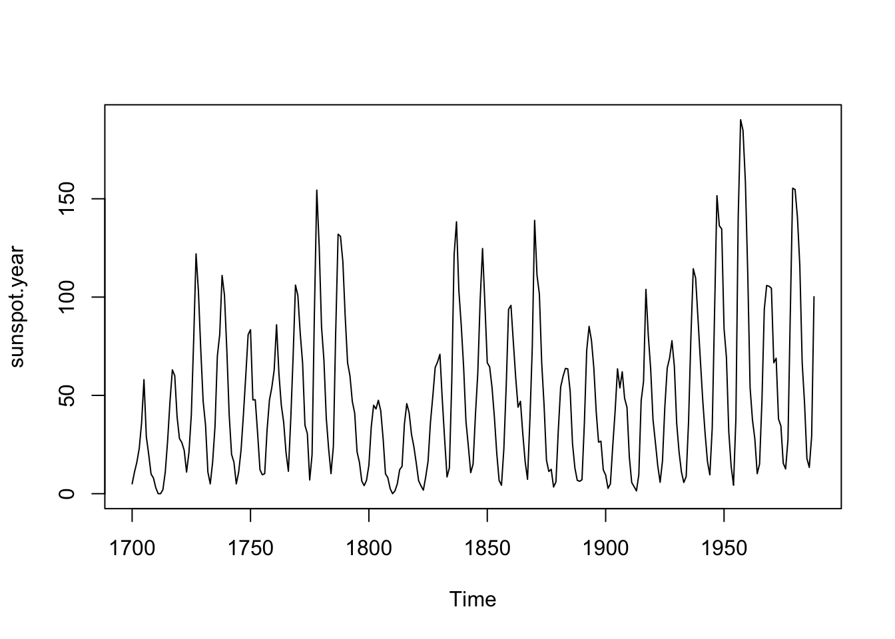

# The Freqs Come out at Night


## Big Idea
We move from the time domain to the frequency domain. That means that we think about data in terms of the embedded periodicities rather than as a squiggly line. It's head scratcher at first but worth the effort.

## Reading
Have a look at Chapter nine from @Cowpertwait2009. It's OK to skim the readings in this book. It's not a great book for our purposes as many of you haven't taken linear algebra and the book occasionally goes that way. But it's useful to hum your way through the chapter nonetheless.

## Packages
We will just use the `tidyverse` [@R-tidyverse] for the main part. I'll show you things using `dplR` [@R-dplR] and `waveslim` [@R-waveslim] too.


``` r
library(tidyverse)
```


## The Frequency Domain
Thus far, we’ve looked at time series as a squiggly line—changes in some variable as a function of time. This is the time domain view, where the horizontal axis is time and our focus is on detecting trends, abrupt shifts, autocorrelation, and so on. This approach works well when events unfold sequentially and our interest lies in when things happen.

But there’s another, equally powerful way to look at time series: the frequency domain. Here, we shift perspective and ask: What cycles are embedded in this series? Rather than asking when something happened, we ask how often it tends to happen. In the frequency domain, we represent a time series in terms of its periodic components—the frequencies that “make up” the data. The result is a view of variance as a function of frequency: how much of the ups and downs in the data are due to processes operating at different time scales.

This is more than just a mathematical trick. Many natural and environmental systems are driven by periodic forcing—think of daily, seasonal, tidal, or orbital cycles. When we work in the frequency domain, we often get a clearer view of these underlying processes. It can help us detect signals that are hard to see in the time domain, especially when they’re buried in noise.

Our main tool for this is spectral analysis, which lets us decompose a signal into its component frequencies. The idea dates back to Joseph Fourier, who showed that any periodic signal can be expressed as a sum of sine and cosine waves—what we now call a Fourier series. In fact, even signals that are not obviously periodic can be approximated as sums of sinusoids. A time series that looks messy and irregular may just be a combination of overlapping cycles operating at different frequencies and amplitudes.

The mathematical tool that performs this decomposition is the Fourier transform. This is the same technology behind MP3 audio compression and JPEG images: representing complex information as the sum of simple waves. In our case, we’ll use it to analyze time series and detect dominant periodicities—what cycles are strong, which are weak, and which are just noise.

As always, the goal is not just to describe patterns, but to get closer to mechanism. If we can link frequency-domain patterns to known physical drivers—like El Niño, solar cycles, or Milankovitch forcing—we gain a deeper understanding of how environmental systems behave.

### Same Data, Two Domains

Look at these two plots. This is the same signal two ways: once in the time domain and once in the frequency domain.


The two plots have **exactly** the same information -- just a different lens.^[In theory, the time and frequency domains are mathematically equivalent and you can reconstruct one from the other using a full Fourier transform. But in practice, smoothing, truncation, or sampling limitations can obscure some details in one domain or the other.] The time-domain plot shows the signal as it changes over time. The frequency-domain plot shows how much of the signal is happening at different frequencies. You can see strong peaks around 0.02 (i.e., a 50-unit cycle) and 0.005 (a 200-unit cycle). This is the power of spectral analysis: it reveals hidden periodicity even when the time series looks noisy or chaotic.

### Worked example

Let's start with a very quick and clean example. We will create the signal `wav` as the sum of a few sine waves plus some noise. Just as we do when we work in the time domain we will always plot our data!

Here is a sine wave with a period of 250 (frequency of 0.004). Thus, over 1000 observations there are four oscillations.


``` r
sfPal <- PNWColors::pnw_palette(name="Starfish",n=5,type="discrete")

n <- 1000
dat <- tibble(tm = seq(1,n),
              wav250 = 0.3 * sin(2 * pi / 250 * tm))
p1 <- ggplot() +
  labs(x="Some Time",y="Some Signal")

p1 + geom_line(data=dat,mapping = aes(x=tm,y=wav250),color=sfPal[1]) +
  labs(title = "Period 250, f=1/250=0.004", subtitle = "Amplitude = 0.3")
```


Let's add to it with some more sine waves. Run this code one line at time to see each sine function.


``` r
dat <- dat %>% mutate(wav5 = 0.5 * sin(2 * pi / 5 * tm),
                      wav10 = sin(2 * pi / 10 * tm),
                      wav50 = 0.75 * sin(2 * pi / 50 * tm))

p1 + geom_line(data=dat,mapping = aes(x=tm,y=wav50),color=sfPal[2]) +
  labs(title = "Period 50, f=1/50=0.02", subtitle = "Amplitude = 0.75")
```


``` r
p1 + geom_line(data=dat,mapping = aes(x=tm,y=wav10),color=sfPal[3]) +
  labs(title = "Period 10, f=1/10=0.1", subtitle = "Amplitude = 1")
```


``` r
p1 + geom_line(data=dat,mapping = aes(x=tm,y=wav5),color=sfPal[4]) +
  labs(title = "Period 5, f=1/5=0.2", subtitle = "Amplitude = 0.5")
```


And sum them.


``` r
dat <- dat %>% mutate(allWav = wav250 + wav50 + wav10 + wav5)
p1 + geom_line(data=dat,mapping = aes(x=tm,y=allWav),color=sfPal[5]) +
  labs(title = "Multiple frequencies combined")
```


Zoom in a bit:

``` r
p1 + geom_line(data=dat,mapping = aes(x=tm,y=allWav),color=sfPal[5]) +
  labs(title = "Multiple frequencies combined") +
  lims(x=c(500,600))
```

```
## Warning: Removed 899 rows containing missing values or values outside the scale range
## (`geom_line()`).
```


Now let's add a little noise and we have a series that looks a lot like something we might see in nature.


``` r
dat <- dat %>% mutate(allWav = allWav + rnorm(n))
p1 + geom_line(data=dat,mapping = aes(x=tm,y=allWav),color=sfPal[5]) +
  labs(title = "Multiple frequencies combined")
```


A little noise and an awful lot of repeating signals.

How can we analyze that series and find out what it is made of? We will calculate a periodogram using a fast Fourier transform and make a plot (also called a periodogram). The periodogram distributes the variance of a signal over frequency. In R, we will use the `spectrum` function which can also smooth the data in the frequency domain so that we don't get overwhelmed by too many spikes in the plot. The text has a great, and easy to follow, explanation of how and why this smoothing works. For this signal though, we will look at the raw periodogram knowing that `allWav` has four sine waves in it.


``` r
spectrum(dat$allWav,log="no")
```


This is the raw periodogram. By default the plot puts the spectrum on a log axis. I've turned that off above but I suggest you run that again to see the log scales: `spectrum(dat$allWav)`. The spectrum is  scaled so that its area is one half the variance of the series. Again, the text discusses why, as well as discussing the bandwidth parameter (which relates to the smoothing). You can think of the y-axis as being the amplitude of the signal at a given frequency (or its power or even its information). Play with the smoothing argument, e.g., `spectrum(wav,span=5,log="no")`. 

Now, we know the frequencies in these data. Are they in the periodogram? Go through and add vertical lines to the plot where we know the frequency of the sine waves. E.g., `wav5` oscillates every five values and has a period of five and frequency of $1/5=0.2$, thus `abline(v=1/5)`. 

## Sunspot Example

Simulated examples are a great way of mucking about in the frequency domain. The book has two great examples of doing spectral analysis using AR(1) models with both negative and positive values of $\phi$. Check those out. But now, let's look at some real data -- the trusty sunspot counts. 


``` r
data(sunspot.year)
plot(sunspot.year)
```



What periodicities / frequencies are embedded in these data?


``` r
ss.spec <- spectrum(sunspot.year, span=5, plot= FALSE)
plot(ss.spec,log="no", type="h", xlab="Frequency (cycles / yr)", 
     ylab="Spectral density")
```


Two things. First, note the spikes at the 0.09 range of frequencies. What is that period (years)? About eleven years because $~f=1/p$. There is also some amplitude/power/information at lower frequencies. What might that be? Can you see that in the time domain?

Second, you can from the code above that you can plot an object of class `spec` with the `plot` command. See the help page for `plot.spec` for details (`?plot.spec`) on how to fuss with the plot. Here is an example where you can zoom in on the x-axis:


``` r
plot(ss.spec,log="no", type="h", xlab="Frequency (cycles / yr)", 
     ylab="Spectral density", xlim=c(0,0.2))
```


Here is an example where I'll make the plot with `ggplot`. Note the addition of the second x-axis showing period. Try as I might, I still think in periods and not frequencies.


``` r
dat <- tibble(freqs = ss.spec$freq,
              specs = ss.spec$spec)

fPretty <- pretty(dat$freqs)
pPretty <- round(1 / fPretty, 2)

ggplot(data = dat,mapping = aes(x=freqs,xend=freqs,y=0,yend=specs)) +
  geom_segment() +
  scale_y_continuous(name = "Spectral density",
                     expand = c(0,0)) +
  scale_x_continuous(name = "Frequency (cycle / yr)",
                     sec.axis=sec_axis(~., breaks=fPretty,
                                       labels = pPretty,
                                       name="Period (yr / cycle)"))
```


Now, let's look at sunspots but using the monthly data.


``` r
data(sunspot.month)
plot(sunspot.month)
```


``` r
tsp(sunspot.month) # note freq = 12
```

```
## [1] 1749.00 2024.75   12.00
```

The `sunspot.month` is the same data as in `sunspot.year` but with a frequency of 12 instead of one. Think about what that means for the frequency domain before you run the following code:


``` r
ss.spec <- spectrum(sunspot.month, span=5, plot= FALSE)

dat <- tibble(freqs = ss.spec$freq,
              specs = ss.spec$spec)

fPretty <- pretty(dat$freqs)
pPretty <- round(1 / fPretty, 2)

ggplot(data = dat,mapping = aes(x=freqs,xend=freqs,y=0,yend=specs)) +
  geom_segment() +
  scale_y_continuous(name = "Spectral density",
                     expand = c(0,0)) +
  scale_x_continuous(name = "Frequency (cycle / yr)")
```


See if you can figure out why the x-axis has changed with the monthly sunspot data as compared to the annual data.


## Your work

Mess around with what I have above with the sine waves. You don't need to show me any of that work but I suggest playing with that example until you are comfortable with the span argument, finding peaks, logging and unlogging the axes, and so on. Try adding a trend.

### Generate three signals

Using a reasonable sample size, generate three time series: white noise, an AR(1) process, and a random walk. Plot the spectras. Do they look they way you thought they would?

### Milankovitch

Many—hopefully all—of you have encountered the concept of orbital forcing through [Milankovitch cycles](https://en.wikipedia.org/wiki/Milankovitch_cycles). These are the slow, rhythmic changes in Earth’s orbit and axial tilt that influence how much solar energy reaches different parts of the planet. These cycles operate over tens to hundreds of thousands of years and are widely accepted as a major driver of long-term climate variability, including the timing of ice ages.

In this section, we get to work with one of the most iconic data sets in paleoclimate science: reconstructed summer insolation (in W/m²) at 65°N latitude over the past five million years. These data come from Berger and Loutre (1991), whose calculations are foundational in the field. The file `jul65N.rds` contains a data frame with two columns:

- `kya`: Time, in *thousands of years ago*
- `W.per.m2`: July insolation at 65°N

These are not noisy, messy observational data — they are **calculated from celestial mechanics** using well-understood physics. That’s what makes this so compelling: you are looking at the long-term heartbeat of the Earth’s orbital rhythm.

Your task is to apply spectral analysis to these data and identify the dominant periodicities. What cycles jump out from the periodogram? Are they in the the canonical range of Milankovitch frequencies associated with eccentricity, obliquity, and precession?

> Take a moment to appreciate this: we are peering into multi-million-year cycles in Earth’s orbital geometry, captured in a handful of sine waves. It’s one of the most elegant examples of how the frequency domain can reveal deep, physical structure hidden in long time series.


``` r
jul65N <- readRDS("data/jul65N.rds")
ggplot(data = jul65N, aes(x=kya,y=W.per.m2)) +
  geom_line(color=sfPal[5]) +
  labs(x="Thousands of years ago",y = expression(W/m^2),
       title="July insolation at 65N")
```


### Write Up and Reflect
Pass in a R Markdown doc with your analysis. Leave all code visible, although you may quiet messages and warnings if desired. Turn in your knitted html. The last section of your document should include a reflection where you explain how it all went. What triumphs did you have? What is still confusing?

## References
Berger A. and Loutre M. F. (1991)  Insolation values for the climate of the last 10 million years. Quaternary Sciences Review, Vol. 10 No. 4, pp. 297-317, 1991. 


## Postscript: A Glimpse of Wavelets

Wavelets: the pictures that take a thousand words to explain.

We won't go deep into wavelet analysis in this course, but it's worth seeing what the fuss is about. Wavelets are a powerful tool that extend the ideas of the frequency domain by letting us ask how frequency content changes over time. Unlike Fourier analysis, which assumes that the dominant frequencies are constant throughout the whole series, wavelets can reveal when those frequencies are active and when they fade.

Think of it like this: a periodogram tells you *what's in the signal*, but not *when*. Wavelets let you look at the signal's frequency content as it evolves through time. That’s especially useful for messy, real-world data where processes may come and go — like a 20-year cycle that’s strong in one century and absent in the next.

In this postscript, we load a tree-ring series and apply a wavelet transform to visualize the timing and scale of periodicity in the data. You’ll see two types of wavelet decomposition:
- A **continuous wavelet transform**, which produces a heatmap showing power (strength) at different periods across time.
- A **discrete wavelet transform**, which breaks the time series into additive components at different time scales (e.g., 2-year, 4-year, 8-year).

These are not tools you need to use — just something to marvel at. We'll talk briefly about wavelets in class, especially in cases where classic spectral methods fall short.

Wavelets are how you get at signals that change — not just in strength, but in *when* they show up. They’re a great example of how data science keeps evolving to help us make sense of complex, dynamic systems.


``` r
library(waveslim)
library(dplR)

# load a bunch of raw tree-ring data
data(co021)
plot(co021, plot.type="spag")
```


``` r
# detrend and average the individual series to make a chronology
co021.rwi <- detrend(co021, method="Spline")
co021.crn <- chron(co021.rwi)
# here is the signal we will look at:
plot(co021.crn, add.spline=TRUE, nyrs=64)
```


``` r
dat <- co021.crn[, 1]
yrs <- time(co021.crn)

# continuous wavelet transform
out.wave <- morlet(y1 = dat, x1 = yrs, p2 = 8, dj = 0.1,
                   siglvl = 0.99)
wavelet.plot(out.wave, useRaster=NA, reverse.y = TRUE)
```


``` r
# discrete wavelet transform
nYrs <- length(yrs)
nPwrs2 <- trunc(log(nYrs)/log(2)) - 1
dat.mra <- mra(dat, wf = "la8", J = nPwrs2, method = "modwt",
               boundary = "periodic")
YrsLabels <- paste(2^(1:nPwrs2),"yrs",sep="")

par(mar=c(3,2,2,2),mgp=c(1.25,0.25,0),tcl=0.5,
    xaxs="i",yaxs="i")
plot(yrs,rep(1,nYrs),type="n", axes=FALSE, ylab="",xlab="",
     ylim=c(-3,38))
title(main="Multiresolution decomposition of dat",line=0.75)
axis(side=1)
mtext("Years",side=1,line = 1.25)
Offset <- 0
dat.mra2 <- scale(as.data.frame(dat.mra))
for(i in nPwrs2:1){
  #    x <- scale(dat.mra[[i]]) + Offset
  x <- dat.mra2[,i] + Offset
  lines(yrs,x)
  abline(h=Offset,lty="dashed")
  mtext(names(dat.mra)[[i]],side=2,at=Offset,line = 0)
  mtext(YrsLabels[i],side=4,at=Offset,line = 0)
  Offset <- Offset+5
}
box()
```


